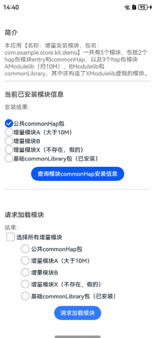
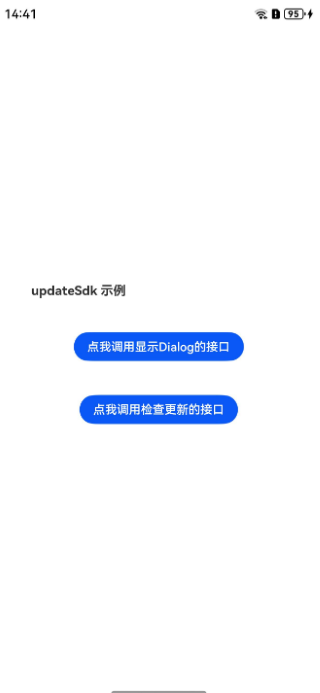
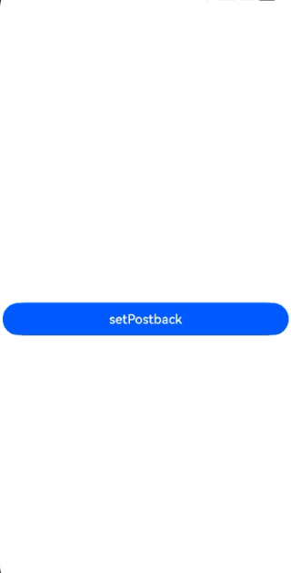

# 应用市场服务（ArkTS）

## 介绍

基于Stage模型，实现了展示应用详情页下载安装目标应用、展示元服务详情页添加至桌面、查询广告验签标签版本、获取模块安装信息和添加按需加载模块、应用市场更新和应用归因服务、查询隐私链接、查询隐私签署结果以及停止隐私协议等功能。

## 效果预览









## 工程目录

```
├─Attribution/src/main/ets
│                       │  
│                       ├─attributionability/AttributionAbility.ets  // 本地启动应用归因ability 
│                       ├─common/utils/SignUtil.ets     // 生成签名方法    
│                       └─pages
│                           └─Attribution.ets  // 应用归因服务及应用归因接入调试功能接口页面
├─entry/src/main/ets
                   ├─common/bean/EntryItemInfo.ets   // 页面入口工具类
                   ├─entryability/EntryAbility.ets   // 本地启动ability   
                   │              
                   └─pages
                       ├─ CheckUpdatePage.ets           // 应用检查更新
                       ├─ DisableService.ets            // 停止隐私协议
                       ├─ GetAdsVerificationVersion.ets // 查询广告验签版本
                       ├─ GetAppPrivacyMgmtInfo.ets     // 查询隐私链接信息
                       ├─ GetAppPrivacyResult.ets       // 查询隐私签署结果
                       ├─ GetSelfSceneCode.ets          // 查询元服务自身场景值
                       ├─ IndexPage.ets                 // 首页入口
                       ├─ LoadInstallService.ets        // 产品特性按需分发页面
                       ├─ LoadProduct.ets               // 应用详情页下载安装
                       └─ LoadService.ets               // 元服务卡片加桌
                   

```

## 具体实现

1.应用包括LoadProduct、LoadService、LoadInstall、CheckUpdate、Attribution等模块

2.点击LoadProduct，展示应用详情页，下载安装目标应用

3.点击LoadService，展示元服务详情页，添加至桌面

4.点击LoadInstall，进入产品特性按需分发页面

5.点击getSelfSceneCode，查询元服务自身场景值

6.点击getAdsVerificationVersion,返回广告验签版本

7.点击Check update，进入应用更新相关页面

8.安装Attribution hap包，向应用归因服务登记广告归因来源和登记转化事件及使用应用归因服务接入调试能力

9.点击getAppPrivacyMgmtInfo，查询隐私链接信息

10.点击getAppPrivacyResult，查询隐私签署结果

11.点击disableService，停止隐私协议


### loadService展示元服务详情页接口说明
步骤一：申请加桌链接

> 当前暂不提供加桌链接，用户可参考[指导文档](https://developer.huawei.com/consumer/cn/doc/service/fa-agds_api_link_integrate-if_add-desk-0000001654814469)自行申请

步骤二：修改LoadService.ets里的uri

步骤三：编译安装demo，点击LoadService按钮

### 调试getSelfSceneCode接口说明
步骤一：将应用改为元服务

&emsp;&emsp;&emsp;&emsp;修改entry/src/main目录下module.json5文件

&emsp;&emsp;&emsp;&emsp;将“installationFree”修改为true

步骤二：用其他应用或元服务拉起本元服务,本元服务会生成场景值, 然后查询元服务自身场景值

&emsp;&emsp;&emsp;&emsp;修改AppScope目录下app.json5文件 ,增加bundleType字段,属性值配置为元服务

&emsp;&emsp;&emsp;&emsp;示例："bundleType": "atomicService"

步骤三：点击查询场景值按钮, 查询元服务自身场景值

### 调试getAdsVerificationVersion接口说明
步骤一：点击getAdsVerificationVersion按钮

步骤二：返回广告验签版本, 当前返回值为1。 广告场景中开发者需要在want参数中携带以下参数：ohos.market.param.signature、
ohos.market.param.ad_networkid、ohos.market.param.timestamp、ohos.market.param.verify_version、
ohos.market.param.ad_nonce，验签时会根据want中这些字段值使用公钥进行验签。


### 产品特性按需分发功能接口说明
一共有5个模块，包括2个hap包模块entry和commonHap，以及3个hsp包模块AModulelib（约10M）、
BModulelib和commonLibrary，其中还构造了XModulelib虚假的模块。

如果需要动态加载某个模块，需要将该demo应用，及demo应用下的各个HSP、HAP等上架到应用市场。

上架应用市场后，从应用市场下载该demo应用，然后才能动态加载模块。

包括查询模块已安装信息，请求加载模块，取消加载模块，开启流量提醒弹窗，监听下载进度，取消监听下载进度接口：

* getInstalledModule()
* fetchModules()
* cancelTask()
* showCellularDataConfirmation()
* on('moduleInstallStatus')
* off('moduleInstallStatus')


步骤一：前置步骤：

&emsp;&emsp;&emsp;&emsp;- 连接可用的网络。

&emsp;&emsp;&emsp;&emsp;- 安装最新版本应用市场。

&emsp;&emsp;&emsp;&emsp;- 刷最新版本rom。

步骤二：通过应用市场下载安装应用A，此时安装的应用A只是基础包，无法使用功能包模块B的功能。

步骤三：在应用A内，用户可选择下载功能包模块B。

步骤四：下载安装完成之后，用户可使用应用A的功能包模块B的功能。


### 应用归因功能及调试功能接口说明

共5个接口，其中validateSource()、setPostback()、flushPostbacks()是应用归因接入调试功能接口
* registerSource()
* registerTrigger()
* validateSource()
* setPostback()
* flushPostbacks()

#### 测试前准备：

&emsp;&emsp;&emsp;&emsp;- adTechId获取

&emsp;&emsp;&emsp;&emsp;- triggerdata获取

&emsp;&emsp;&emsp;&emsp;- signature计算规则


##### adTechId获取

步骤一：登录华为开发者联盟网站

步骤二：点击“管理中心”进入生态服务中心

步骤三：点击“生态服务>应用服务>开发服务”下的“应用市场服务”卡片，进入应用归因云端管理平台

步骤四：注册广告生态伙伴角色：广告平台

步骤五：审核通过后，查看广告平台归因角色ID


##### triggerdata获取

步骤一：登录华为开发者联盟网站

步骤二：通过点击“管理中心”进入生态服务中心

步骤三：点击“生态服务>应用服务>开发服务”下的“应用市场服务”卡片，进入应用归因云端管理平台

步骤四：注册广告生态伙伴角色：广告主

步骤五：点击转化事件，查看转化事件编码

##### signature计算规则

步骤一：生成RSA3072非对称密钥

步骤二：将公钥注册到应用归因云端管理平台

步骤三：生成需要签名的内容，格式如下

mmpIdStr:string = mmpId1 + '\u2063' + mmpId2
signContent: string= adTechId+ '\u2063' + campaignId+ '\u2063' + destinationId+ '\u2063' + serviceTag+ '\u2063' + mmpIdStr + '\u2063' + nonce + '\u2063' + timestamp

步骤四：import {AegRsaSign} from "@hms-security/agoh-crypto" ， 使用AegRsaSign.ohAegSignRSAWithPSSTextBase64生成签名，使用方法如下
>https://ohpm.openharmony.cn/#/cn/detail/@hms-security%2Fagoh-crypto

>https://gitee.com/seuercc/hw-security/blob/master/aegis/agoh-crypto/doc/CryptoFramework/%E5%AF%86%E7%A0%81%E7%AE%97%E6%B3%95/%E7%AD%BE%E5%90%8D%E7%AE%97%E6%B3%95/SHA256withRSA-PSS%E7%AD%BE%E5%90%8D%E7%AE%97%E6%B3%95.md#%E6%8E%A5%E5%8F%A3-ohaegsignrsawithpsstextbase64
 
#### 应用归因服务接口调用 （API version 12及以上支持）

步骤一：点击“Register Source”按钮，会调用registerSource接口，该接口会返回是否登记归因来源成功。

步骤二：点击“registerTrigger”按钮，会调用registerTrigger()接口，该接口会返回是否登记转化成功。

步骤三：点击“validateSource”按钮，会调用validateSource()接口，该接口会返回是否验证归因来源信息成功。

步骤四：点击“setPostback”按钮，会调用setPostback()接口，该接口返回是否设置归因结果成功。

步骤五：点击“flushPostbacks”按钮，会调用flushPostbacks()接口，该接口返回是否触发归因结果回传成功。


### 升级功能接口说明（API version 12及以上支持）

* checkAppUpdate()
* showUpdateDialog()

步骤一：点击“点我调用检查更新接口”，会调用checkAppUpdate接口，该接口会返回是否有版本更新

步骤二：当有版本更新时，点击“点我调用显示Dialog接口”，会显示出更新版本的对话框。

### 隐私管理服务接口说明（API version 12及以上支持）
* getAppPrivacyMgmtInfo()
* getAppPrivacyResult()
* disableService()

步骤一：应用需要接入隐私声明托管服务(接入地址：https://developer.huawei.com/consumer/cn/doc/app/agc-help-harmonyos-privacystatementguide-0000001757041969)

步骤二：应用接入隐私托管之后，可以查询隐私链接信息、查询隐私签署结果以及停止隐私协议（备注：如果应用没有接入隐私托管，调用接口会返回错误码：1006700003）

## 相关权限

不涉及

## 约束与限制

1.本示例仅支持标准系统上运行，支持设备：华为手机、平板、2in1。

2.HarmonyOS系统：HarmonyOS NEXT Developer Beta1及以上。

3.DevEco Studio版本：DevEco Studio NEXT Developer Beta1及以上。

4.HarmonyOS SDK版本： HarmonyOS NEXT Developer Beta1 SDK及以上。

5.本示例需要安装14.0.1.300以上版本应用市场。