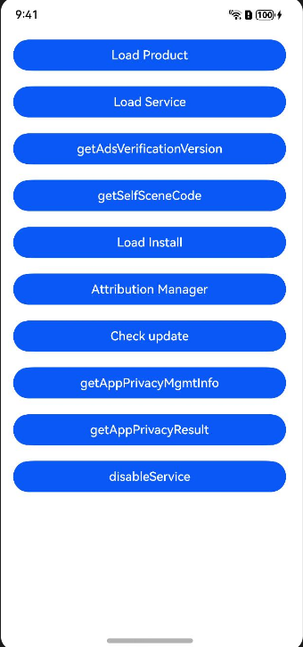
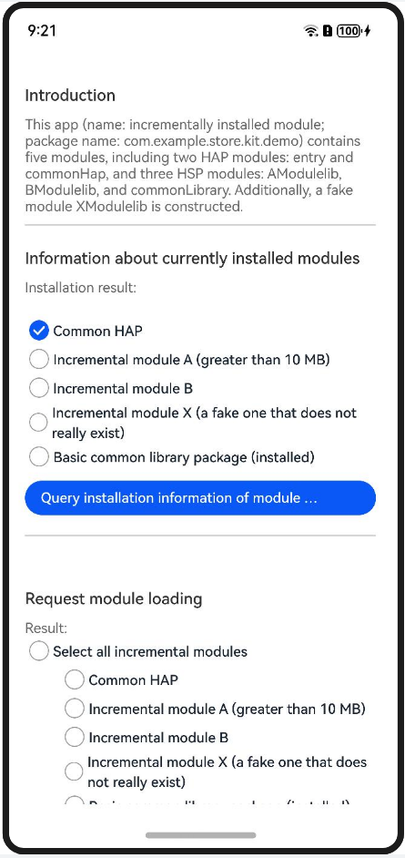
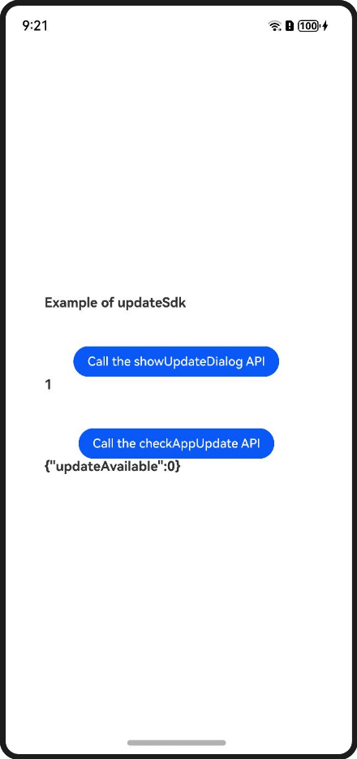
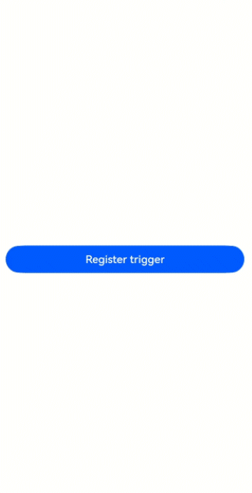
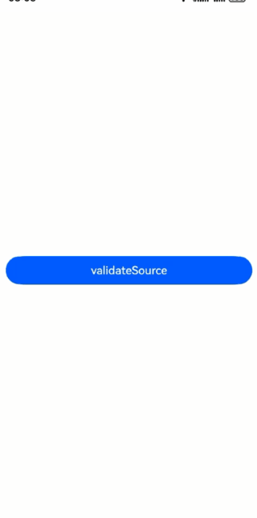
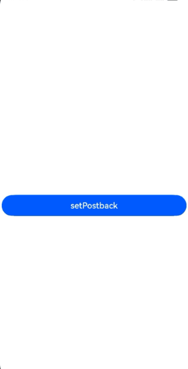

# Store Kit (ArkTS)

## Overview

Based on the stage model, this demo implements features such as displaying an app details page for downloading and installing the target app, displaying an atomic service details page for adding the atomic service widget to the home screen, querying the ad signature verification version, obtaining module installation information, adding a module for on-demand loading, displaying reminders of updates on AppGallery, performing app attribution, querying privacy agreement URLs, querying the privacy agreement signing results, and terminating privacy agreements.

## Preview
 










## Project Directory

```
├─Attribution/src/main/ets
│                       │  
│                       ├─attributionability/AttributionAbility.ets  // Ability to locally start app attribution.
│                       ├─common/utils/SignUtil.ets     // Signature generation method.   
│                       └─pages
│                           └─Attribution.ets  // Page of the app attribution service and debugging function.
├─entry/src/main/ets
                   ├─common/bean/EntryItemInfo.ets   // Page entry utility class.
                   ├─entryability/EntryAbility.ets   // Ability for local startup.  
                   │              
                   └─pages
                       ├─ CheckUpdatePage.ets           // App update detection.
                       ├─ DisableService.ets            // Terminate privacy agreements.
                       ├─ GetAdsVerificationVersion.ets // Query the ad signature verification version.
                       ├─ GetAppPrivacyMgmtInfo.ets     // Query privacy agreement URLs.
                       ├─ GetAppPrivacyResult.ets       //  Query privacy agreement signing results.
                       ├─ GetSelfSceneCode.ets          // Query the scene value of your atomic service.
                       ├─ IndexPage.ets                 // Entrance to the home screen.
                       ├─ LoadInstallService.ets        // Page for on-demand feature distribution.
                       ├─ LoadProduct.ets               // App details page for download and installation.
                       └─ LoadService.ets               // Page for adding your atomic service widget to the home screen.
```

## How to Implement

1. Your app contains modules such as **LoadProduct**, **LoadService**, **LoadInstall**, **CheckUpdate**, **Attribution**, **getAppPrivacyMgmtInfo**, **getAppPrivacyResult**, and **disableService**.

2. Tap **Load Product** to access the app details page, where you can download and install the target app.

3. Tap **Load Service** to access the atomic service details page, where you can add the atomic service widget to the home screen.

4. Tap **Load Install** to access the page for on-demand feature distribution.

5. Tap **getSelfSceneCode** to query the scene value of your atomic service.

6. Tap **getAdsVerificationVersion** to return the ad signature verification version.

7. Tap **Check update** to access the app update page.

8. Install the HAP file of the app attribution service to register ad attribution sources and conversion events with the app attribution service, and perform debugging when you use the app attribution service.

9. Tap **getAppPrivacyMgmtInfo** to query privacy agreement URLs.

10. Tap **getAppPrivacyResult** to query the privacy agreement signing results.

11. Tap **disableService** to terminate privacy agreements.

### Description of the loadService API for Displaying the Atomic Service Details Page
Step 1: Apply for a link for adding an atomic service widget to the home screen.

> Currently, the link for adding an atomic service widget to the home screen is not provided. If needed, you can request one by following the [instructions](https://developer.huawei.com/consumer/cn/doc/service/fa-agds_api_link_integrate-if_add-desk-0000001654814469).

Step 2: Change **uri** in **LoadService.ets**.

Step 3: Compile and install the demo and tap **Load Service**.

### Debugging the getSelfSceneCode API
Step 1: Change your app to an atomic service.

&emsp;&emsp;&emsp;&emsp;Modify the **module.json5** file in the **entry/src/main** directory.

&emsp;&emsp;&emsp;&emsp;Change the value of **installationFree** to **true**.

Step 2: Use another app or atomic service to start your atomic service. Query the scene values generated by your atomic service.

&emsp;&emsp;&emsp;&emsp;Add the **bundleType** field to the **app.json5** file in the **AppScope** directory and set the attribute value to **atomicService**.

&emsp;&emsp;&emsp;&emsp;Example: "bundleType": "atomicService"

Step 3: Tap the corresponding button to query scene values of the atomic service.

### Debugging the getAdsVerificationVersion API
Step 1: Tap **getAdsVerificationVersion**.

Step 2: Return the ad signature verification version. Currently, the return value is **1**. In the advertising scenario, you need to include the following parameters in the **want** parameter: **ohos.market.param.signature**, **ohos.market.param.ad_networkid**, **ohos.market.param.timestamp**, **ohos.market.param.verify_version**, and **ohos.market.param.ad_nonce**. These parameters and the public key will be used for signature verification.

### APIs of On-Demand Feature Distribution
There are five modules, including two HAP modules: **entry** and **commonHap**, and three HSP modules: **AModulelib** (approximately 10 MB), **BModulelib**, and **commonLibrary**. Additionally, a fake module **XModulelib** is constructed.

To dynamically load a specific module, you need to release the demo app and its HSPs and HAPs to AppGallery.

Once the demo app is available on AppGallery, you can download it from AppGallery and then dynamically load a module.

The following APIs are available, used to query module installation information, request module loading, cancel module loading, enable mobile data reminders, monitor the download progress, and cancel monitoring of the download progress, respectively:

* getInstalledModule()
* fetchModules()
* cancelTask()
* showCellularDataConfirmation()
* on('moduleInstallStatus')
* off('moduleInstallStatus')


Step 1: Perform the preliminary steps:

&emsp;&emsp;&emsp;&emsp;- Connect to the network.

&emsp;&emsp;&emsp;&emsp;- Install the latest version of AppGallery.

&emsp;&emsp;&emsp;&emsp;- Flash the latest version of the ROM.

Step 2: Download and install app A from AppGallery. The installed app A is only a basic package, and features of module B (the function package) cannot be used.

Step 3: Within app A, download module B.

Step 4: After the download and installation are complete, use features of module B within app A.


### APIs of App Attribution and Service Debugging

There are a total of five APIs, with **validateSource()**, **setPostback()**, and **flushPostbacks()** being the debugging APIs for the app attribution service.
* registerSource()
* registerTrigger()
* validateSource()
* setPostback()
* flushPostbacks()

#### Preparations for testing:

&emsp;&emsp;&emsp;&emsp;- Obtain **adTechId**.

&emsp;&emsp;&emsp;&emsp;- Obtain **triggerdata**.

&emsp;&emsp;&emsp;&emsp;- Generate a signature.


##### Obtaining adTechId

Step 1: Sign in to HUAWEI Developers.

Step 2: Click **Console** in the upper right corner to go to the ecosystem service center.

Step 3: Go to **Ecosystem services** > **App services** > **Development** > **AG Service** to access the cloud platform of the app attribution service.

Step 4: Register an ad ecosystem partner role (ad platform in this step).

Step 5: Check the attribution role ID of the ad platform after the request is approved.


##### Obtaining triggerdata

Step 1: Sign in to HUAWEI Developers.

Step 2: Click **Console** in the upper right corner to go to the ecosystem service center.

Step 3: Go to **Ecosystem services** > **App services** > **Development** > **AG Service** to access the cloud platform of the app attribution service.

Step 4: Register an ad ecosystem partner role (advertiser in this step).

Step 5: Click a conversion event to view its ID.

##### Generating a Signature

Step 1: Generate an RSA3072 asymmetric key pair.

Step 2: Register the public key with the cloud platform of the app attribution service.

Step 3: Generate the content to be signed. The format is as follows:

mmpIdStr:string = mmpId1 + '\u2063' + mmpId2
signContent: string= adTechId+ '\u2063' + campaignId+ '\u2063' + destinationId+ '\u2063' + serviceTag+ '\u2063' + mmpIdStr + '\u2063' + nonce + '\u2063' + timestamp

Step 4: Execute the **import {AegRsaSign} from "@hms-security/agoh-crypto"** code to import **AegRsaSign** from **@hms-security/agoh-crypto**, and use **AegRsaSign.ohAegSignRSAWithPSSTextBase64** to generate a signature. For details, please refer to the following websites:
>https://ohpm.openharmony.cn/#/cn/detail/@hms-security%2Fagoh-crypto

>https://gitee.com/seuercc/hw-security/blob/master/aegis/agoh-crypto/doc/CryptoFramework/%E5%AF%86%E7%A0%81%E7%AE%97%E6%B3%95/%E7%AD%BE%E5%90%8D%E7%AE%97%E6%B3%95/SHA256withRSA-PSS%E7%AD%BE%E5%90%8D%E7%AE%97%E6%B3%95.md#%E6%8E%A5%E5%8F%A3-ohaegsignrsawithpsstextbase64

#### Calling APIs of the App Attribution Service (Supported by API Version 12)

Step 1: Tap **Register Source** to call the **registerSource** API, which will return whether the attribution source registration is successful.

Step 2: Tap **Register trigger** to call the **registerTrigger()** API, which will return whether the conversion registration is successful.

Step 3: Tap **validateSource** to call the **validateSource()** API, which will return whether the validation of the attribution source information is successful.

Step 4: Tap **setPostback** to call the **setPostback()** API, which will return whether the attribution result is successfully set.

Step 5: Tap **flushPostbacks** to call the **flushPostbacks()** API, which will return whether the attribution result postback is successfully triggered.


### APIs of the Update Function (Supported by API Version 12)

* checkAppUpdate()
* showUpdateDialog()

Step 1: Tap **Call the checkAppUpdate API**, which will return whether there is a version update.

Step 2: When a new version is available, tap **Call the showUpdateDialog API** to show a pop-up that provides a new version.

### APIs of the Privacy Agreement Management Service (Supported by API Version 12)
* getAppPrivacyMgmtInfo()
* getAppPrivacyResult()
* disableService()

Step 1: Integrate the privacy statement hosting service into your app. For details, please refer to the following website: https://developer.huawei.com/consumer/cn/doc/app/agc-help-harmonyos-privacystatementguide-0000001757041969

Step 2: Query privacy agreement URLs, check the privacy agreement signing results, and terminate privacy agreements. (Note: If your app has not integrated the privacy statement hosting service, error code **1006700003** will be returned when an API is called.)

## Required Permissions

N/A

## Constraints

1. The sample app is only supported on Huawei phones, tablets,2in1 devices with standard systems.

2. The HarmonyOS version must be HarmonyOS NEXT Developer Beta1 or later.

3. The DevEco Studio version must be DevEco Studio NEXT Developer Beta1 or later.

4. The HarmonyOS SDK version must be HarmonyOS NEXT Developer Beta1 SDK or later.

5. Install AppGallery 14.0.1.300 or later.
