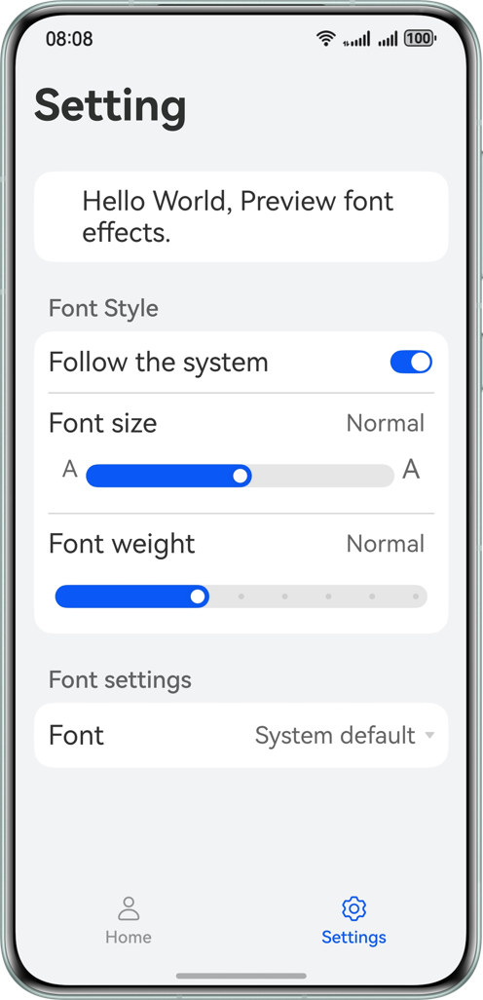
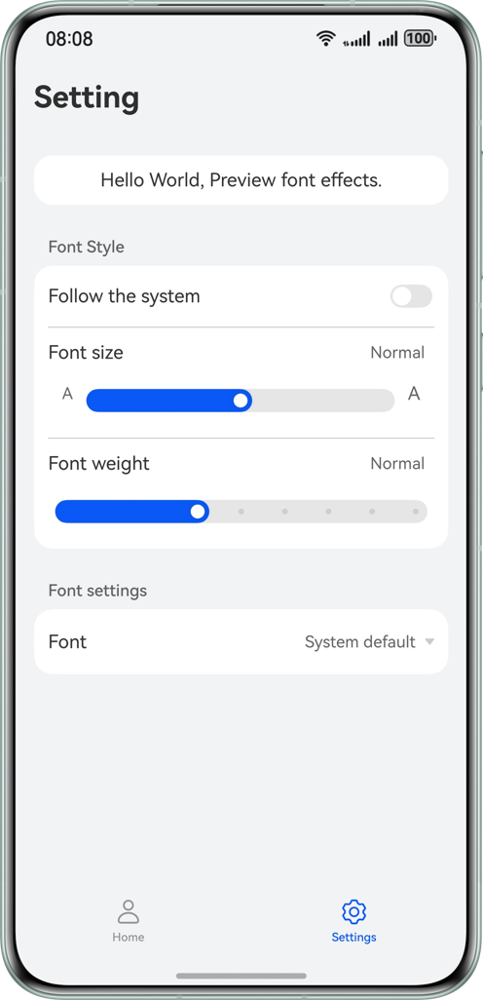
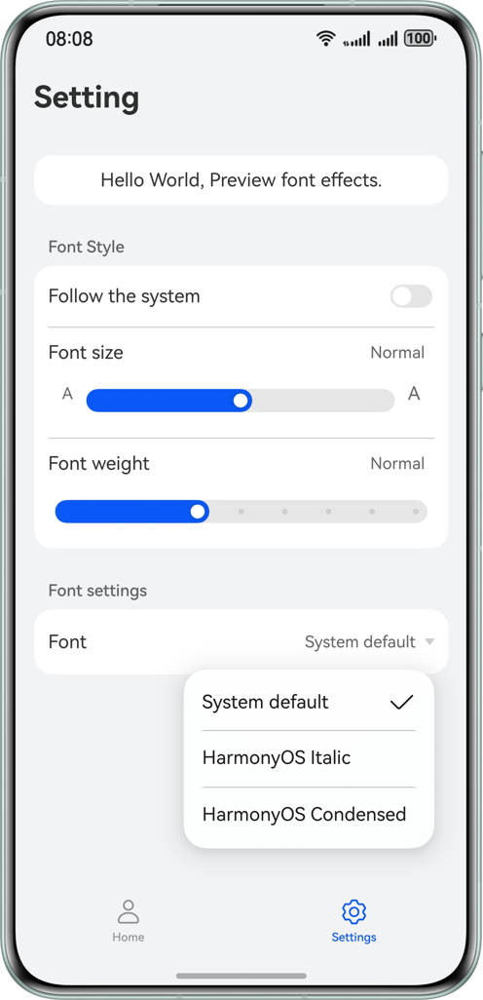

# Font Settings

#### Overview
This sample demonstrates the following functionalities based on the font control capability provided by ArkUI: displaying text with custom fonts, restoring custom fonts to system fonts, making font sizes follow system settings, and preventing font sizes from following system settings.


#### Preview

| Following the System or Not                                   | Customizing Font Size and Weight                            | Customizing the Font                                 |
|---------------------------------------------------------------|-------------------------------------------------------------|------------------------------------------------------|
|  |  |  |

#### Project Directory
```
├──entry/src/main/ets                                   // Code 
│  ├──common 
│  │  ├──CommonData.ets                                 // List data 
│  │  └──CommonUtils.ets                                // Utility class/Tool functions 
│  ├──entryability 
│  │  └──EntryAbility.ets                               // Entry point class 
│  ├──entrybackupability 
│  │  └──EntryBackupAbility.ets 
│  ├──pages                               
│  │  └──Index.ets                                      // Entry page 
│  └──view   
│     ├──HomePage.ets                                   // Home page 
│     └──SettingsPage.ets                               // Settings page 
└──entry/src/main/resources                             // Application resources
```


#### Required Permissions
None

#### Constraints
1.	This sample is only supported on Huawei phones running standard systems.
2.	The HarmonyOS version must be HarmonyOS 5.0.5 Release or later.
3.	The DevEco Studio version must be DevEco Studio 5.0.5 Release or later.
4.	The HarmonyOS SDK version must be HarmonyOS 5.0.5 Release SDK or later.

