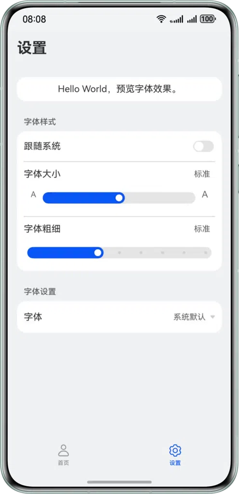

# 实现字体设置功能

#### 简介

本示例基于ArkUI提供的字体控制能力，实现了自定义字体显示文本、自定义字体恢复为系统字体、字体大小跟随系统设置、字体大小不跟随系统设置等功能。

#### 效果预览

| 是否跟随系统设置                                                    | 自定义字体大小和字重                                                | 自定义字体                                              |
|-------------------------------------------------------------|-----------------------------------------------------------|----------------------------------------------------|
|  |  |  |

#### 工程目录

```
├──entry/src/main/ets                                   // 代码区
│  ├──common
│  │  ├──CommonData.ets                                 // 列表数据
│  │  └──CommonUtils.ets                                // 工具类/工具函数
│  ├──entryability
│  │  └──EntryAbility.ets                               // 程序入口类
│  ├──entrybackupability
│  │  └──EntryBackupAbility.ets
│  ├──pages                              
│  │  └──Index.ets                                      // 入口页
│  └──view  
│     ├──HomePage.ets                                   // 首页
│     └──SettingsPage.ets                               // 设置页
└──entry/src/main/resources                             // 应用资源目录
```

#### 相关权限

无

#### 约束与限制

1. 本示例仅支持标准系统上运行，支持设备：华为手机。
2. HarmonyOS系统：HarmonyOS 5.0.5 Release及以上。
3. DevEco Studio版本：DevEco Studio 5.0.5 Release及以上。
4. HarmonyOS SDK版本：HarmonyOS 5.0.5 Release SDK及以上。
