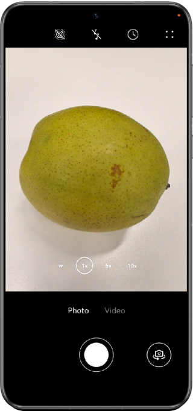
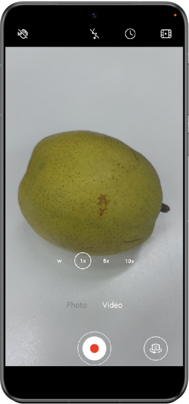

# System-Level Camera Experience for a Third-Party Camera App

This sample demonstrates a third-party camera app featuring system-level camera-level effects and functionalities, such as resolution control, moving photo, video stabilization, and continuous zoom. These capabilities are achieved through the open camera capabilities of HarmonyOS.

## Preview




## How to Use

The application allows users to click on the circular button at the bottom to take photos, as well as rotate the camera angle, switch between front and rear cameras, and adjust zoom, flash, and other parameters. After taking the photo, users can preview it.
## Project Directory

```
├──entry/src/main/ets/
│  ├──constants
│  │  └──CameraConstants.ets
│  ├──entryability
│  │  └──EntryAbility.ets 
│  ├──pages
│  │  ├──Index.ets                       // Home page 
│  │  └──MovingPhotoPage.ets             // Moving photo preview page  
│  └──utils
│     ├──CameraShooter.ets               // Photographing 
│     ├──GravityUtil.ets                 // Gravity tools 
│     ├──PreviewUtil.ets                 // Preview tools 
│     └──VideoRecorder.ets               // Video recording
└──entry/src/main/resource               // Static resources
```

## How to Implement
Use Camera Kit to take photos and use **photoAccessHelper** to save photos and videos.

## Required Permissions
1. The media permission is restricted and requires applying for [ACL](https://developer.huawei.com/consumer/en/doc/harmonyos-guides/declare-permissions-in-acl), generating debugging certificates, and obtaining permission to store photos in the system gallery.

2. Camera permissions:
**ohos.permission.CAMERA** :Used for third-party camera development scenarios;
**ohos.permission.MICROPHONE**:For third-party camera recording scenarios.

3. Media library permissions:
**ohos.permission.READ_IMAGEVIDEO**:For third-party camera to read media files;
**ohos.permission.WRITE_IMAGEVIDEO**:For third-party camera to save media files;
**ohos.permission.MEDIA_LOCATION**:For third-party camera to access media information scenarios.

## Constraints

1. The sample app is supported only on Huawei phones running the standard system.

2. The HarmonyOS version must be HarmonyOS 5.0.0 Release or later.

3. The DevEco Studio version must be DevEco Studio 5.0.0 Release or later.

4. The HarmonyOS SDK version must be HarmonyOS 5.0.0 Release SDK or later.
