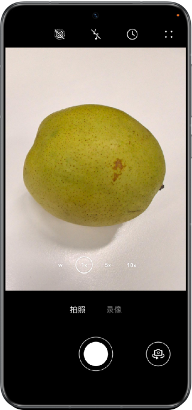
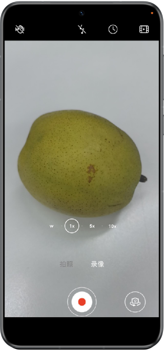

# 基于相机开放能力实现系统级相机

本示例展示了如何使用HarmonyOS提供的相机开放能力，主要包括使用Camera kit拍摄以及photoAccessHelper进行保存图片和视频。本示例主要适用于第三方应用调用系统相机能力，实现系统相机级别的效果和能力，比如分辨率、动图、视频防抖、连续变焦等。

## 效果展示




## 使用说明

应用可以点击底部圆形按钮拍摄照片，同时可以实现旋转相机角度、切换前后摄像头等操作和调节变焦、闪光灯等参数，拍摄完成后可以预览照片。

## 工程目录

```
├──entry/src/main/ets/
│  ├──constants
│  │  └──CameraConstants.ets
│  ├──entryability
│  │  └──EntryAbility.ets 
│  ├──pages
│  │  ├──Index.ets                       // 主页 
│  │  └──MovingPhotoPage.ets             // 动态照片预览页
│  └──utils
│     ├──CameraShooter.ets               // 拍照  
│     ├──GravityUtil.ets                 // 重力工具类 
│     ├──PreviewUtil.ets                 // 预览工具类  
│     └──VideoRecorder.ets               // 录像 
└──entry/src/main/resource               // 应用静态资源目录
```

## 实现思路

使用Camera kit拍摄以及photoAccessHelper进行保存图片和视频。

## 相关权限
1、媒体库权限是受限权限，需要申请[ACL提权](https://developer.huawei.com/consumer/cn/doc/harmonyos-guides/declare-permissions-in-acl)，生成调试证书，获得权限将照片存入系统图库

2、相机权限：
ohos.permission.CAMERA:用于三方相机开发场景；
ohos.permission.MICROPHONE:用于三方相机录像场景。

3、媒体库权限：
ohos.permission.READ_IMAGEVIDEO：用于三方相机读取媒体文件；
ohos.permission.WRITE_IMAGEVIDEO：用于三方相机保存媒体文件；
ohos.permission.MEDIA_LOCATION：用于三方相机获取媒体信息场景。

## 约束与限制

1. 本示例仅支持标准系统上运行，支持设备：华为手机。

2. HarmonyOS系统：HarmonyOS 5.0.0 Release及以上。

3. DevEco Studio版本：DevEco Studio 5.0.0 Release及以上。

4. HarmonyOS SDK版本：HarmonyOS 5.0.0 Release SDK及以上。
