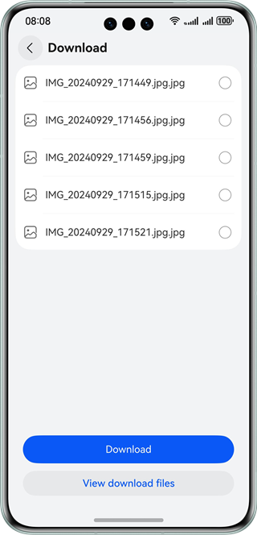

# Network Upload and Download (ArkTS)

### Overview
This sample shows how to use the APIs provided by @ohos.request to create upload and download tasks. The HTTP File Server (HFS) acts as the server to upload and download files and query tasks.

### Preview

|                Home Page                 |                   Upload                   |                      Download                      |
|:----------------------------------------:|:------------------------------------------:|:--------------------------------------------------:|
|  |  |  |

### How to Use

1. Configure the server. For details, see [Configuring the HFS](./environment/README.en.md).

2. Tap **Upload** or **Download** on the home page. To download data in the background, you must enable the background task first.

3. Upload files. The app must have the permission to access Gallery.

   Tap **+**, select one or more photos from Gallery, and tap **Post** to upload them. On the photo selection screen, you can also take photos by using the camera.

   If background task is enabled on the home page, the files will be uploaded in the background. You can view the task status in the notification bar when the app runs in the background.

4. Download files. 

   Select the files to be downloaded, tap **Download**, and specify the destination directory.

   Tap **View downloaded files** and tap the folder to view the files downloaded.

   If background task is enabled on the home page, the files will be downloaded in the background. You can view the task status in the notification bar when the app runs in the background.

   Only a single file can be downloaded in the foreground. Multiple files can be downloaded in the background.

### Project Directory

```

├──entry/src/main/ets/                              // Home page
│  ├──components             
│  │  ├──AddPictures.ets                            // Component used for adding pictures
│  │  ├──CustomDataSource.ets                       // Custom data source
│  │  └──SelectFolderDialog.ets                     // Component for selecting a folder
│  ├──entryability
│  │  └──EntryAbility.ets                           // Entry ability
│  └──pages
│     ├──Download.ets                               // Download page                     
│     ├──DownloadFiles.ets                          // Page displaying the downloaded files.
│     ├──Index.ets                                  // Home page entry
│     └──Upload.ets                                 // Upload page 
├──entry/src/main/resources                         // Static resources of the app
├──features/uploadanddownload/src/main/ets/         // Upload and download
│  ├──components
│  │  ├──FileBrowse.ets                             // Component for viewing downloaded files
│  │  └──FilesDetailView.ets                        // Component for viewing downloaded files detail 
│  ├──download                                      // Download
│  │  ├──model
│  │  │  └──FileModel.ets
│  │  ├──RequestDownload.ets                        // Download module
│  │  └──RequestFiles.ets
│  ├──upload                                        
│  │  └──RequestUpload.ets                          // Upload module
│  └──utils                                         // Utilities
│     ├──Constants.ets
│     ├──FileUtils.ets
│     ├──Logger.ets
│     ├──MediaUtils.ets
│     └──UrlUtils.ets
└──features/uploadanddownload/src/main/resources    // Static resources of the app
```

### How to Implement

* This sample has two modules:
  * Upload module
    * Use **agent.create** in @ohos.request to create an upload task, and use task-related APIs in @ohos.request to create or cancel an upload task and obtain the upload progress. If the operation fails, the query API will be called to obtain the failure cause and log the failure. Multiple files can be uploaded at a time.
    * Source code: [RequestUpload.ets](./features/uploadanddownload/src/main/ets/upload/RequestUpload.ets), [AddPictures.ets](./entry/src/main/ets/components/AddPictures.ets), [Upload.ets](./entry/src/main/ets/pages/Upload.ets)
    * APIs: @ohos.request and @ohos.file.picker
  * Download module
    * Use **agent.create** in @ohos.request to create a download task, and use task-related APIs in @ohos.request to create, cancel, pause, or resume a download task and obtain the download progress. 

      If the operation fails, the query API will be called to obtain the failure cause and log the failure. 

      Only a single file can be downloaded in the foreground, and multiple files can be downloaded at a time in the background. 

      Use @ohos.file.fs APIs to create the destination directory for a download task and query downloaded files.

    * Source code: [RequestDownload.ets](./features/uploadanddownload/src/main/ets/download/RequestDownload.ets), [Download.ets](./entry/src/main/ets/pages/Download.ets), [FileUtils.ets](./features/uploadanddownload/src/main/ets/utils/FileUtils.ets) and [FileBrowse.ets](./features/uploadanddownload/src/main/ets/components/FileBrowse.ets)

    * APIs: @ohos.request and @ohos.file.fs

### Required Permissions

- ohos.permission.INTERNET

- ohos.permission.READ_MEDIA


### Dependencies

[HFS](./environment/README.en.md)

### Constraints

1. The sample app is supported only on Huawei phones running the standard system.

2. The HarmonyOS version must be HarmonyOS 5.0.5 Release or later.

3. The DevEco Studio version must be DevEco Studio 5.0.5 Release or later.

4. The HarmonyOS SDK version must be HarmonyOS 5.0.5 Release or later.
