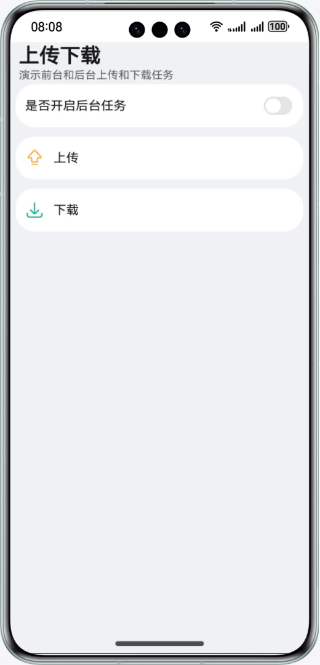

# 实现上传和下载功能

### 介绍
本示例使用@ohos.request接口创建上传和下载任务，实现上传、下载功能，hfs作为服务器，实现了文件的上传和下载和任务的查询功能。帮助开发者实现上传、下载文件并查询的场景。

### 效果预览

|                    主页                    |                     上传                     |                         下载                         |
|:----------------------------------------:|:------------------------------------------:|:--------------------------------------------------:|
|  |  |  |

使用说明

1. 本示例功能需要先配置服务器环境后使用，具体配置见[上传下载服务配置](./environment/README.md)。

2. 首页展示上传和下载两个入口组件，点击进入对应的页面，如果要使用后台下载任务，请开启后台任务开关。

3. 上传页面(请先在图库中确定已开启图库权限)：

    3.1 点击**+**，**从相册选择**拉起图库选择照片，图片选择页面支持拍照，选择照片后点击发表进行上传。 
   
    3.2 在首页中打开后台任务开关后，上传页面开启的是后台上传任务，后台任务在应用退出到后台时可以在通知栏看到任务状态。

4. 下载页面：

    4.1 点击文件列表选择要下载的文件后，点击**下载**选择指定路径后开始下载。

    4.2 点击**查看下载文件**进入下载文件页面，点击文件夹查看文件夹内的文件。

    4.3 在首页中打开后台任务开关后，下载页面开启的是后台下载任务，后台任务在应用退出到后台时可以在通知栏看到任务状态。

    4.4 前台下载时只支持单文件下载，后台下载时支持选择多个文件下载。

### 工程目录

```

├──entry/src/main/ets/                              // 应用首页
│  ├──components             
│  │  ├──AddPictures.ets                            // 添加图片组件
│  │  ├──CustomDataSource.ets                       // 自定义数据源
│  │  └──SelectFolderDialog.ets                     // 选择文件夹组件
│  ├──entryability
│  │  └──EntryAbility.ets                           // 程序入口类
│  └──pages
│     ├──Download.ets                               // 下载页面                     
│     ├──DownloadFiles.ets                          // 查看下载文件页面
│     ├──Index.ets                                  // 主页入口
│     └──Upload.ets                                 // 上传页面 
├──entry/src/main/resources                         // 应用静态资源目录
├──features/uploadanddownload/src/main/ets/         // 上传和下载
│  ├──components
│  │  ├──FileBrowse.ets                             // 查看下载文件组件  
│  │  └──FilesDetailView.ets                        // 文件详情组件  
│  ├──download                                      // 下载任务相关
│  │  ├──model
│  │  │  └──FileModel.ets
│  │  ├──RequestDownload.ets                        // 下载模块
│  │  └──RequestFiles.ets
│  ├──upload                                        
│  │  └──RequestUpload.ets                          // 上传模块
│  └──utils                                         // 相关工具类
│     ├──Constants.ets
│     ├──FileUtils.ets
│     ├──Logger.ets
│     ├──MediaUtils.ets
│     └──UrlUtils.ets
└──features/uploadanddownload/src/main/resources    // 应用静态资源目录
```

### 具体实现

* 该示例分为两个模块：
  * 上传模块
    * 使用@ohos.request中接口agent.create创建上传任务，调用@ohos.request中的Task相关接口实现上传任务的创建、取消、进度加载，失败的任务会调用查询接口获取失败原因并打印在日志中，支持多个文件上传。
    * 源码链接：[RequestUpload.ets](./features/uploadanddownload/src/main/ets/upload/RequestUpload.ets)，[AddPictures.ets](./entry/src/main/ets/components/AddPictures.ets)，[Upload.ets](./entry/src/main/ets/pages/Upload.ets)
    * 参考接口：@ohos.request，@ohos.file.picker
  * 下载模块
    * 使用@ohos.request中接口agent.create创建上传任务，调用@ohos.request中的Task相关接口实现上传任务的创建、取消、暂停、继续、进度加载，失败的任务会调用查询接口获取失败原因并打印在日志中，前台下载任务只支持单个文件下载，后台下载任务支持多文件下载。使用@ohos.file.fs完成指定路径的创建和查询已下载的文件。
    * 源码链接：[RequestDownload.ets](./features/uploadanddownload/src/main/ets/download/RequestDownload.ets)，[Download.ets](./entry/src/main/ets/pages/Download.ets)，[FileUtils.ets](./features/uploadanddownload/src/main/ets/utils/FileUtils.ets)，[FileBrowse.ets](./features/uploadanddownload/src/main/ets/components/FileBrowse.ets)
    * 参考接口：@ohos.request，@ohos.file.fs

### 相关权限

ohos.permission.INTERNET：允许应用在上传下载场景中访问网络

### 依赖

[上传下载服务配置](./environment/README.md)。

### 约束与限制

1.本示例仅支持标准系统上运行，支持设备：华为手机。

2.HarmonyOS系统：HarmonyOS 5.0.5 Release及以上。

3.DevEco Studio版本：DevEco Studio 5.0.5 Release及以上。

4.HarmonyOS SDK版本：HarmonyOS 5.0.5 Release SDK及以上。
