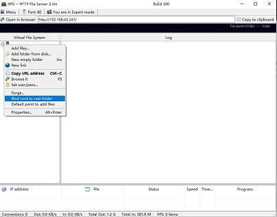
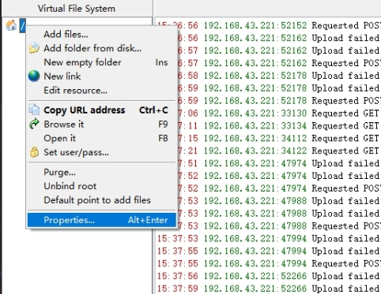
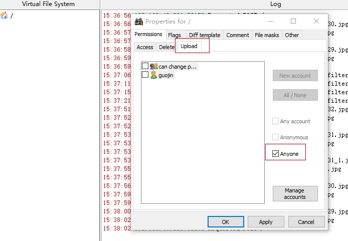
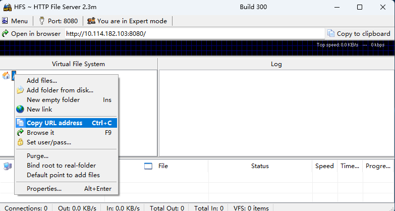

## Configuring the HFS

### **Server Configuration**

1. Connect the test device and the PC to the same LAN.

2. Open the **hfs.exe** file in the same directory on the PC.

3. Configure the HTTP File Server (HFS) client.

| Create a folder on the PC. On the HFS client, click **you are in Easy mode**. After a black area is displayed, right-click the root node and choose **bind root to real-folder** from the shortcut menu to bind the folder to the created folder. | Right-click the root node and choose **Properties** from the shortcut menu. | Click **Upload**, select **Anyone**, and click **OK**. |
| ------------------------------------------------------------ | ------------------------------------------------------------ | ------------------------------------------------------ |
|                                         |                                         |                             |

4. Set **url** in the [EntryAbility.ets](../entry/src/main/ets/entryability/EntryAbility.ets) file.

|         Obtain the client URL.         | In the **entry/src/main/ets/entryability/EntryAbility.ets** file, set **URL** in line 22 to the client URL.|
|:-------------------------:|:--------------------------------------------------------------------:|
|  |                                               |

5. Run the upload and download test tasks.

## Dependencies

The [Upload and Download](..) application depends on the HFS.
