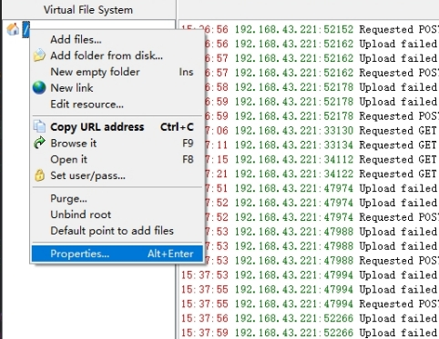

## 上传下载应用服务器使用说明

### 服务器配置：

1.测试设备和电脑连接同一个局域网。

2.电脑打开本目录下`hfs.exe`可执行文件。

3.hfs客户端配置：

| 电脑端创建一个文件夹，hfs客户端点击you are in Easy mode出现黑色区域后，在根节点右键点击bind root to real-folder，绑定到创建的文件夹 | 根节点右键点击Properties | 点击upload选项，勾选anyone后，点击ok |
|-------------------------------------------------------------------------------------------| ------------------------ | ------------------------------------ |
|                                                                      |     |           |

4.设置[EntryAbility.ets](../entry/src/main/ets/entryability/EntryAbility.ets)文件中的url。

|         获取客户端url          | 修改entry/src/main/ets/entryability/EntryAbility.ets文件中第22行的url为客户端url |
|:-------------------------:|:--------------------------------------------------------------------:|
|  |                                               |

5、按照顺序操作1-4步骤后，即可运行测试上传下载任务。

## 相关依赖

[上传下载](..)应用依赖本服务。