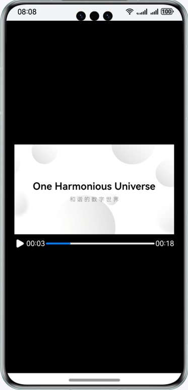

# Playing While Caching

### Overview
This sample, based on the third-party library OhosVideoCache, implements video caching-while-streaming functionality. By passing the audio/video URL to OhosVideoCache for processing and then configuring it for the media player, it enables simultaneous downloading and local caching of streaming data while reading cached content for playback. It is specifically designed for HTTP/HTTPS protocol-based streaming media playback scenarios.

### Preview



### How to Use

1. This sample requires access to a direct network video link to implement the play-while-caching feature. You can change the value of **ORIGIN_URL** in **VideoPlayerManager.ets** to the direct link(HTTP/HTTPS protocol specification type canonical resource identifier: https://xxxx.mp4) of the target video. This sample also provides a solution for playing a local video and setting up a local server to simulate accessing a network video. For details, see Setting Up a Server.

2. Install and open the app. The app downloads the audio and video data and saves it locally while reading from the local cache to play back to the player.

### Setting Up a Server

1. This sample provides a Python script for you to quickly set up a server. The Python environment must be available on the local host, and the Flask framework must be installed. You can use pip, the package installer for Python, to install Flask by running the following command on the terminal:

    ```
    pip install flask
    ```

2. Change **VIDEO_PATH** in **video_server.py** to the path of the video to play.

3. Run the script on the terminal.
    ```
    python video_server.py
    ```

4. The script starts a Flask server that listens to port 5000 by default. You can access http://\<IP address of your computer>:5000/video to play the video.

### Project Directory

```
├──entry/src/main/ets
│  ├──common
│  │  └──CommonConstants.ets            // Common constants
│  ├──entryability
│  │  └──EntryAbility.ets               // Entry ability
│  ├──model
│  │  ├──GlobalProxyServer.ets          // Proxy server
│  │  └──VideoPlayerManager.ets         // Player management class
│  ├──pages                  
│  │  └──Index.ets                      // Home page
│  └──utils
│     └──utils.ets                      // Utility class
└──entry/src/main/resource              // Static resources
```

### Required Permissions

- ohos.permission.INTERNET
- ohos.permission.GET_NETWORK_INFO

### Dependencies

N/A

### Constraints

1. The sample app is supported only on Huawei phones running the standard system.

2. The HarmonyOS version must be HarmonyOS 5.0.5 Release or later.

3. The DevEco Studio version must be DevEco Studio 5.0.5 Release or later.

4. The HarmonyOS SDK version must be HarmonyOS 5.0.5 Release SDK or later.
