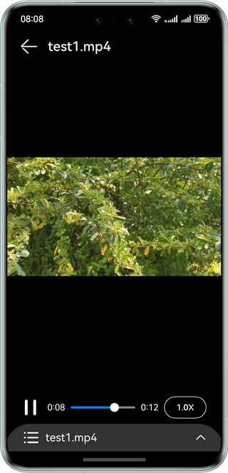

# Video Playback using AVPlayer

### Overview
The core function of video playback is to convert video data into visible signals, play the signals through output devices, and manage the playback process. This document outlines the development for scenarios such as full-process video playback, video switching, and looping.

This sample demonstrates the capabilities of playing local and online videos. It uses the interfaces provided by @ohos.multimedia.media, @ohos.resourceManager, and @ohos.wifiManager to implement video playing, pausing, and switching, as well as playback speed adjustment.

### Preview
| Play                                         | Pause                                       | Playback speed adjustment                                      | Video panel                                     |
|----------------------------------------------|---------------------------------------------|--------------------------------------------|-------------------------------------------|
|  |  |  | |


### How to Use

1. Touch the video screen. The video control panel is displayed. Touch the video screen again. The panel disappears. If you do not perform any operation within 5 seconds, the panel automatically disappears.

2. Use the pause/play button to toggle the video's play state.

3. Drag the video progress bar to seek to the specified position. The time progress is displayed in the middle of the video to show the playback progress.

4. Touch to adjust the speed, with options for 1.0x, 1.25x, 1.75x, or 2.0x.

5. Touch the video title below to switch between videos. Note: **network** indicates online videos. The app will exit if there is no Internet connection. If connected, the app allows switching between local and online videos.

6. Touch the exit arrow in the upper left corner to close the app.

### Project Directory
```
├──entry/src/main/ets                             // Core code
│  ├──components
│  │  ├──ExitVideo.ets                            // App exit components
│  │  ├──SpeedDialog.ets                          // Playback speed adjustment dialog box
│  │  ├──VideoOperate.ets                         // Video operation components
│  │  └──VideoPanel.ets                           // Video panel
│  ├──entryability
│  │  └──EntryAbility.ets                     
│  ├──pages
│  │  └──Index.ets                                // Home page
│  ├──utils
│  │  ├──GlobalContext.ets                        // Common tools
│  │  ├──Logger.ts                                // Log utility
│  │  ├──ResourceUtil.ets                         // Common tools
│  │  └──TimeUtils.ts                             // Video time helper class
│  └──videomanager                                 
│     └──AvPlayManager.ets                        // Video management interface, encapsulating the external functional APIs
└────entry/src/main/resources                     // Static resources
```

### How to Implement
+ The interfaces for playback speed adjustment, video pausing, playing, switching, and seeking are encapsulated in **AvPlayManager.ets**. For details about the source code, see [AvPlayManager.ets](entry/src/main/ets/videomanager/AvPlayManager.ets).
+ Use **media.createAVPlayer()** to obtain an **AVPlayer** object.
+ Playback speed adjustment: Call **avPlayer.setSpeed(speed: PlaybackSpeed)**.
+ Video pausing and playing: Call **avPlayer.pause()** and **avPlayer.play()**, respectively.
+ Video switching: Before video switching, call **avPlayer.reset()** to reset resources, and then use **avPlayer.fdSrc** to assign a value to **fdSrc** to trigger the reporting of the initialized state.
+ Video seeking: Call **avPlayer.seek()** when the slider is being dragged.

### Required Permissions

- ohos.permission.INTERNET

- ohos.permission.GET_WIFI_INFO

### Dependencies
N/A

### Constraints

1. The sample app is supported only on Huawei phones running the standard system.

2. The HarmonyOS version must be HarmonyOS 5.0.5 Release or later.

3. The DevEco Studio version must be DevEco Studio 5.0.5 Release or later.

4. The HarmonyOS SDK version must be HarmonyOS NEXT 5.0.5 Release SDK or later.
