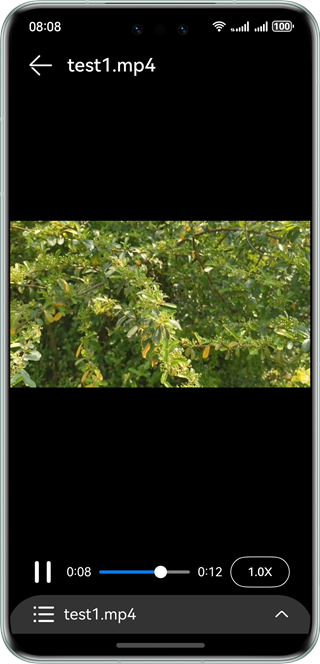
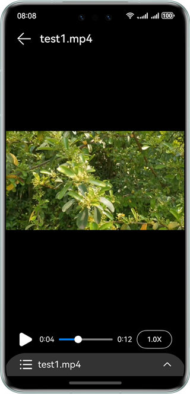
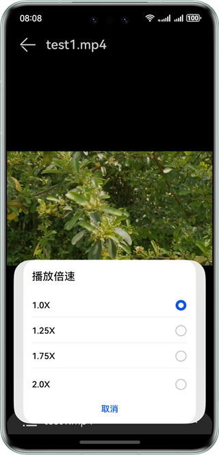
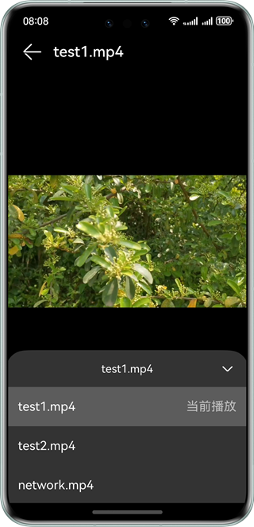

# 实现AVPlayer视频播放功能

### 介绍
视频播放的主要工作是将视频数据转码并输出到设备进行播放，同时管理播放任务。本文将对视频播放全流程、视频切换、视频循环播放等场景开发进行介绍说明。
本示例主要展示了播放本地视频和网络视频相关功能,使用 @ohos.multimedia.media, @ohos.resourceManager,@ohos.wifiManager等接口,实现了视频播放、暂停、调节倍速、切换视频的功能;实现效果如下;

### 效果预览
| 播放                                         | 暂停                                       | 倍速弹窗                                               | 视频列表                                      |
|--------------------------------------------|------------------------------------------|----------------------------------------------------|-------------------------------------------|
|  |  |  |  |


使用说明

1.点击视频界面，唤起视频操作面板，再次点击操作面板消失，如果不做任何操作操作界面会5s自动消失;

2.点击暂停/播放按钮，控制视频暂停播放;

3.滑动视频进度条，视频跳转到指定位置,在视频中间会出现时间进度方便用户查看视频进度;

4.点击倍速，可以选择1.0、1.25、1.75、2.0进行倍速调节;

5.点击下方视频名称，可以选择视频进行切换。注意：network是网络视频，没有连接网络无法切换到网络视频，有网络能在本地视频和网络视频进行切换;

6.点击左上角退出箭头，退出应用。

### 目录结构
```
├──entry/src/main/ets                             // 代码区
│  ├──components
│  │  ├──ExitVideo.ets                            // 退出应用组件
│  │  ├──SpeedDialog.ets                          // 播放倍速弹窗
│  │  └──VideoOperate.ets                         // 视频操作组件
│  ├──entryability
│  │  └──EntryAbility.ets                     
│  ├──pages
│  │  └──Index.ets                                // 首页视频界面
│  ├──utils
│  │  ├──GlobalContext.ets                        // 公共工具类
│  │  ├──Logger.ts                                // 日志帮助类
│  │  ├──ResourceUtil.ets                         // 公共工具类
│  │  └──TimeUtils.ts                             // 视频时间帮助类
│  └──videomanager                                 
│     └──AvPlayManager.ets                        // 视频管理接口，统一封装了对外提供的功能接口
└────entry/src/main/resources                     // 应用资源目录
```

### 具体实现
+ 视频倍速切换、暂停、播放、切换视频、视频跳转的功能接口都封装在AvPlayManager.ets,源码参考：[AvPlayManager.ets](entry/src/main/ets/videomanager/AvPlayManager.ets);
+ 使用media.createAVPlayer()来获取AVPlayer对象;
+ 倍速切换：选择不同的倍速时调用avPlayer.setSpeed(speed: PlaybackSpeed);
+ 暂停、播放：点击暂停、播放时调用avPlayer.pause()、avPlayer.play();
+ 切换视频：在切换视频前要先调用avPlayer.reset()重置资源，再通过avPlayer.fdSrc为fdSrc赋值触发initialized状态机上报;
+ 视频跳转：在拖动滑动条时调用avPlayer.seek()

### 相关权限

#### ohos.permission.INTERNET
#### ohos.permission.GET_NETWORK_INFO

### 依赖
不涉及。

### 约束与限制

1.本示例仅支持标准系统上运行，支持设备：华为手机。

2.HarmonyOS系统：HarmonyOS 5.0.5 Release及以上。

3.DevEco Studio版本：DevEco Studio 5.0.5 Release及以上。

4.HarmonyOS SDK版本：HarmonyOS 5.0.5 Release SDK及以上。
