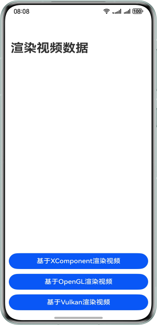
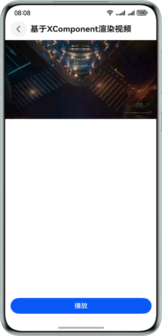
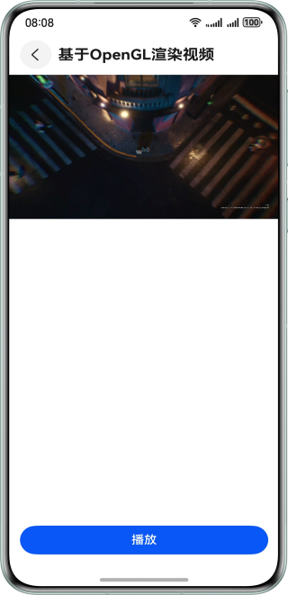
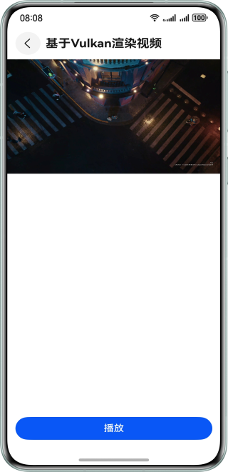

# 渲染视频数据

## 项目简介
本示例适用于视频解码后的视频画面渲染送显，渲染送显的方式包括基于XComponent渲染送显、基于OpenGL渲染送显、基于Vulkan渲染送显。本示例提供了视频渲染的多种方案，帮助开发者实现自定义播放器开发，了解视频解码到渲染的全流程。


## 效果预览
| 首页                                                  | 基于XComponent播放页                                     |
|-----------------------------------------------------|--------------------------------------------------------| 
|    |  | 
| 基于OpenGL播放页                                         | 基于Vulkan播放页                                     |
|  |  |

## 使用说明
点击进入基于XComponent渲染视频、基于OpenGL渲染视频、基于Vulkan渲染视频的子页面，点击播放即可渲染播放视频。

## 工程目录

```
├───entry/src/main/cpp
│   ├───capbilities
│   │   ├───include
│   │   │   ├───SampleInfo.h                // 视频样本
│   │   │   ├───SampleCallback.h            // 视频回调
│   │   │   ├───Demuxer.h                   // 媒体解析
│   │   │   └───VideoDecoder.h              // 视频解码
│   │   └───src
│   │       ├───SampleCallback.cpp          // 视频回调
│   │       ├───Demuxer.cpp                 // 媒体解析
│   │       └───VideoDecoder.cpp            // 视频解码
│   ├───player
│   │   ├───include
│   │   │   └───Player.h                    // 视频播放
│   │   ├───src
│   │   │   └───Player.cpp                  // 视频播放
│   └───render
│       ├───include
│       │   ├───OpenGLRender.h              // OpenGL渲染上下文
│       │   ├───OpenGLRenderThread.h        // OpenGL渲染线程
│       │   ├───PluginManager.h             // XComponent管理
│       │   ├───PluginRender.h              // 渲染管理
│       │   ├───ShaderProgram.h             // 着色器
│       │   ├───VulkanRender.h              // Vulkan渲染上下文
│       │   └───VulkanRenderThread.h        // Vulkan渲染线程
│       └───src
│           ├───OpenGLRender.cpp            // OpenGL渲染上下文
│           ├───OpenGLRenderThread.cpp      // OpenGL渲染线程
│           ├───PluginManager.cpp           // XComponent管理
│           ├───PluginRender.cpp            // 渲染管理
│           ├───ShaderProgram.cpp           // OpenGL着色器
│           ├───VulkanRender.cpp            // Vulkan渲染上下文
│           └───VulkanRenderThread.cpp      // Vulkan渲染线程
├───entry/src/main/ets
│   ├───entryability
│   │   └-──EntryAbility.ets                // 主Ability的生命周期回调内容
│   ├───entrybackupability
│   │   └───EntryBackupAbility.ets          // Ability的生命周期回调内容
│   └───pages
│       ├───OpenGLPlayer.ets                // OpenGL播放页面
│       ├───Index.ets                       // 首页
│       ├───VulkanPlayer.ets                // Vulkan播放页面
│       └───XComponentPlayer.ets            // XComponent播放页面
└───entry/src/main/resources                // 资源目录          
```

## 具体实现
### 基于XComponent渲染视频
1. 在XComponent创建时，通过回调函数OnSurfaceCreatedCB获取对应的NativeWindow对象。
2. 实现编解码器的基本功能，包括解封装器、解码器等。
3. 实现播放功能，启动输入子线程、输出子线程。
4. 在解码输入子线程中，通过解封装器读取视频数据，并提交给解码器。
5. 在解码输出子线程中，将解码后的数据提交给输出Surface。

### 基于OpenGL渲染视频
1. 实现OpenGL渲染子线程相关的内容，包括初始化OpenGL环境、创建Surface、初始化NativeImage等基础能力。
2. 创建NativeImage对象，并根据NativeImage获取NativeWindow对象。
3. 在XComponent创建时，通过回调函数OnSurfaceCreatedCB获取对应的NativeWindow对象，OpenGL通过XComponent的NativeWindow对象创建Surface。 
4. 实现编解码器的基本功能，包括解封装器、解码器等。
5. 实现播放功能，启动输入子线程、输出子线程。 
6. 在解码输入子线程中，通过解封装器读取视频数据，并提交给解码器。 
7. 在解码输出子线程中，将解码后的数据提交给输出Surface，即NativeImage的NativeWindow对象。 
8. 通过NativeImage，将视频图像缓存更新至OpenGL的纹理上。 
9. 通过eglSwapBuffers将渲染的缓存提交给XComponent的NativeWindow对象。

### 基于Vulkan渲染视频
1. 创建渲染子线程，在启动子线程时，加载Vulkan的动态链接库。
2. 创建NativeImage对象，并根据NativeImage获取NativeWindow对象。
3. 在XComponent创建时，通过回调函数OnSurfaceCreatedCB获取对应的NativeWindow对象，Vulkan通过XComponent的NativeWindow对象创建Surface。
4. 实现编解码器的基本功能，包括解封装器、解码器等。
5. 实现播放功能，启动输入子线程、输出子线程。
6. 在解码输入子线程中，通过解封装器读取视频数据，并提交给解码器。
7. 在解码输出子线程中，将解码后的数据提交给输出Surface，即NativeImage的NativeWindow对象。
8. 在NativeImage有可用数据后，通过OH_NativeImage_AcquireNativeWindowBuffer()获取视频数据，并通过OH_NativeBuffer_FromNativeWindowBuffer()转化为NativeBuffer的类型。
9. Vulkan获取到NativeBuffer后，将格式转化为RGBA后进行渲染显示。

## 相关权限

不涉及

## 约束与限制

1. 本示例仅支持标准系统上运行，支持设备：华为手机。

2. HarmonyOS系统：HarmonyOS 5.1.1 Release及以上。

3. DevEco Studio版本：DevEco Studio 5.1.1 Release及以上。

4. HarmonyOS SDK版本：HarmonyOS 5.1.1 Release SDK及以上。