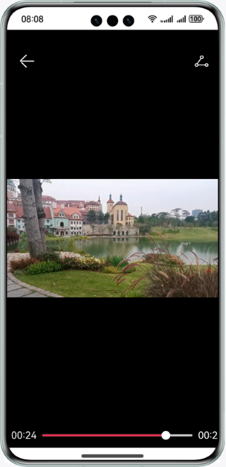

# 实现视频播放的功能

### 介绍

本示例通过系统组件Video，实现视频播放的功能，包含视频组件化、全屏播放视频、小窗口播放视频、上下轮播视频等。帮助有媒体播放业务的开发者掌握Video组件的相关接口和属性，开发自己的业务。

### 效果预览
| 首页                                    | 弹窗                                            | 视频                                     | 直播                                           |
|---------------------------------------|-----------------------------------------------|----------------------------------------|----------------------------------------------|
|  |  |  |  |

### 使用说明：
1. 进入首页点击播放按键；
2. 点击视频播放按钮，视频开始播放,再次点击视频进入视频全屏页；
3. 首页下滑500vp后，视频小窗口化；
4. 点击直播按钮进入直播页，上下滑动视频。

### 目录结构
```
├──entry/src/main                                // 代码区
│  ├──ets
│  │  ├──application
│  │  │  └──MyAbilityStage.ets
│  │  ├──entryability
│  │  │  └──EntryAbility.ets 
│  │  └──pages
│  │     ├──FullPage.ets                         // 全屏播放视频页
│  │     ├──Index.ets                            // 首页
│  │     └──LivePage.ets                         // 直播页
│  └──resources                                  // 应用资源目录
└──VideoComponent/src/main                       // 代码区
   ├──ets
   │  ├──mock
   │  │  └──LiveData.ets                         // mock直播数据
   │  ├──model
   │  │  └──LiveDataModel.ets                    // 直播数据结构
   │  ├──net
   │  │  └──Utils.ets
   │  └──pages
   │     ├──CommentPage.ets                      // 评论页面
   │     ├──FullPage.ets                         // 全屏播放视频页
   │     ├──LivePage.ets                         // 直播页
   │     ├──MainPage.ets                         // 首页
   │     ├──SmallVideo.ets                       // 小窗口
   │     └──VideoPage.ets                        // 视频播放页
   └──resources                                  // 应用资源目录
```
### 具体实现
  + 视频播放：start方法视频开始播放，源码参考[VideoPage.ets](VideoComponent/src/main/ets/components/pages/VideoPage.ets)；
  + 全屏播放：再次点击视频进入全屏播放页面，使用setCurrentTime参数设定当前播放时间，pause方法停止播放，源码参考[FullPage.ets](VideoComponent/src/main/ets/components/pages/FullPage.ets);
  + 小窗口播放：记录当前播放时间，小窗口页面渲染之前设置视频当前播放时间，页面滚动到固定距离开始展示组件；
  + 直播：使用http接口的request方法获取直播数据，代码参考[Utils.ets](VideoComponent/src/main/ets/components/net/Utils.ets)，使用时请将虚拟网络地址替换为真实地址;

### 相关权限

ohos.permission.INTERNET

### 依赖

不涉及。

### 约束与限制

1.本示例仅支持标准系统上运行，支持设备：华为手机。

2.HarmonyOS系统：HarmonyOS 5.0.5 Release及以上。

3.DevEco Studio版本：DevEco Studio 5.0.5 Release及以上。

4.HarmonyOS SDK版本：HarmonyOS 5.0.5 Release SDK及以上。

