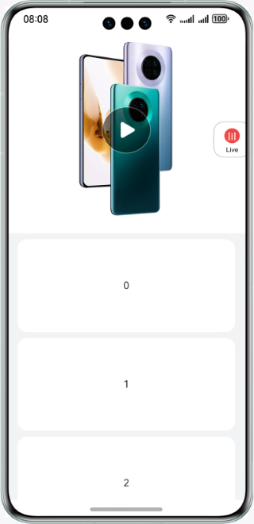
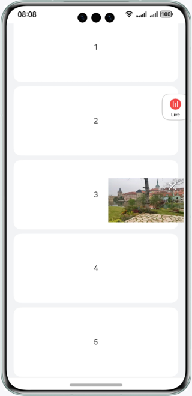
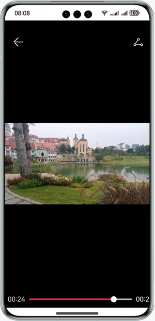
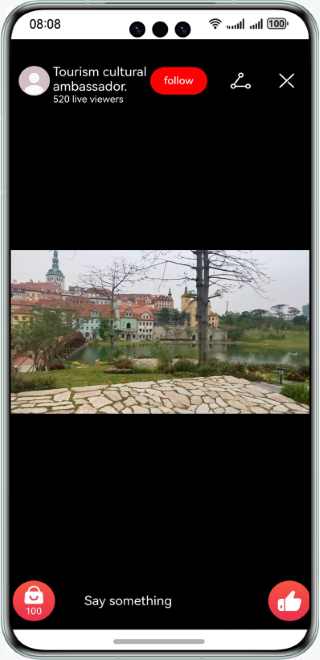

# Videos in the Media Library

### Overview

This sample demonstrates the basic features of the **Video** component, including video componentization, full-screen display, window display, and video rotation.

### Preview
| Home page                                | Small window                                     | Video                                    | Live                                            |
|------------------------------------------|--------------------------------------------------|----------------------------------------|-------------------------------------------------|
|  |  |  |  |

### How to Use
1. On the home page, touch the play button.
2. The video plays. Touch the video again. The video plays in full-screen mode.
3. Swipe up on the screen. When the home page slides down by 500vp, the video is displayed in a small window.
4. Touch the live button. The live screen is displayed, where you can swipe up or down to view videos.

### Project Directory
```
├──entry/src/main                                // Core code
│  ├──ets
│  │  ├──application
│  │  │  └──MyAbilityStage.ets
│  │  ├──entryability
│  │  │  └──EntryAbility.ets 
│  │  └──pages
│  │     ├──FullPage.ets                         // Full-screen video playback page
│  │     ├──Index.ets                            // Home page
│  │     └──LivePage.ets                         // Live page
│  └──resources                                  // Static resources
└──VideoComponent/src/main                       // Core code
   ├──ets
   │  ├──mock
   │  │  └──LiveData.ets                         // Mock live data
   │  ├──model
   │  │  └──LiveDataModel.ets                    // Live data structure
   │  ├──net
   │  │  └──Utils.ets
   │  └──pages
   │     ├──CommentPage.ets                      // Comment page
   │     ├──FullPage.ets                         // Full-screen video playback page
   │     ├──LivePage.ets                         // Live page
   │     ├──MainPage.ets                         // Home page
   │     ├──SmallVideo.ets                       // Small window
   │     └──VideoPage.ets                        // Video playback page
   └──resources                                  // Static resources
```
### How to Implement
  + Video playback: Use the **start** method to start video playback. For details about the source code, see [VideoPage.ets](VideoComponent/src/main/ets/components/pages/VideoPage.ets).
  + Full-screen playback: Touch the video again to enter the full-screen mode. Use the **setCurrentTime** parameter to set the current playback time and the **pause** method to pause the playback. For details about the source code, see [FullPage.ets](VideoComponent/src/main/ets/components/pages/FullPage.ets).
  + Small-window playback: Record the current playback time. Before rendering the small-window page, set the current playback time. Display the component when the page scrolls by a fixed distance.
  + Live: Use the **request** method of the http interface to obtain live data. For details about the code, see [Utils.ets](VideoComponent/src/main/ets/components/net/Utils.ets).

### Required Permissions

ohos.permission.INTERNET

### Dependencies

N/A

### Constraints

1. The sample app is supported only on Huawei phones running the standard system.

2. The HarmonyOS version must be HarmonyOS 5.0.5 Release or later.

3. The DevEco Studio version must be DevEco Studio 5.0.5 Release or later.

4. The HarmonyOS SDK version must be HarmonyOS 5.0.5 Release or later.
