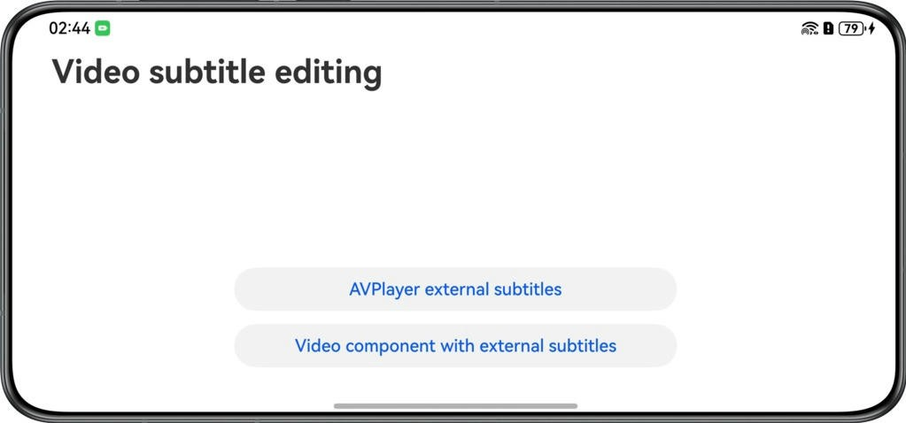

# Setting External Subtitles for Video

## Overview

This sample demonstrates how to set external subtitles for videos and set the subtitle font format, font size, and color using AVPlayer and the Video component.

## Effect

| Home Screen |          |
|:------------|--------------------------------------------------------------------|
| Effect      |  |

## How to Use
1. Open the application and tap AVPlayer external subtitles or Video component with external subtitles.
2. Tap the bottom font icon to set the subtitle format and confirm.

## Project Directory

```
├──entry/src/main/ets/                              
│  ├──entryability
│  │  └──EntryAbility.ets                           // Entry point
│  ├──constants
│  │  └──Constants.ets                              // Constants
│  ├──model  
│  │  └──ViewModel.ets                              // Video playback parameter class     
│  ├──pages  
│  │  ├──Index.ets                                  // Home page        
│  │  └──VideoPage.ets                              // Video playback page
│  ├──utils                                         
│  │  ├──CommonUtil.ets                             // Common utility
│  │  └──Logger.ets                                 // Log utility
│  └──views             
│     ├──AvPlayerComponent.ets                      // AVPlayer video component
│     ├──CaptionFontComponent.ets                   // Caption font settings component
│     └──VideoPlayerComponent.ets                   // Video playback component
└──entry/src/main/resources                         // Static resources
```

## How to Implement

1. Register the on('subtitleUpdate') method with the AVPlayer instance to listen for subtitle data. Update the Text component's content via state variables and adjust the subtitle format by modifying the Text component's properties.
2. Use the Update event of the Video component to listen for the video progress and refresh subtitles. Update the Text component's content via state variables and adjust the subtitle format by modifying the Text component's properties.

## Required Permissions

N/A

## Constraints

1. This sample is only supported on Huawei phones and tablets running standard systems.

2. The HarmonyOS version must be HarmonyOS 5.1.1 Release or later.

3. The DevEco Studio version must be DevEco Studio 5.1.1 Release or later.

4. The HarmonyOS SDK version must be HarmonyOS 5.1.1 Release SDK or later.

