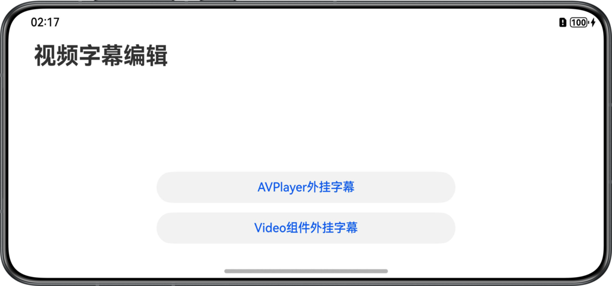

# 实现视频外挂字幕

## 项目简介

本示例分别使用AVPlayer实例和Video组件两种方式，实现了视频配置外挂字幕和设置字幕字体格式、字体大小、颜色。

## 效果预览

| 应用首页   |          |
|:-------|-----------------------------------------------------------------|
| 应用效果展示 |  |


## 使用说明
1. 打开应用，点击按钮，进入AVPlayer/Video组件外挂字幕页面。
2. 点击下方字幕设置按钮，选择字幕格式，设置完成，点击确认，字幕格式修改生效。

## 工程目录

```
├──entry/src/main/ets/                              
│  ├──entryability
│  │  └──EntryAbility.ets                           // 程序入口类
│  ├──constants
│  │  └──Constants.ets                              // 常量文件
│  ├──model  
│  │  └──ViewModel.ets                              // 视频播放参数类     
│  ├──pages  
│  │  ├──Index.ets                                  // 首页入口页面           
│  │  └──VideoPage.ets                              // 视频播放页
│  ├──utils                                         
│  │  ├──CommonUtil.ets                             // 公共工具类
│  │  └──Logger.ets                                 // 日志类
│  └──views             
│     ├──AvPlayerComponent.ets                      // AVPlayer视频播放组件
│     ├──CaptionFontComponent.ets                   // 字幕字体设置组件
│     └──VideoPlayerComponent.ets                   // Video视频播放组件
└──entry/src/main/resources                         // 应用静态资源目录
```

## 具体实现

1.AVPlayer实例注册on('subtitleUpdate')方法监听字幕信息，使用状态变量刷新Text组件内容，并通过改变Text属性修改字幕格式。

2.Video组件的Update监听视频进度，更新字幕信息，使用状态变量刷新Text组件内容，并通过改变Text属性修改字幕格式。

## 相关权限

无

## 约束与限制

1.本示例仅支持标准系统上运行，支持设备：华为手机、平板。

2.HarmonyOS系统：HarmonyOS 5.1.1 Release及以上。

3.DevEco Studio版本：DevEco Studio 5.1.1 Release及以上。

4.HarmonyOS SDK版本：HarmonyOS 5.1.1 Release SDK及以上。

