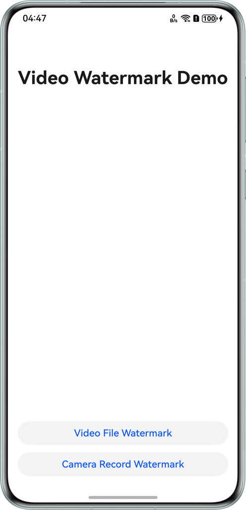
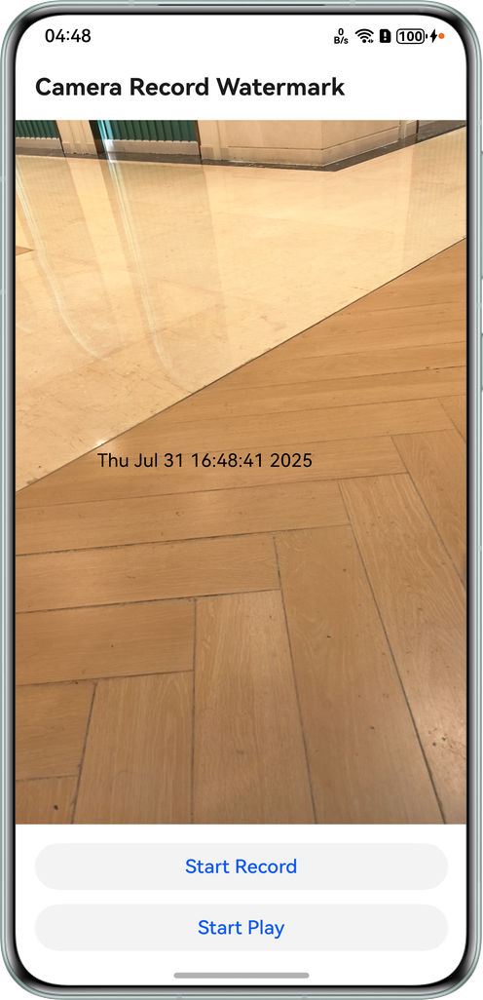
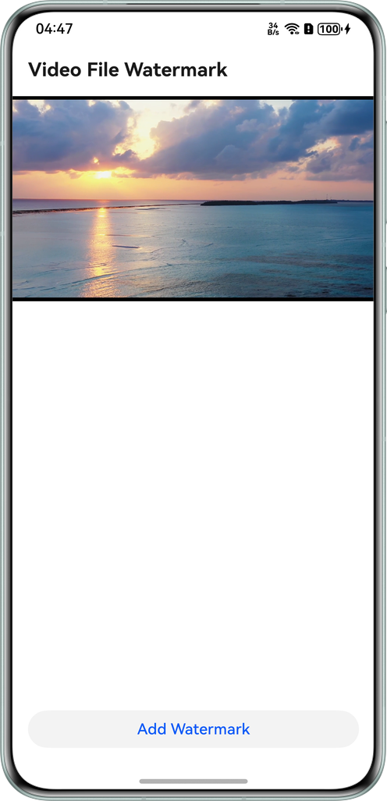

# Adding Watermarks to Videos

## Overview

This sample demonstrates how to add watermarks to local video files and apply them in real time during camera preview and recording, using the system camera, OpenGL, and video encoding and decoding capabilities.

## Preview

| Home Page                                           | Camera Watermark Page                                               | Local Video Watermark Page                                     | 
|-----------------------------------------------------| ------------------------------------------------------------ | ------------------------------------------------------ |
|  |       |  |
| 1. Select a scenario for watermark adding.          | 1. Tap **Record** to add watermarks in real time.<br>2. Tap **Play** to view the last recording. | 1. Tap **Add Watermark** to embed it into a local video.                | 

## Project Directory

```
├───entry/src/main/cpp 
│   ├───camera 
│   │   ├───ndk_camera.cpp 
│   │   └───ndk_camera.h                    // Camera management. 
│   ├───capbilities 
│   │   ├───include 
│   │   │   ├───audio_capturer.h            // Audio recording. 
│   │   │   ├───audio_decoder.h             // Audio decoding. 
│   │   │   ├───audio_encoder.h             // Audio encoding. 
│   │   │   ├───demuxer.h                   // Media parsing. 
│   │   │   ├───muxer.h                     // Media packaging. 
│   │   │   ├───video_decoder.h             // Video decoding. 
│   │   │   └───video_encoder.h             // Video encoding. 
│   │   ├───audio_capturer.cpp 
│   │   ├───audio_decoder.cpp 
│   │   ├───audio_encoder.cpp 
│   │   ├───demuxer.cpp 
│   │   ├───muxer.cpp 
│   │   ├───video_decoder.cpp 
│   │   └───video_encoder.cpp 
│   ├───common 
│   │   ├───config 
│   │   │   ├───config.cpp 
│   │   │   └───config.h                    // Application configuration. 
│   │   ├───dfx 
│   │   │   ├───error 
│   │   │   │   └───av_codec_sample_error.h // Custom error code. 
│   │   │   └───log 
│   │   │       └───av_codec_sample_log.h   // Custom logs. 
│   │   ├───file 
│   │   │   ├───file.cpp 
│   │   │   └───file.h                      // File operations. 
│   │   ├───common.h                        // Custom constants. 
│   │   ├───sample_callback.cpp 
│   │   ├───sample_callback.h               // Codec callback definition. 
│   │   └───sample_info.h                   // Codec data structure. 
│   ├───drawing 
│   │   ├───sample_bitmap.cpp 
│   │   └───sample_bitmap.h                 // Bitmap drawing. 
│   ├───manager 
│   │   ├───plugin_manager.cpp 
│   │   └───plugin_manager.h                // Native API management. 
│   ├───recorder 
│   │   ├───recorder.cpp 
│   │   └───recorder.h                      // Video recording. 
│   ├───render 
│   │   ├───egl_render_context.cpp 
│   │   ├───egl_render_context.h            // OpenGL environment context. 
│   │   ├───plugin_render.cpp 
│   │   ├───plugin_render.h                 // Rendering API management. 
│   │   ├───render_thread.cpp 
│   │   ├───render_thread.h                 // Rendering thread class. 
│   │   ├───shader_program.cpp 
│   │   └───shader_program.h                // OpenGL shader program. 
│   └───transform 
│       ├───transform.cpp 
│       └───transform.h                     // Used to add watermarks to local video files. 
├───entry/src/main/ets 
│   ├───commonutils 
│   │   ├───Logger.ets                      // Log utility. 
│   │   └───XComponentContext.ets           // XComponent APIs. 
│   ├───components 
│   │   └───CustomButton.ets                // Custom button. 
│   ├───entryability 
│   │   ├───CameraAbility.ets               // Lifecycle callbacks for the camera watermark adding ability. 
│   │   ├───EntryAbility.ets                // Lifecycle callbacks for the entry ability. 
│   │   └───VideoFileAbility.ets            // Lifecycle callbacks for the local video watermark adding ability. 
│   ├───entrybackupability 
│   │   └───EntryBackupAbility.ets          // Lifecycle callbacks for the entry ability. 
│   └───pages 
│       ├───CameraRecordWaterMark.ets       // Used to add watermarks to camera streams. 
│       ├───Index.ets                       // Home page. 
│       └───VideoFileWaterMark.ets          // Used to add watermarks to local videos. 
└───entry/src/main/resources                // Resource directory.
```

## Required Permissions

1. **ohos.permission.CAMERA**: required for camera permission.
2. **ohos.permission.MICROPHONE**: required for microphone permission.

## Module Dependency
N/A

## Constraints
1. This sample is only supported on Huawei phones running standard systems.
2. The HarmonyOS version must be HarmonyOS 5.0.5 Release or later.
3. The DevEco Studio version must be DevEco Studio 5.0.5 Release or later.
4. The HarmonyOS SDK version must be HarmonyOS 5.0.5 Release SDK or later.
