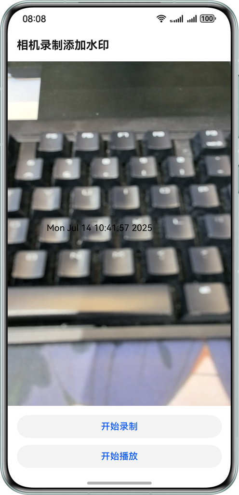
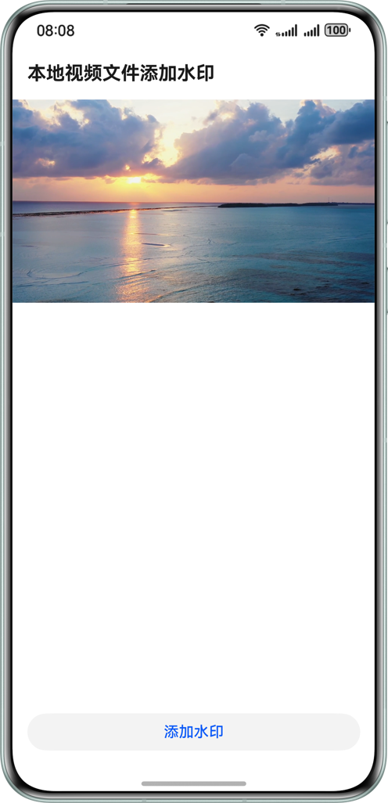

# 实现视频添加水印功能

### 介绍

本示例基于系统相机、OpenGL、视频编解码等能力，实现了本地视频文件添加水印和相机预览录制实时添加水印。

### 效果图预览
| 首页                                               | 相机添加水印页                                               | 本地视频添加水印页                                     | 
|--------------------------------------------------| ------------------------------------------------------------ | ------------------------------------------------------ |
|  |       |  |
| 1、选择添加水印场景                                       | 1、点击录制，实现实时水印添加<br>2、点击播放，播放最近一次录制视频 | 1、点击添加水印，给本地视频文件添加水印                | 

### 工程结构&模块类型

```
├───entry/src/main/cpp
│   ├───camera
│   │   ├───ndk_camera.cpp
│   │   └───ndk_camera.h                        // 相机管理
│   ├───capbilities
│   │   ├───include
│   │   │   ├───audio_capturer.h                // 音频录制
│   │   │   ├───audio_decoder.h                 // 音频解码
│   │   │   ├───audio_encoder.h                 // 音频编码
│   │   │   ├───demuxer.h                       // 媒体解析
│   │   │   ├───muxer.h                         // 媒体封装
│   │   │   ├───video_decoder.h                 // 视频解码
│   │   │   └───video_encoder.h                 // 视频编码
│   │   ├───audio_capturer.cpp
│   │   ├───audio_decoder.cpp
│   │   ├───audio_encoder.cpp
│   │   ├───demuxer.cpp
│   │   ├───muxer.cpp
│   │   ├───video_decoder.cpp
│   │   └───video_encoder.cpp
│   ├───common
│   │   ├───config
│   │   │   ├───config.cpp
│   │   │   └───config.h                        // 应用配置
│   │   ├───dfx
│   │   │   ├───error
│   │   │   │   └───av_codec_sample_error.h     // 自定义错误码
│   │   │   └───log
│   │   │       └───av_codec_sample_log.h       // 自定义日志
│   │   ├───file
│   │   │   ├───file.cpp
│   │   │   └───file.h                          // 文件操作
│   │   ├───common.h                            // 自定义常量
│   │   ├───sample_callback.cpp
│   │   ├───sample_callback.h                   // 编解码回调定义
│   │   └───sample_info.h                       // 编解码数据结构
│   ├───drawing
│   │   ├───sample_bitmap.cpp
│   │   └───sample_bitmap.h                     // 位图绘制
│   ├───manager
│   │   ├───plugin_manager.cpp
│   │   └───plugin_manager.h                    // Native接口管理
│   ├───recorder
│   │   ├───recorder.cpp
│   │   └───recorder.h                          // 视频录制
│   ├───render
│   │   ├───egl_render_context.cpp
│   │   ├───egl_render_context.h                // OpenGL环境上下文
│   │   ├───plugin_render.cpp
│   │   ├───plugin_render.h                     // 渲染接口管理
│   │   ├───render_thread.cpp
│   │   ├───render_thread.h                     // 渲染线程类
│   │   ├───shader_program.cpp
│   │   └───shader_program.h                    // OpenGL着色器程序
│   ├───transform
│   │   ├───transform.cpp
│   │   └───transform.h                         // 本地视频文件添加水印
│   ├───types                                   // 用于存放C++的API接口描述文件
│   │   └───libnativerender                     
│   │       ├───index.d.ts                      // 描述C++ API接口行为
│   │       └───oh-package.json5                // 配置.so三方包声明文件的入口及包名
│   ├───CMakeLists.txt                          // CMake配置文件
│   └───napi_init.cpp                           // 定义C++ API接口的文件
├───entry/src/main/ets
│   ├───commonutils
│   │   ├───Logger.ets                          // 日志工具类
│   │   └───XComponentContext.ets               // XComponent的接口
│   ├───components
│   │   └───CustomButton.ets                    // 自定义按钮
│   ├───entryability
│   │   ├───CameraAbility.ets                   // 相机添加水印Ability的生命周期回调内容
│   │   ├───EntryAbility.ets                    // 主Ability的生命周期回调内容
│   │   └───VideoFileAbility.ets                // 本地视频添加水印Ability的生命周期回调内容
│   ├───entrybackupability                      
│   │   └───EntryBackupAbility.ets              // Ability的生命周期回调内容
│   └───pages                                   
│       ├───CameraRecordWaterMark.ets           // 相机添加水印页
│       ├───Index.ets                           // 首页
│       └───VideoFileWaterMark.ets              // 本地视频添加水印页
└───entry/src/main/resources                    // 资源目录          
```

### 相关权限

1. 系统相机权限：ohos.permission.CAMERA

2. 麦克风使用权限：ohos.permission.MICROPHONE

### 模块依赖

不涉及

### 约束与限制

1. 本示例仅支持标准系统上运行，支持设备：华为手机

2. HarmonyOS系统：HarmonyOS 5.0.5 Release及以上。

3. DevEco Studio版本：DevEco Studio 5.0.5 Release及以上。

4. HarmonyOS SDK版本：HarmonyOS 5.0.5 Release SDK及以上。