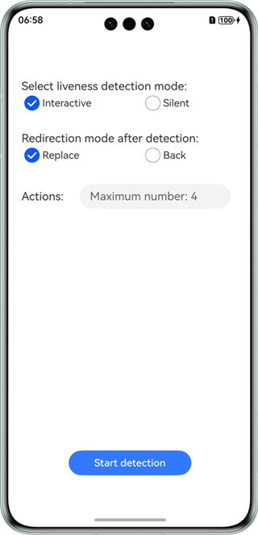
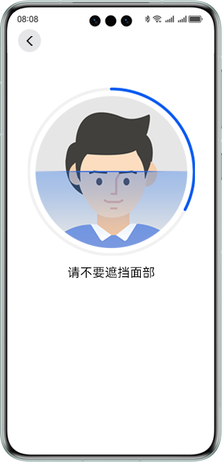
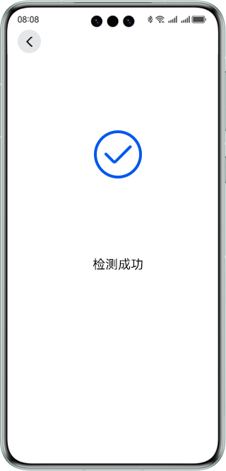
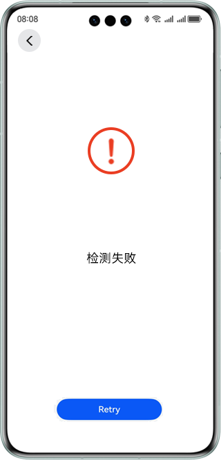
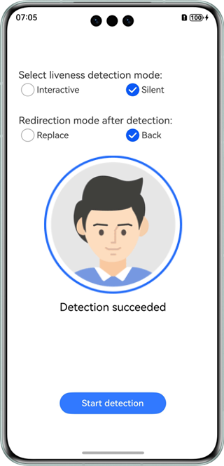
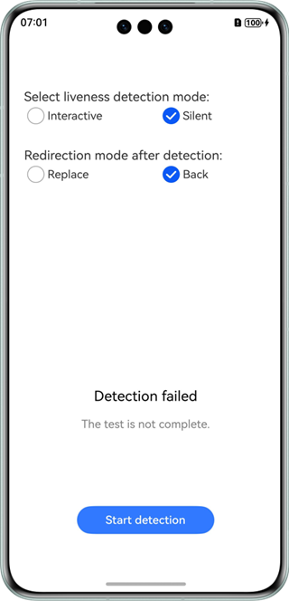

# 人脸活体检测控件

## 介绍

本示例展示了使用视觉类AI能力中的人脸活体检测能力。

本示例模拟了在应用里，跳转人脸活体检测控件，获取到检测结果并展示出来。

需要使用人脸活体检测接口@hms.ai.interactiveLiveness.d.ts。

## 效果预览

|         **主窗口**          |                 **开始检测**                  |           **检测成功**           |          **检测失败**           |         **检测结果成功**          |            **检测结果失败**             |
|:------------------------:|:-----------------------------------------:|:----------------------------:|:---------------------------:|:---------------------------:|:---------------------------------:|
|  |  |  |  |  |  | 

使用说明：

1. 在手机的主屏幕，点击”faceDetectionDemo“，启动应用。
2. 点击“Start detection”按钮，进入人脸活体检测控件。
3. 检测结束后获取到检测结果并展示出来。


## 工程目录

```
├─entry/src/main/ets                         // 代码区  
│  ├─entryability
│  │  └─EntryAbility.ets                     // 入口Ability
│  └─pages
│     └─Index.ets                            // 主页界面
└─screenshots                                // 截图
```

## 具体实现

本示例展示的控件在@hms.ai.interactiveLiveness.d.ts定义了人脸活体检测API：
```ts
function startLivenessDetection(config: InteractiveLivenessConfig): Promise<boolean>;
function getInteractiveLivenessResult(): Promise<InteractiveLivenessResult>;
```

业务使用时，需要先进行import导入interactiveLiveness。
调用进入活体控件接口和检测结果接口，接收处理返回的结果。参考entry/src/main/ets/pages/Index.ets.

## 相关权限

ohos.permission.CAMERA。

## 依赖

不涉及。

## 约束与限制

1. 本实例仅支持标准系统上运行，支持设备：华为手机、华为平板。
2. HarmonyOS系统：HarmonyOS NEXT Developer Beta1及以上。
3. DevEco Studio版本：DevEco Studio NEXT Developer Beta1及以上。
4. HarmonyOS SDK版本：HarmonyOS NEXT Developer Beta1 SDK及以上。


