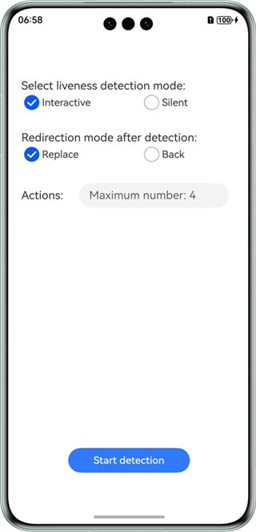
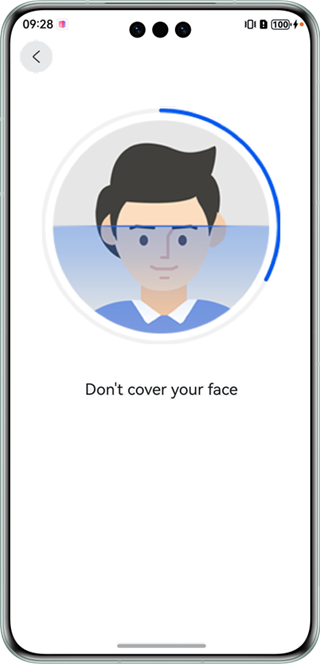
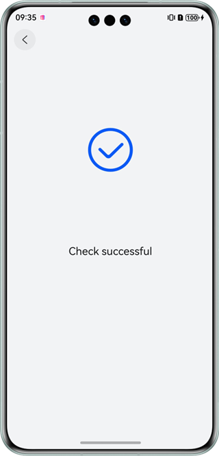
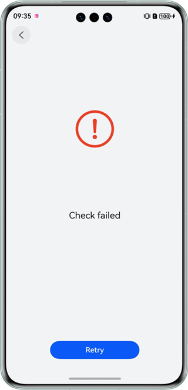
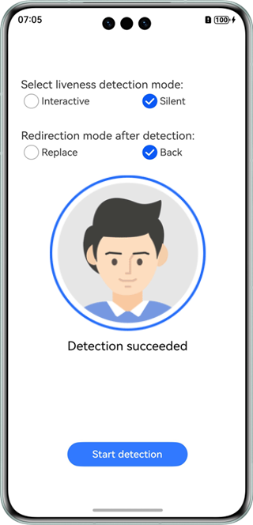
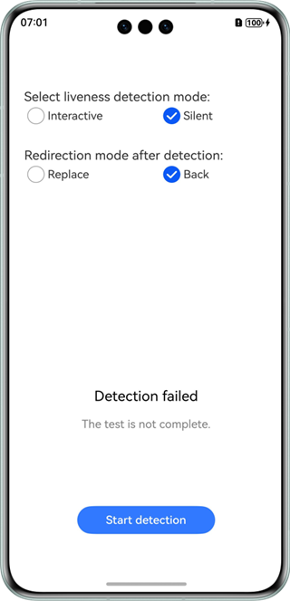

# Face Liveness Detection Control

## Overview

This sample code illustrates how to use the face liveness detection capability among the visual AI capabilities.

It simulates how to redirect to the face liveness detection control, obtain the detection result, and display the result.

You need to use **@hms.ai.interactiveLiveness.d.ts**, which contains the APIs for face liveness detection.

## Preview

|         **App home screen**         |                 **Starting detection**                 |           **Success message**          |          **Failure message**          |         **Detection success result**         |            **Detection failure result**            |
|:------------------------:|:-----------------------------------------:|:----------------------------:|:---------------------------:|:---------------------------:|:---------------------------------:|
|  |  |  |  |  |  |

Instructions:

1. On the home screen of a mobile phone, tap **faceDetectionDemo** to start the app.
2. Tap **Start detection** to access the face liveness detection control.
3. The detection result is displayed on the screen after the detection is complete.


## Project Directory

```
├─entry/src/main/ets                         // Code area
│  ├─entryability
│  │  └─EntryAbility.ets                     // Entry ability
│  └─pages
│     └─Index.ets                            // Home page
└─screenshots                                // Screenshot
```

## How to Implement

The APIs for the face liveness detection control in this sample have been defined in **@hms.ai.interactiveLiveness.d.ts**.
```ts
function startLivenessDetection(config: InteractiveLivenessConfig): Promise<boolean>;
function getInteractiveLivenessResult(): Promise<InteractiveLivenessResult>;
```

Before using the service, you need to import **interactiveLiveness**.
Call the face liveness detection API and receive the processing result. For details, please refer to **entry/src/main/ets/pages/Index.ets**.

## Required Permissions

ohos.permission.CAMERA

## Dependencies

N/A

## Constraints

1. The sample app is only supported on Huawei phones and tablets with standard systems.
2. The HarmonyOS version must be HarmonyOS NEXT Developer Beta1 or later.
3. The DevEco Studio version must be DevEco Studio NEXT Developer Beta1 or later.
4. The HarmonyOS SDK version must be HarmonyOS NEXT Developer Beta1 SDK or later.
