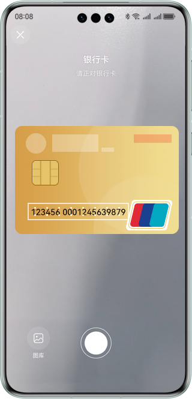

# 卡证识别控件

## 介绍

本示例展示了使用视觉类AI能力中的卡证识别能力。

本示例模拟了在应用里，跳转卡证识别控件，获取到验证结果并展示出来。

需要使用卡证识别验证接口@hms.ai.CardRecognition.d.ets。


## 效果预览

| 预览                         | 拍照                         |
| ---------------------------- | ---------------------------- |
|  |  |


使用说明：

1. 在手机的主屏幕，点击”CardRecognition“，启动应用。
2. 点击拍照按钮，识别卡证图片。
3. 拍摄完成后卡证信息显示在页面上。


## 工程目录

```
├─entry/src/main/ets                         // 代码区  
│  ├─entryability
│  │  └─EntryAbility.ets                     // 入口Ability
│  └─pages
│     ├─MainPage.ets                         // 主页界面
│     └─CardDemoPage.ets                     // 卡证控件调用界面
└─entry/src/main/resources                   // 应用资源目录
```


## 具体实现

本示例展示的控件在@hms.ai.CardRecognition.d.ets定义了卡证识别控件：
```ts
/**
 * This is a ui component used to identify card
 * @syscap SystemCapability.AI.Component.CardRecognition
 * @atomicservice
 * @since 5.0.0(12)
 */
@Component
declare struct CardRecognition {
    /**
     * Supported card identification types.
     * @type { CardType }
     * @syscap SystemCapability.AI.Component.CardRecognition
     * @atomicservice
     * @since 5.0.0(12)
     */
    supportType: CardType;
    /**
     * Card side to recognize.
     * @type { ?CardSide }
     * @default CardSide.DEFAULT
     * @syscap SystemCapability.AI.Component.CardRecognition
     * @atomicservice
     * @since 5.0.0(12)
     */
    cardSide?: CardSide;
    /**
     * Card recognition result callback.
     * @type { Callback<CallbackParam> }
     * @syscap SystemCapability.AI.Component.CardRecognition
     * @atomicservice
     * @since 5.0.0(12)
     */
    callback: Callback<CallbackParam>;
    /**
     * Card recognition config.
     * @type { ?CardRecognitionConfig }
     * @syscap SystemCapability.AI.Component.CardRecognition
     * @atomicservice
     * @since 5.0.0(12)
     */
    cardRecognitionConfig?: CardRecognitionConfig;
    /**
     * Constructor used to create a <b>CardRecognition</b> object.
     * @syscap SystemCapability.AI.Component.CardRecognition
     * @atomicservice
     * @since 5.0.0(12)
     */
    build(): void;
}
```

业务使用时，需要先进行import导入CardRecognition。
调用卡证识别接口，接收处理返回的结果。


## 相关权限

不涉及。


## 依赖

不涉及。


## 约束与限制

1. 本实例仅支持标准系统上运行，支持设备：华为手机、华为平板。
2. HarmonyOS系统：HarmonyOS NEXT Developer Beta1及以上。
3. DevEco Studio版本：DevEco Studio NEXT Developer Beta1及以上。
4. HarmonyOS SDK版本：HarmonyOS NEXT Developer Beta1 SDK及以上。

