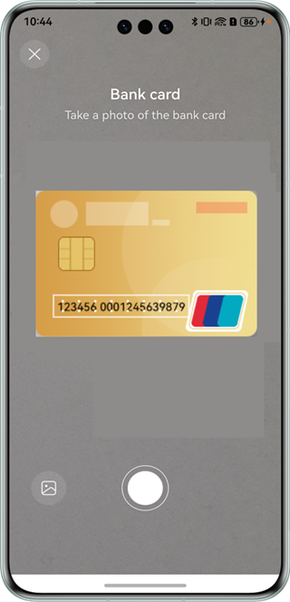
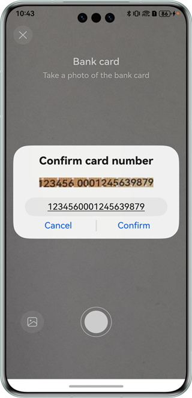

# Card Recognition Control

## Overview

This sample code illustrates how to use the card recognition capability among the visual AI capabilities.

It simulates how to redirect to the card recognition control, obtain the recognition result, and display the result.

You need to use **@hms.ai.CardRecognition.d.ets**, which contains the APIs for card recognition.


## Preview

| Preview                        | Photo taking                        |
| ---------------------------- | ---------------------------- |
|  |  |


Instructions:

1. On the home screen of a mobile phone, tap **CardRecognition** to start the app.
2. Tap the shutter button to recognize a card.
3. The card information is displayed on the screen.


## Project Directory

```
├─entry/src/main/ets                         // Code area 
│  ├─entryability
│  │  └─EntryAbility.ets                     // Entry ability
│  └─pages
│     ├─MainPage.ets                         // Main page
│     └─CardDemoPage.ets                     // Page for calling the card recognition control
└─entry/src/main/resources                   // App resource directory
```


## How to Implement

The APIs for the card recognition control in this sample have been defined in **@hms.ai.CardRecognition.d.ets**.
```ts
/**
 * This is a ui component used to identify card
 * @syscap SystemCapability.AI.Component.CardRecognition
 * @atomicservice
 * @since 5.0.0(12)
 */
@Component
declare struct CardRecognition {
    /**
     * Supported card identification types.
     * @type { CardType }
     * @syscap SystemCapability.AI.Component.CardRecognition
     * @atomicservice
     * @since 5.0.0(12)
     */
    supportType: CardType;
    /**
     * Card side to recognize.
     * @type { ?CardSide }
     * @default CardSide.DEFAULT
     * @syscap SystemCapability.AI.Component.CardRecognition
     * @atomicservice
     * @since 5.0.0(12)
     */
    cardSide?: CardSide;
    /**
     * Card recognition result callback.
     * @type { Callback<CallbackParam> }
     * @syscap SystemCapability.AI.Component.CardRecognition
     * @atomicservice
     * @since 5.0.0(12)
     */
    callback: Callback<CallbackParam>;
    /**
     * Card recognition config.
     * @type { ?CardRecognitionConfig }
     * @syscap SystemCapability.AI.Component.CardRecognition
     * @atomicservice
     * @since 5.0.0(12)
     */
    cardRecognitionConfig?: CardRecognitionConfig;
    /**
     * Constructor used to create a <b>CardRecognition</b> object.
     * @syscap SystemCapability.AI.Component.CardRecognition
     * @atomicservice
     * @since 5.0.0(12)
     */
    build(): void;
}
```

Before using the service, you need to import **CardRecognition**.
Call the card recognition API and receive the processing result.


## Required Permissions

N/A


## Dependencies

N/A


## Constraints

1. The sample app is only supported on Huawei phones and tablets with standard systems.
2. The HarmonyOS version must be HarmonyOS NEXT Developer Beta1 or later.
3. The DevEco Studio version must be DevEco Studio NEXT Developer Beta1 or later.
4. The HarmonyOS SDK version must be HarmonyOS NEXT Developer Beta1 SDK or later.
