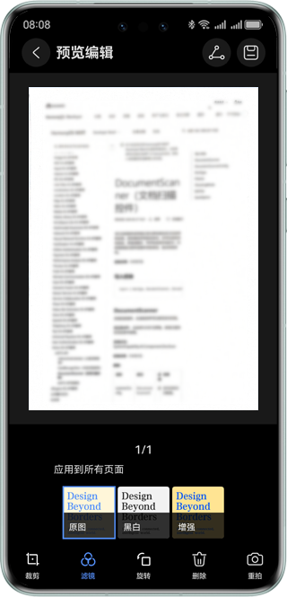

# 文档扫描控件

## 介绍

本示例展示了使用视觉类AI能力中的文档扫描能力。

本示例模拟了在应用里，跳转文档扫描控件，获取到扫描结果并展示出来。

需要使用文档扫描验证接口@hms.ai.DocumentScanner.d.ets。


## 效果预览

| 预览                         | 拍照                         | 编辑                      |
| ---------------------------- | ---------------------------- | ------------------------- |
|  |  |  |


使用说明：

1. 在手机的主屏幕，点击”DocumentScanDemo“，启动应用。
2. 点击拍照按钮，识别文档图片。
3. 点击缩略图，进入编辑页面。
4. 可更换滤镜、手动裁剪等。


## 工程目录

```
├─entry/src/main/ets                         // 代码区  
│  ├─entryability
│  │  └─EntryAbility.ets                     // 入口Ability
│  └─pages
│     └─DocDemoPage.ets                      // 文档扫描主界面
└─entry/src/main/resources                   // 应用资源目录
```


## 具体实现

本示例展示的控件在@hms.ai.DocumentScanner.d.ets定义了文档扫描控件：
```ts
/**
 * This is a ui component used for generating document scans.
 * @struct { DocumentScanner }
 * @syscap SystemCapability.AI.Component.DocScan
 * @atomicservice
 * @since 5.0.0(12)
 */
@Component
declare struct DocumentScanner {
    /**
     * config for document scanner.
     *
     * @type { DocumentScannerConfig }
     * @syscap SystemCapability.AI.Component.DocScan
     * @atomicservice
     * @since 5.0.0(12)
     */
    scannerConfig: DocumentScannerConfig;
    /**
     * @type { DocumentScannerResultCallback }
     * callback of the listened event, called when the Component is terminated.
     * @syscap SystemCapability.AI.Component.DocScan
     * @atomicservice
     * @since 5.0.0(12)
     */
    onResult: DocumentScannerResultCallback;
    /**
     * Constructor used to create a <b>DocumentScanner</b> object.
     * @syscap SystemCapability.AI.Component.DocScan
     * @atomicservice
     * @since 5.0.0(12)
     */
    build(): void;
}
```

业务使用时，需要先进行import导入DocumentScanner。
调用验证结果接口，接收处理返回的结果。


## 相关权限

不涉及。


## 依赖

不涉及。


## 约束与限制

1. 本实例仅支持标准系统上运行，支持设备：华为手机、华为平板。
2. HarmonyOS系统：HarmonyOS NEXT Developer Beta1及以上。
3. DevEco Studio版本：DevEco Studio NEXT Developer Beta1及以上。
4. HarmonyOS SDK版本：HarmonyOS NEXT Developer Beta1 SDK及以上。

