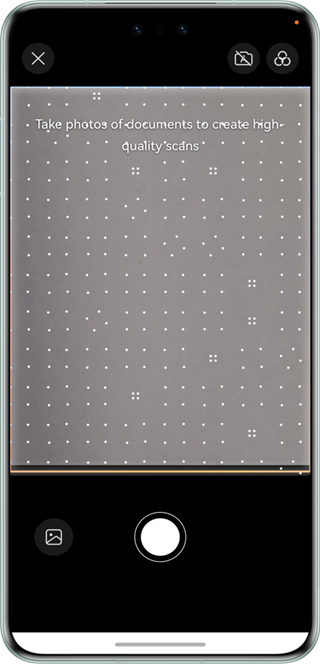

# Document Scanning Control

## Overview

This sample code illustrates how to use the document scanning capability among the visual AI capabilities.

It simulates how to redirect to the document scanning control, obtain the scanning result, and display the result.

You need to use **@hms.ai.DocumentScanner.d.ets**, which contains the APIs for document scanning.


## Preview

| Preview                        | Photo taking                        | Editing                     |
| ---------------------------- | ---------------------------- | ------------------------- |
|  |  |  |


Instructions:

1. On the home screen of a mobile phone, tap **DocumentScanDemo** to start the app.
2. Tap the shutter button to scan a document.
3. Tap the thumbnail to go to the editing page.
4. Perform operations such as changing the filter or manually clipping the image.


## Project Directory

```
├─entry/src/main/ets                         // Code area 
│  ├─entryability
│  │  └─EntryAbility.ets                     // Entry ability
│  └─pages
│     └─DocDemoPage.ets                      // Main page for document scanning
└─entry/src/main/resources                   // App resource directory
```


## How to Implement

The APIs for the document scanning control in this sample have been defined in **@hms.ai.DocumentScanner.d.ets**.
```ts
/**
 * This is a ui component used for generating document scans.
 * @struct { DocumentScanner }
 * @syscap SystemCapability.AI.Component.DocScan
 * @atomicservice
 * @since 5.0.0(12)
 */
@Component
declare struct DocumentScanner {
    /**
     * config for document scanner.
     *
     * @type { DocumentScannerConfig }
     * @syscap SystemCapability.AI.Component.DocScan
     * @atomicservice
     * @since 5.0.0(12)
     */
    scannerConfig: DocumentScannerConfig;
    /**
     * @type { DocumentScannerResultCallback }
     * callback of the listened event, called when the Component is terminated.
     * @syscap SystemCapability.AI.Component.DocScan
     * @atomicservice
     * @since 5.0.0(12)
     */
    onResult: DocumentScannerResultCallback;
    /**
     * Constructor used to create a <b>DocumentScanner</b> object.
     * @syscap SystemCapability.AI.Component.DocScan
     * @atomicservice
     * @since 5.0.0(12)
     */
    build(): void;
}
```

Before using the service, you need to import **DocumentScanner**.
Call the document scanning API and receive the processing result.


## Required Permissions

N/A


## Dependencies

N/A


## Constraints

1. The sample app is only supported on Huawei phones and tablets with standard systems.
2. The HarmonyOS version must be HarmonyOS NEXT Developer Beta1 or later.
3. The DevEco Studio version must be DevEco Studio NEXT Developer Beta1 or later.
4. The HarmonyOS SDK version must be HarmonyOS NEXT Developer Beta1 SDK or later.
