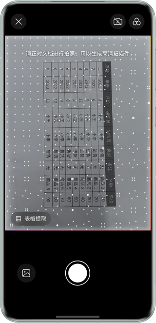
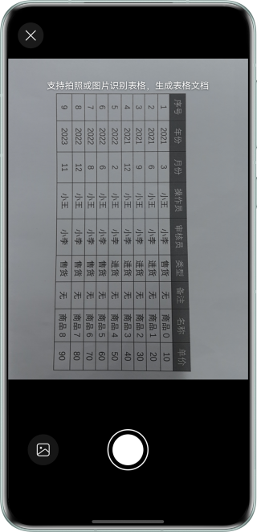
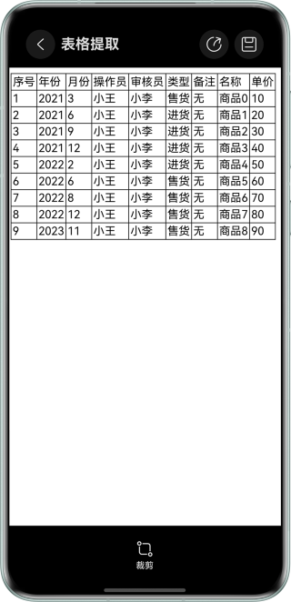

# 基于文档扫描控件实现从图像中提取表格的功能

## 介绍

本示例展示了如何集成文档扫描控件，实现从图像中识别并提取表格的功能。表格内容支持保存为Excel文件。

需要使用文档扫描控件@hms.ai.DocumentScanner.d.ets。


## 效果预览

| 预览                           | 拍照                           | 表格提取                   |
|------------------------------|------------------------------|------------------------|
|  |  |  |


使用说明：

1. 在手机的主屏幕，点击”SheetDemo“，启动应用。
2. 点击“SheetExtraction”按钮，跳转到文档扫描控件。
3. 将镜头对准一张表格，跳出”表格提取“气泡（必须保证是表格，否则无法出现入口）。
4. 点击”表格提取“气泡，进入表格提取拍摄页面。
5. 点击拍摄识别表格。


## 工程目录

```
├──entry/src/main/ets                         // 代码区  
│  ├──entryability
│  │  └──EntryAbility.ets                     // 入口Ability
│  └──pages
│     ├──Index.ets                            // 应用主界面
│     └──SheetExtractionPage.ets              // 文档扫描主界面
└──entry/src/main/resources                   // 应用资源目录
```


## 相关权限

不涉及。


## 依赖

不涉及。


## 约束与限制

1. 本实例仅支持标准系统上运行，支持设备：华为手机、华为平板。
2. HarmonyOS系统：HarmonyOS 5.0.0 Release及以上。
3. DevEco Studio版本：DevEco Studio 5.0.0 Release及以上。
4. HarmonyOS SDK版本：HarmonyOS 5.0.0 Release SDK及以上。

