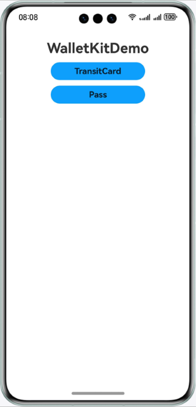
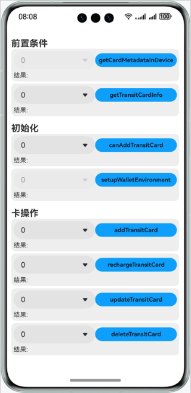
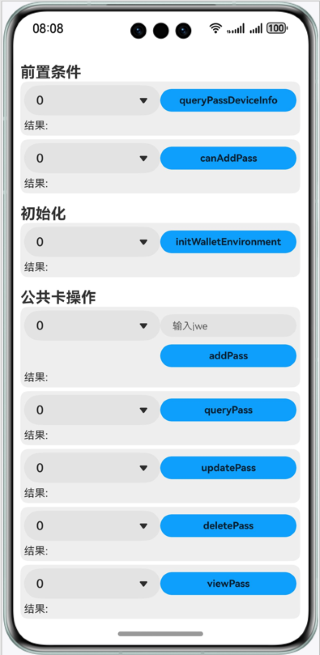

# 钱包服务（ArkTS）

## 介绍

基于Stage模型，提供钱包交通卡和Pass卡的开卡、预览卡、查询卡信息、更新卡片信息、删除卡片、初始化钱包环境等功能。

## 效果预览

| 1                          | 2                                | 3                         |
|----------------------------|----------------------------------|---------------------------|
|  |  |  |

## 工程目录

```
├─entry/src/main/ets
                   |─application/AbilityStage.ts   // stage
                   ├─common                         // 页面工具类
                   ├─components                     // 页面组件
                   ├─mainability/MainAbility.ts    // 本地启动ability   
                   │              
                   └─pages
                       ├─ Index.ets                 // 首页
                       ├─ wallet
                                ├─ ICCECallBack.ets // ICCE工具类
                                ├─ Pass.ets         // Pass卡页面
                                ├─ TransitCard.ets  // 交通卡页面
```

## 具体实现

### 交通卡

在@hms.core.payment.walletTransitCard中定义了钱包交通卡接口API，示例接口如下：

```
  /**
          * Obtains an array of CardMetadataInDevice objects, each of which contains the device information and the metadata of every card supported by the device.
          * An empty array will be returned in the device without eSE or if the specified device does not support any transit card. 
          *
          * @param { DeviceType } specifiedDeviceType - Type of the specified device.
          * @param { string } callerToken? - Authentication JWT token of the mini program in Wechat, Alipay, and the like.
          * @returns { Promise<CardMetadataInDevice[]> } - Returns the array of CardMetadataInDevice objects, each of which contains the device information and the metadata of every card.
          * @throws { BusinessError } 401 - Parameter error. Possible causes: Parameter verification failed.
          * @throws { BusinessError } 1010200001 - No permission to access the Wallet APIs.
          * @throws { BusinessError } 1010200002 - Wallet app not found.
          * @throws { BusinessError } 1010200003 - The environment of the wallet is not ready.
          * @throws { BusinessError } 1010200006 - The device's remote paired watch cannot be connected.
          * @throws { BusinessError } 1010200010 - Network connection error.
          * @throws { BusinessError } 1010200013 - Operation failed because of an internal error.
          * @throws { BusinessError } 1010200014 - The Wallet APIs can be called by the device owner only.
          * @throws { BusinessError } 1010210701 - Failed to verify the caller token.
          * @throws { BusinessError } 1010210702 - Failed to get the metadata of the cards.
          * @syscap SystemCapability.Payment.Wallet
          * @atomicservice
          * @since 5.0.0(12)
          */
         getCardMetadataInDevice(specifiedDeviceType: DeviceType, callerToken?: string): Promise<CardMetadataInDevice[]>;
          
         /**
          * Obtains the information of a transit card.
          *
          * @param { string } logicalCardNumber - Serial number of the card.
          * @param { string } callerToken? - Authentication JWT token of the mini program in Wechat, Alipay, and the like.
          * @param { string } specifiedDeviceId - ID of the device where the card exists.
          * @returns { Promise<TransitCardInfo> } - Returns the transit card information.
          * @throws { BusinessError } 401 - Parameter error. Possible causes: Parameter verification failed.
          * @throws { BusinessError } 1010200001 - No permission to access the Wallet APIs.
          * @throws { BusinessError } 1010200002 - Wallet app not found.
          * @throws { BusinessError } 1010200003 - The environment of the wallet is not ready.
          * @throws { BusinessError } 1010200006 - The device's remote paired watch cannot be connected.
          * @throws { BusinessError } 1010200010 - Network connection error.
          * @throws { BusinessError } 1010210101 - The card status is not correct.
          * @throws { BusinessError } 1010210102 - Failed to verify the caller token.
          * @throws { BusinessError } 1010210119 - Failed to read the card data.
          * @throws { BusinessError } 1010200013 - Operation failed because of an internal error.
          * @throws { BusinessError } 1010200014 - The Wallet APIs can be called by the device owner only.
          * @syscap SystemCapability.Payment.Wallet
          * @atomicservice
          * @since 5.0.0(12)
          */
         getTransitCardInfo(logicalCardNumber: string, specifiedDeviceId: string, callerToken?: string): Promise<TransitCardInfo>;
         
         /**
          * Checks whether a transit card can be added in Wallet in the specified device. 
          *
          * @param { string } issuerId - ID of the issuer of the card. The value is from CardMetadata in CardMetadataInDevice.
          * @param { string } specifiedDeviceId - ID of the device where the card will be added. The value is from CardMetadataInDevice.
          * @returns { Promise<string> } - Returns a token for adding the card.
          * @throws { BusinessError } 401 - Parameter error. Possible causes: Parameter verification failed.
          * @throws { BusinessError } 1010200001 - No permission to access the Wallet APIs.
          * @throws { BusinessError } 1010200002 - Wallet app not found.
          * @throws { BusinessError } 1010200003 - The environment of the wallet is not ready.
          * @throws { BusinessError } 1010200006 - The device's remote paired watch cannot be connected.
          * @throws { BusinessError } 1010200007 - The OS version is too old. Please upgrade the OS version.
          * @throws { BusinessError } 1010200008 - The wallet version is too old.
          * @throws { BusinessError } 1010200009 - The chip space is full, and no more cards can be added.
          * @throws { BusinessError } 1010200010 - Network connection error.
          * @throws { BusinessError } 1010200013 - Operation failed because of an internal error.
          * @throws { BusinessError } 1010200014 - The Wallet APIs can be called by the device owner only.
          * @throws { BusinessError } 1010200016 - This card is not available for the current country or region.
          * @throws { BusinessError } 1010210201 - The device does not support adding the card specified by issuerId.
          * @throws { BusinessError } 1010210202 - A card conflicting with the specified card already exists in the device.
          * @throws { BusinessError } 1010210203 - The specified card already exists.
          * @throws { BusinessError } 1010210204 - The card addition service is temporarily offline.
          * @syscap SystemCapability.Payment.Wallet
          * @atomicservice
          * @since 5.0.0(12)
          */
         canAddTransitCard(issuerId: string, specifiedDeviceId: string): Promise<string>;
         
         /**
          * Sets up the Wallet app's environment. 
          * You should call this API to setup the Wallet app when you get the error code below from another API:
          * Error code: 1010200002 - Wallet app not found. A dialog box will be displayed to guide the user to install the app. 
          * Error code: 1010200003 - The environment of the wallet is not ready. The Wallet app will be opened. The user needs to accept the
          * privacy agreement of Wallet and log in with a Huawei ID.
          *
          * @returns { Promise<void> } - Promise that returns no value.
          * @throws { BusinessError } 1010200014 - The Wallet APIs can be called by the device owner only.
          * @throws { BusinessError } 1010200002 - Wallet app not found.
          * @throws { BusinessError } 1010200011 - Failed to initialize the environment.
          * @throws { BusinessError } 1010200013 - Operation failed because of an internal error.
          * @throws { BusinessError } 1010200017 - The Wallet app was closed by the user.
          * @syscap SystemCapability.Payment.Wallet
          * @atomicservice
          * @since 5.0.0(12)
          */
         setupWalletEnvironment(): Promise<void>;
         
         /**
          * Adds a transit card into the wallet and returns the card metadata.
          *
          * @param { string } addCardOpaqueData - Result of the function canAddTransitCard.
          * @param { string } serverOrderId - Order ID generated in the service provider's backend server for the card addition business.
          * @returns { Promise<CardMetadata> } - Returns the card metadata.
          * @throws { BusinessError } 401 - Parameter error. Possible causes: Parameter verification failed.
          * @throws { BusinessError } 1010200001 - No permission to access the Wallet APIs.
          * @throws { BusinessError } 1010200010 - Network connection error.
          * @throws { BusinessError } 1010200013 - Operation failed because of an internal error.
          * @throws { BusinessError } 1010200014 - The Wallet APIs can be called by the device owner only.
          * @throws { BusinessError } 1010200016 - This card is not available for the current country or region.
          * @throws { BusinessError } 1010200017 - The Wallet app was closed by the user.
          * @throws { BusinessError } 1010210301 - The card adding conditions are not met. The order can be refunded to end the card addition process.
          * @throws { BusinessError } 1010210302 - Failed to confirm the order. The order can be refunded to end the card addition process.
          * @throws { BusinessError } 1010210319 - Failed to add the card.
          * @syscap SystemCapability.Payment.Wallet
          * @atomicservice
          * @since 5.0.0(12)
          */
         addTransitCard(addCardOpaqueData: string, serverOrderId: string): Promise<CardMetadata>;
         
         /**
          * Recharges a transit card according to the service specified by serverOrderId and returns the new balance.
          *
          * @param { string } logicalCardNumber - Serial number of the card.
          * @param { string } specifiedDeviceId - ID of the device where the card exists.
          * @param { string } serverOrderId - Order ID generated in the service provider's backend server for the balance recharging service.
          * @returns { Promise<number> } - Returns the new balance.
          * @throws { BusinessError } 401 - Parameter error. Possible causes: Parameter verification failed.
          * @throws { BusinessError } 1010200001 - No permission to access the Wallet APIs.
          * @throws { BusinessError } 1010200002 - Wallet app not found.
          * @throws { BusinessError } 1010200003 - The environment of the wallet is not ready.
          * @throws { BusinessError } 1010200006 - The device's remote paired watch cannot be connected.
          * @throws { BusinessError } 1010200010 - Network connection error.
          * @throws { BusinessError } 1010200013 - Operation failed because of an internal error.
          * @throws { BusinessError } 1010200014 - The Wallet APIs can be called by the device owner only.
          * @throws { BusinessError } 1010210401 - The specified card does not exist.
          * @throws { BusinessError } 1010210402 - The status of the specified card is incorrect.
          * @throws { BusinessError } 1010210403 - Failed to confirm the order. The order can be refunded to end the recharging process.
          * @throws { BusinessError } 1010210419 - Failed to recharge the card.
          * @syscap SystemCapability.Payment.Wallet
          * @atomicservice
          * @since 5.0.0(12)
          */
         rechargeTransitCard(logicalCardNumber: string, specifiedDeviceId: string, serverOrderId: string): Promise<number>;
         
         /**
          * Updates the data of a transit card according to the service specified by serverOrderId.
          *
          * @param { string } logicalCardNumber - Serial number of the card.
          * @param { string } specifiedDeviceId - ID of the device where the card exists.
          * @param { string } serverOrderId - Order ID generated in the service provider's backend server for the card data update service.
          * @returns { Promise<void> } - Promise that returns no value.
          * @throws { BusinessError } 401 - Parameter error. Possible causes: Parameter verification failed.
          * @throws { BusinessError } 1010200001 - No permission to access the Wallet APIs.
          * @throws { BusinessError } 1010200002 - Wallet app not found.
          * @throws { BusinessError } 1010200003 - The environment of the wallet is not ready.
          * @throws { BusinessError } 1010200006 - The device's remote paired watch cannot be connected.
          * @throws { BusinessError } 1010200010 - Network connection error.
          * @throws { BusinessError } 1010200013 - Operation failed because of an internal error.
          * @throws { BusinessError } 1010200014 - The Wallet APIs can be called by the device owner only.
          * @throws { BusinessError } 1010210501 - The specified card does not exist.
          * @throws { BusinessError } 1010210502 - The status of the specified card is incorrect.
          * @throws { BusinessError } 1010210503 - Failed to confirm the order.
          * @throws { BusinessError } 1010210519 - Failed to update the card data.
          * @syscap SystemCapability.Payment.Wallet
          * @atomicservice
          * @since 5.0.0(12)
          */
         updateTransitCard(logicalCardNumber: string, specifiedDeviceId: string, serverOrderId: string): Promise<void>;
         
         /**
          * Deletes a transit card according to the service specified by serverOrderId.
          *
          * @param { string } logicalCardNumber - Serial number of the card.
          * @param { string } specifiedDeviceId - ID of the device where the card exists.
          * @param { string } serverOrderId - Order ID generated in the service provider's backend server for the card deletion service.
          * @returns { Promise<void> } - Promise that returns no value.
          * @throws { BusinessError } 401 - Parameter error. Possible causes: Parameter verification failed.
          * @throws { BusinessError } 1010200001 - No permission to access the Wallet APIs.
          * @throws { BusinessError } 1010200002 - Wallet app not found.
          * @throws { BusinessError } 1010200003 - The environment of the wallet is not ready.
          * @throws { BusinessError } 1010200006 - The device's remote paired watch cannot be connected.
          * @throws { BusinessError } 1010200010 - Network connection error.
          * @throws { BusinessError } 1010200013 - Operation failed because of an internal error.
          * @throws { BusinessError } 1010200014 - The Wallet APIs can be called by the device owner only.
          * @throws { BusinessError } 1010210619 - Failed to delete the card.
          * @throws { BusinessError } 1010210601 - Failed to confirm the order.
          * @syscap SystemCapability.Payment.Wallet
          * @atomicservice
          * @since 5.0.0(12)
          */
         deleteTransitCard(logicalCardNumber: string, specifiedDeviceId: string, serverOrderId: string): Promise<void>;
```

### Pass卡

在@hms.core.payment.walletPass中定义了钱包Pass卡接口API，示例接口如下：

```
         /**
          * Obtains the device information of a pass card.
          * 
          * @param { string } passStr - Pass card information.
          * @returns { Promise<string> } - Returns a string in JSON format, which contains the device information.
          * @throws { BusinessError } 401 - Parameter error. Possible causes: Mandatory parameters are left unspecified.
          * @throws { BusinessError } 1010200001 - No permission to access the Wallet APIs.
          * @throws { BusinessError } 1010200002 - Wallet app not found.
          * @throws { BusinessError } 1010200003 - The environment of the wallet is not ready.
          * @throws { BusinessError } 1010200006 - The device's remote paired watch cannot be connected.
          * @throws { BusinessError } 1010200010 - Network connection error.
          * @throws { BusinessError } 1010200013 - Operation failed because of an internal error.
          * @throws { BusinessError } 1010200014 - The Wallet APIs can be called by the device owner only.
          * @throws { BusinessError } 1010220003 - Pass service is temporarily unavailable.
          * @syscap SystemCapability.Payment.Wallet
          * @atomicservice
          * @since 5.0.0(12)
          */
         queryPassDeviceInfo(passStr: string): Promise<string>;
         
         /**
          * Checks whether a pass card can be added to this device or the remote paired watch.
          *
          * @param { string } passStr - Pass card information.
          * @returns { Promise<string> } - Returns a string indicating the check result.
          * @throws { BusinessError } 401 - Parameter error. Possible causes: Mandatory parameters are left unspecified.
          * @throws { BusinessError } 1010200001 - No permission to access the Wallet APIs.
          * @throws { BusinessError } 1010200002 - Wallet app not found.
          * @throws { BusinessError } 1010200003 - The environment of the wallet is not ready.
          * @throws { BusinessError } 1010200004 - The device does not support this card.
          * @throws { BusinessError } 1010200006 - The device's remote paired watch cannot be connected.
          * @throws { BusinessError } 1010200009 - The chip space is full, and no more cards can be added.
          * @throws { BusinessError } 1010200010 - Network connection error.
          * @throws { BusinessError } 1010200013 - Operation failed because of an internal error.
          * @throws { BusinessError } 1010200014 - The Wallet APIs can be called by the device owner only.
          * @throws { BusinessError } 1010200015 - This card is not available for a child account.
          * @throws { BusinessError } 1010200016 - This card is not available for the current country or region.
          * @throws { BusinessError } 1010220002 - The card already exists in the specified device.
          * @throws { BusinessError } 1010220003 - Pass service is temporarily unavailable.
          * @throws { BusinessError } 1010220005 - The number of cards has reached the upper limit.
          * @syscap SystemCapability.Payment.Wallet
          * @atomicservice
          * @since 5.0.0(12)
          */
         canAddPass(passStr: string): Promise<string>;
         
         /**
          * Initializes the Wallet app's environment. 
          *
          * @param { string } passStr - Pass card information.
          * @returns { Promise<void> } - Promise that returns no value.
          * @throws { BusinessError } 401 - Parameter error. Possible causes: Mandatory parameters are left unspecified.
          * @throws { BusinessError } 1010200002 - Wallet app not found.
          * @throws { BusinessError } 1010200005 - The operation was canceled by the user.
          * @throws { BusinessError } 1010200011 - Failed to initialize the environment.
          * @throws { BusinessError } 1010200013 - Operation failed because of an internal error.
          * @throws { BusinessError } 1010200014 - The Wallet APIs can be called by the device owner only.
          * @throws { BusinessError } 1010200017 - The Wallet app was closed by the user.
          * @syscap SystemCapability.Payment.Wallet
          * @atomicservice
          * @since 5.0.0(12)
          */
         initWalletEnvironment(passStr: string): Promise<void>;
         
         /**
          * Adds a pass card into Wallet.
          *
          * @param { string } passStr - Pass card information.
          * @returns { Promise<string> } - Returns a string indicating whether the pass card has been added.
          * @throws { BusinessError } 401 - Parameter error. Possible causes: Mandatory parameters are left unspecified.
          * @throws { BusinessError } 1010200002 - Wallet app not found.
          * @throws { BusinessError } 1010200004 - The device does not support this card.
          * @throws { BusinessError } 1010200005 - The operation was canceled by the user.
          * @throws { BusinessError } 1010200006 - The device's remote paired watch cannot be connected.
          * @throws { BusinessError } 1010200009 - The chip space is full, and no more cards can be added.
          * @throws { BusinessError } 1010200012 - Duplicate request.
          * @throws { BusinessError } 1010200013 - Operation failed because of an internal error.
          * @throws { BusinessError } 1010200014 - The Wallet APIs can be called by the device owner only.
          * @throws { BusinessError } 1010200015 - This card is not available for a child account.
          * @throws { BusinessError } 1010200016 - This card is not available for the current country or region.
          * @throws { BusinessError } 1010200017 - The Wallet app was closed by the user.
          * @throws { BusinessError } 1010220002 - The card already exists in the specified device.
          * @throws { BusinessError } 1010220003 - Pass service is temporarily unavailable.
          * @throws { BusinessError } 1010220005 - The number of cards has reached the upper limit.
          * @throws { BusinessError } 1010220401 - Failed to add the card because the signature verification failed.
          * @throws { BusinessError } 1010220402 - Failed to add the card because the data decryption failed.
          * @throws { BusinessError } 1010220403 - Failed to add the card because the instance ID does not exist.
          * @throws { BusinessError } 1010220404 - Failed to add the card because the instance ID has been used.
          * @syscap SystemCapability.Payment.Wallet
          * @atomicservice
          * @since 5.0.0(12)
          */
         addPass(passStr: string): Promise<string>;
         
         /**
          * Obtains the pass cards in the specified device.
          *
          * @param { string } passStr - Pass card information.
          * @returns { Promise<string> } - Returns the pass cards in the specified device.
          * @throws { BusinessError } 401 - Parameter error. Possible causes: Mandatory parameters are left unspecified.
          * @throws { BusinessError } 1010200001 - No permission to access the Wallet APIs.
          * @throws { BusinessError } 1010200002 - Wallet app not found.
          * @throws { BusinessError } 1010200003 - The environment of the wallet is not ready.
          * @throws { BusinessError } 1010200006 - The device's remote paired watch cannot be connected.
          * @throws { BusinessError } 1010200013 - Operation failed because of an internal error.
          * @throws { BusinessError } 1010200014 - The Wallet APIs can be called by the device owner only.
          * @throws { BusinessError } 1010220501 - No card that meets the search criteria is found.
          * @syscap SystemCapability.Payment.Wallet
          * @atomicservice
          * @since 5.0.0(12)
          */
         queryPass(passStr: string): Promise<string>;
         
         /**
          * Views the enabled pass cards.
          *
          * @param { string } passStr - Pass card information.
          * @returns { Promise<void> } - Promise that returns no value.
          * @throws { BusinessError } 1010200002 - Wallet app not found.
          * @throws { BusinessError } 1010200013 - Operation failed because of an internal error.
          * @syscap SystemCapability.Payment.Wallet
          * @atomicservice
          * @since 5.0.0(12)
          */
         viewPass(passStr: string): Promise<void>;
         
         /**
          * Updates the data of a pass card.
          *
          * @param { string } passStr - Pass card information.
          * @returns { Promise<string> } - Returns a string indicating whether the pass card has been updated.
          * @throws { BusinessError } 401 - Parameter error. Possible causes: Mandatory parameters are left unspecified.
          * @throws { BusinessError } 1010200001 - No permission to access the Wallet APIs.
          * @throws { BusinessError } 1010200002 - Wallet app not found.
          * @throws { BusinessError } 1010200005 - The operation was canceled by the user.
          * @throws { BusinessError } 1010200006 - The device's remote paired watch cannot be connected.
          * @throws { BusinessError } 1010200010 - Network connection error.
          * @throws { BusinessError } 1010200013 - Operation failed because of an internal error.
          * @throws { BusinessError } 1010200014 - The Wallet APIs can be called by the device owner only.
          * @throws { BusinessError } 1010220003 - Pass service is temporarily unavailable.
          * @throws { BusinessError } 1010220004 - The card does not exist in the specified device.
          * @throws { BusinessError } 1010220701 - Failed to update the card because no update is detected.
          * @syscap SystemCapability.Payment.Wallet
          * @atomicservice
          * @since 5.0.0(12)
          */
         updatePass(passStr: string): Promise<string>;
         
         /**
          * Deletes a pass card.
          *
          * @param { string } passStr - Pass card information.
          * @returns { Promise<string> } - Returns a string indicating whether the pass card has been deleted.
          * @throws { BusinessError } 401 - Parameter error. Possible causes: Mandatory parameters are left unspecified.
          * @throws { BusinessError } 1010200001 - No permission to access the Wallet APIs.
          * @throws { BusinessError } 1010200002 - Wallet app not found.
          * @throws { BusinessError } 1010200005 - The operation was canceled by the user.
          * @throws { BusinessError } 1010200006 - The device's remote paired watch cannot be connected.
          * @throws { BusinessError } 1010200010 - Network connection error.
          * @throws { BusinessError } 1010200012 - Duplicate request.
          * @throws { BusinessError } 1010200013 - Operation failed because of an internal error.
          * @throws { BusinessError } 1010200014 - The Wallet APIs can be called by the device owner only.
          * @throws { BusinessError } 1010220003 - Pass service is temporarily unavailable.
          * @throws { BusinessError } 1010220004 - The card does not exist in the specified device.
          * @throws { BusinessError } 1010220801 - Failed to delete the card because the signature verification failed.
          * @syscap SystemCapability.Payment.Wallet
          * @atomicservice
          * @since 5.0.0(12)
          */
         deletePass(passStr: string): Promise<string>;
         
         /**
          * Checks the connection state between the device and the vehicle.
          *
          * @param { string } rkeStr - RKE command.
          * @returns { Promise<string> } - Returns a string in JSON format, which indicates the connection state between the device and the vehicle.
          * @throws { BusinessError } 401 - Parameter error. Possible causes: Mandatory parameters are left unspecified.
          * @throws { BusinessError } 1010200001 - No permission to access the Wallet APIs.
          * @throws { BusinessError } 1010200002 - Wallet app not found.
          * @throws { BusinessError } 1010200006 - The device's remote paired watch cannot be connected.
          * @throws { BusinessError } 1010200013 - Operation failed because of an internal error.
          * @throws { BusinessError } 1010200014 - The Wallet APIs can be called by the device owner only.
          * @throws { BusinessError } 1010220004 - The card does not exist in the specified device.
          * @throws { BusinessError } 1010220006 - Bluetooth permission is not granted.
          * @syscap SystemCapability.Payment.Wallet
          * @atomicservice
          * @since 5.0.0(12)
          */
         queryICCEConnectionState(rkeStr: string): Promise<string>;
         
         /**
          * Initiates a connection to the vehicle.
          *
          * @param { string } rkeStr - RKE command.
          * @returns { Promise<string> } - Returns a string, which indicates whether the connection between the device and the vehicle is established.
          * @throws { BusinessError } 401 - Parameter error. Possible causes: Mandatory parameters are left unspecified.
          * @throws { BusinessError } 1010200001 - No permission to access the Wallet APIs.
          * @throws { BusinessError } 1010200002 - Wallet app not found.
          * @throws { BusinessError } 1010200005 - The operation was canceled by the user.
          * @throws { BusinessError } 1010200006 - The device's remote paired watch cannot be connected.
          * @throws { BusinessError } 1010200010 - Network connection error.
          * @throws { BusinessError } 1010200012 - Duplicate request.
          * @throws { BusinessError } 1010200013 - Operation failed because of an internal error.
          * @throws { BusinessError } 1010200014 - The Wallet APIs can be called by the device owner only.
          * @throws { BusinessError } 1010220004 - The card does not exist in the specified device.
          * @throws { BusinessError } 1010220006 - Bluetooth permission is not granted.
          * @throws { BusinessError } 1010221001 - Connection failed because the pairing code is not obtained.
          * @syscap SystemCapability.Payment.Wallet
          * @atomicservice
          * @since 5.0.0(12)
          */
         startICCEConnection(rkeStr: string): Promise<string>;
         
         /**
          * Registers an ICCE listener.
          *
          * @param { string } rkeStr - RKE command.
          * @param { rpc.RemoteObject } eventNotifyListener - Event listener.
          * @returns { Promise<string> } - Returns a string indicating whether the registration is successful.
          * @throws { BusinessError } 401 - Parameter error. Possible causes: Mandatory parameters are left unspecified.
          * @throws { BusinessError } 1010200001 - No permission to access the Wallet APIs.
          * @throws { BusinessError } 1010200002 - Wallet app not found.
          * @throws { BusinessError } 1010200012 - Duplicate request.
          * @throws { BusinessError } 1010200013 - Operation failed because of an internal error.
          * @throws { BusinessError } 1010200014 - The Wallet APIs can be called by the device owner only.
          * @throws { BusinessError } 1010221101 - Registration failed because of duplicate register name.
          * @syscap SystemCapability.Payment.Wallet
          * @atomicservice
          * @since 5.0.0(12)
          */
         registerICCEListener(rkeStr: string, eventNotifyListener: rpc.RemoteObject): Promise<string>;
         
         /**
          * Unregisters an ICCE listener.
          *
          * @param { string } rkeStr - RKE command.
          * @returns { Promise<string> } - Returns a string indicating whether the unregistration is successful.
          * @throws { BusinessError } 401 - Parameter error. Possible causes: Mandatory parameters are left unspecified.
          * @throws { BusinessError } 1010200001 - No permission to access the Wallet APIs.
          * @throws { BusinessError } 1010200002 - Wallet app not found.
          * @throws { BusinessError } 1010200013 - Operation failed because of an internal error.
          * @throws { BusinessError } 1010200014 - The Wallet APIs can be called by the device owner only.
          * @throws { BusinessError } 1010221201 - The registration may have been unregistered before.
          * @syscap SystemCapability.Payment.Wallet
          * @atomicservice
          * @since 5.0.0(12)
          */
         unregisterICCEListener(rkeStr: string): Promise<string>;
         
         /**
          * Sends an RKE message.
          *
          * @param { string } rkeStr - RKE command.
          * @returns { Promise<string> } - Returns a string indicating whether the RKE message is sent successfully.
          * @throws { BusinessError } 401 - Parameter error. Possible causes: Mandatory parameters are left unspecified.
          * @throws { BusinessError } 1010200001 - No permission to access the Wallet APIs.
          * @throws { BusinessError } 1010200002 - Wallet app not found.
          * @throws { BusinessError } 1010200006 - The device's remote paired watch cannot be connected.
          * @throws { BusinessError } 1010200012 - Duplicate request.
          * @throws { BusinessError } 1010200013 - Operation failed because of an internal error.
          * @throws { BusinessError } 1010200014 - The Wallet APIs can be called by the device owner only.
          * @throws { BusinessError } 1010220004 - The card does not exist in the specified device.
          * @throws { BusinessError } 1010220006 - Bluetooth permission is not granted.
          * @throws { BusinessError } 1010221301 - Failed to send the RKE message because of a connection failure.
          * @throws { BusinessError } 1010221302 - Failed to send the RKE message because of an authentication failure.
          * @syscap SystemCapability.Payment.Wallet
          * @atomicservice
          * @since 5.0.0(12)
          */
         sendICCERKEMessage(rkeStr: string): Promise<string>;
```

## 相关权限

不涉及

## 约束与限制

1.本示例仅支持标准系统上运行，支持设备：华为手机。

2.HarmonyOS系统：HarmonyOS NEXT Developer Beta1及以上。

3.DevEco Studio版本：DevEco Studio NEXT Developer Beta1及以上。

4.HarmonyOS SDK版本： HarmonyOS NEXT Developer Beta1 SDK及以上。

5.本示例需要安装14.0.1.300以上版本应用市场。