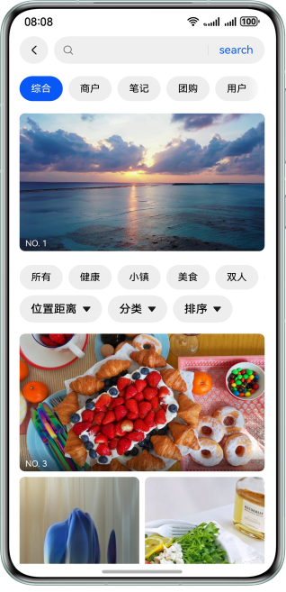

# 实现WaterFlow瀑布流布局功能

### 介绍

本示例为开发者展示使用WaterFlow瀑布流容器实现首页布局效果，包括使用sections实现分组混排布局、删除滑动错位、结合item实现滑动吸顶、停止滑动自动播放，等场景。

### 效果预览

| 场景一                                        | 场景二                                        | 
|--------------------------------------------|--------------------------------------------|
|  |  |

### 工程目录
```
├──entry/src/main/ets                        // 代码区
│  ├──common
│  │  ├──constants                  
│  │  │   └──CommonConstants.ets             // 常量类  
│  │  └──utils
│  │      └──Logger.ets                      // 日志类  
│  ├──entryability
│  │  └──EntryAbility.ets 
│  ├──model
│  │  └──MediaItem.ets                       // 瀑布流item数据类
│  ├──viewmodel
│  │  ├──SectionsWaterFlowDataSource.ets     // sections瀑布流数据
│  │  └──StickyWaterFlowDataSource.ets       // 吸顶瀑布流数据
│  ├──pages
│  │  ├──Index.ets                           // 场景聚合首页
│  │  ├──SectionsHomePage.ets                // 场景一-首页
│  │  └──StickyHomePage.ets                  // 场景二-首页               
│  └──view
│     ├──SectionsWaterFlowComponent.ets      // sections瀑布流组件 
│     └──StickyWaterFlowComponent.ets        // sticky瀑布流组件
└──entry/src/main/resources                  // 应用资源目录
```

### 具体实现

+ 场景一：使用WaterFlow的sections实现了分组混排布局，实现下拉刷新，加载更多，删除滑动错位；
+ 场景二：结合某一item实现了滑动吸顶，图片视频混排，滑动停止Item自动播放；

- WaterFlow：瀑布流容器，由“行”和“列”分割的单元格所组成，通过容器自身的排列规则，将不同大小的“项目”自上而下，如瀑布般紧密布局。
- FlowItem：瀑布流容器的子组件。
- LazyForEach：LazyForEach从提供的数据源中按需迭代数据，并在每次迭代过程中创建相应的组件。当LazyForEach在滚动容器中使用了，框架会根据滚动容器可视区域按需创建组件，当组件划出可视区域外时，框架会进行组件销毁回收以降低内存占用。
- Tabs：导航页签组件。
- Refresh：下拉刷新容器组件。
- Scroll：可滚动容器组件。


### 相关权限

1. 网络使用权限：ohos.permission.INTERNET。

### 约束与限制

1. 本示例仅支持标准系统上运行，支持设备：华为手机。

2. HarmonyOS系统：HarmonyOS 5.0.5 Release及以上。

3. DevEco Studio版本：DevEco Studio 5.0.5 Release及以上。

4. HarmonyOS SDK版本：HarmonyOS 5.0.5 Release SDK及以上。