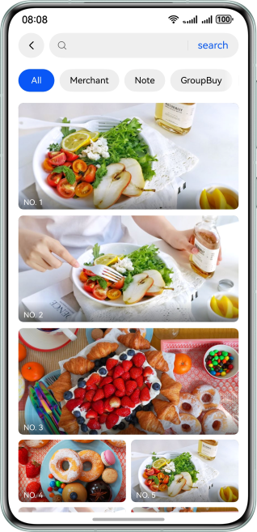
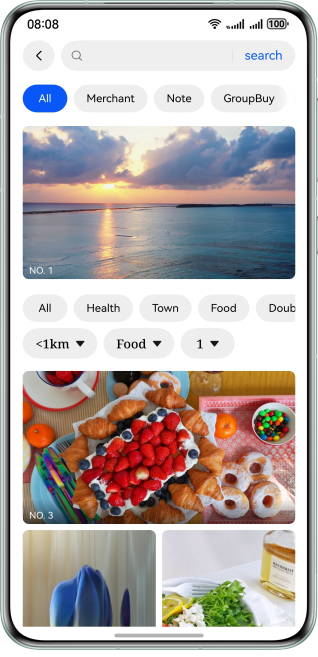

# UI Framework - WaterFlow Instance

### Overview

This sample describes how to implement the waterfall layout based on the WaterFlow container. Sections are used to implement hybrid layout, and functions such as tab ceiling, pull-down refresh, and unlimited loading are also implemented in this sample.


### Preview

| Scenario 1                                    | Scenario 2                                    |
|-----------------------------------------------|-----------------------------------------------|
|  |  |


### Project Directory
```
├──entry/src/main/ets                        // Code area
│  ├──common
│  │  ├──constants                  
│  │  │   └──CommonConstants.ets             // Constant class 
│  │  └──utils
│  │      └──Logger.ets                      // Log class 
│  ├──entryability
│  │  └──EntryAbility.ets 
│  ├──model
│  │  └──MediaItem.ets                       // Waterfall item data class
│  ├──viewmodel
│  │  ├──SectionsWaterFlowDataSource.ets     // Sections waterfall data
│  │  └──StickyWaterFlowDataSource.ets       // Waterfall data
│  ├──pages
│  │  ├──Index.ets                           // Home page of scenario aggregation
│  │  ├──SectionsHomePage.ets                // Scenario 1 - Home page
│  │  └──StickyHomePage.ets                  // Scenario 2 - Home page              
│  └──view
│     ├──SectionsWaterFlowComponent.ets      // Sections Waterfall component
│     └──StickyWaterFlowComponent.ets        // Sticky waterfall component
└──entry/src/main/resources                  // App resource directory
```

### How to Implement

+ Scenario 1: Use the sections of WaterFlow to implement the hybrid layout.
+ Scenario 2: Implemented swiping ceiling based on an item.

- WaterFlow: a water flow container that consists of cells formed by rows and columns and arranges items of different sizes from top to bottom according to the preset rules.
- FlowItem: subcomponent of the waterfall container.
- LazyForEach: iterates over provided data sources and creates corresponding components during each iteration. When **LazyForEach** is used in a scrolling container, the framework creates components as required within the visible area of the scrolling container. When a component is out of the visible area, the framework destroys and reclaims the component to reduce memory usage.
- Tabs: navigation tab component.
- Refresh: pull-down refresh component.
- Scroll: scrollable component.


### Required Permissions

1. Network permission: ohos.permission.INTERNET.

### Constraints

1. The sample is only supported on Huawei phones with standard systems.

2. The HarmonyOS version must be HarmonyOS 5.0.5 Release or later.

3. The DevEco Studio version must be DevEco Studio 5.0.5 Release or later.

4. The HarmonyOS SDK version must be HarmonyOS 5.0.5 Release SDK or later.