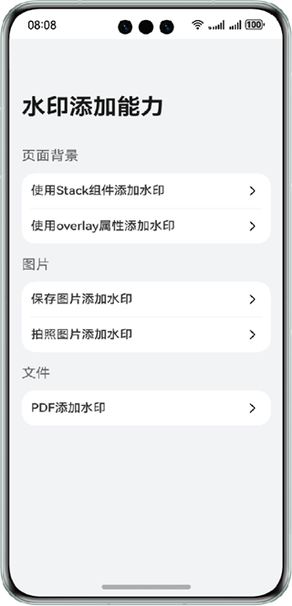
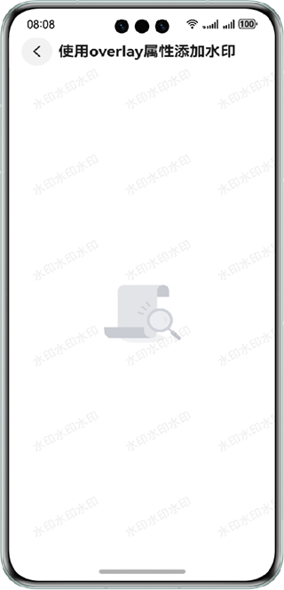
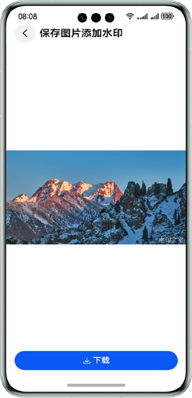
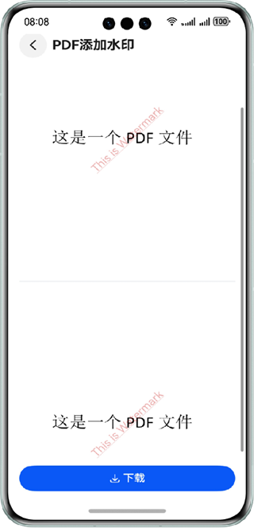

# 实现添加水印功能

### 介绍

本示例为开发者展示常用的水印添加能力，包括两种方式给页面添加水印、保存图片添加水印、拍照图片添加水印和pdf文件添加水印。

### 效果预览

| 首页                                  | 页面水印                                | 图片水印                                 | pdf水印                              |
|-------------------------------------|-------------------------------------|--------------------------------------|------------------------------------|
|  |  |  |  |

### 工程目录

```
├──entry/src/main/ets/
│  ├──component
│  │  ├──NavBar.ets                     // 顶部导航条
│  │  └──Watermark.ets                  // 页面水印组件
│  ├──constants
│  │  ├──Utils.ets                      // 工具类
│  │  └──Constants.ets                  // 公共常量类
│  ├──entryability
│  │  └──EntryAbility.ets               // 程序入口类
│  └──pages            
│     ├──CameraPage.ets                 // 拍照添加水印
│     ├──Index.ets                      // 首页
│     ├──SaveImagePage.ets              // 保存图片添加水印
│     ├──WatermarkPdfPage.ets           // pdf文件添加水印
│     ├──WatermarkStackPage.ets         // 使用Stack添加页面背景水印
│     └──WatermarkOverlay.ets           // 使用overlay添加页面背景水印
└──entry/src/main/resources             // 应用静态资源目录
```

### 具体实现

1. 页面添加水印：封装Canvas绘制水印组件，使用Stack层叠布局或overlay浮层属性，将水印组件与页面融合。
2. 保存图片添加水印：获取图片数据，createPixelMap，使用OffScreenContext在指定位置绘制水印，最后保存带水印图片。
3. 拍照图片添加水印：打开相机，获取存储fileUri，然后存入沙箱，获取图片数据，createPixelMap，绘制水印，最后保存带水印图片。
4. pdf文件添加水印: 使用PdfView预览组件预览pdf，使用pdfService服务加载pdf、添加水印、保存pdf。

### 相关权限
不涉及

### 依赖
不涉及

### 约束与限制

1.本示例仅支持标准系统上运行，支持设备：华为手机。 

2.HarmonyOS系统：HarmonyOS 5.0.5 Release及以上。

3.DevEco Studio版本：DevEco Studio 5.0.5 Release及以上。

4.HarmonyOS SDK版本：HarmonyOS 5.0.5 Release SDK及以上。