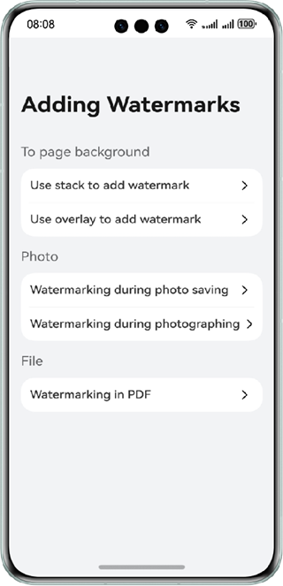

# Adding Watermarks

### Overview

This sample describes how to add watermarks to the page background during photo saving and photo shooting.

### Preview

| Home page                              | Add a watermark to the page            | Add a watermark to a photo              | Watermarking in pdf                   |
|----------------------------------------|----------------------------------------|-----------------------------------------|---------------------------------------|
|  |  |  |  |

### Project Directory

```
├──entry/src/main/ets/
│  ├──component
│  │  ├──NavBar.ets                     // Top navigation bar
│  │  └──Watermark.ets                  // Watermark component
│  ├──constants
│  │  ├──Utils.ets                      // Utils class
│  │  └──Constants.ets                  // Common constants
│  ├──entryability
│  │  └──EntryAbility.ets               // Entry point class
│  └──pages            
│     ├──CameraPage.ets                 // Add a watermark during photographing.
│     ├──Index.ets                      // Home page
│     ├──SaveImagePage.ets              // Add a watermark during photo saving.
│     ├──WatermarkPdfPage.ets           // Add a watermark in pdf.
│     ├──WatermarkCanvasPage.ets        // Use canvas to add a watermark to the page background.
│     └──WatermarkOverlay.ets           // Use overlay to add a watermark to the page background.
└──entry/src/main/resources             // Static resources of the app
```

### How to Implement

1. Add a watermark to the page: Encapsulate the Canvas-based watermark drawing component and use the Stack cascading layout or overlay floating layer attribute to integrate the watermark component with the page.
2. Add a watermark to a photo during saving: Obtain the photo, call **createPixelMap** to create a pixel map, call **OffScreenContext** to draw a watermark at the specified position, and save the image with the watermark.
3. Add a watermark to a photo during shooting: Open the camera, obtain the URI to the storage file, save the file URI to the sandbox, obtain the photo data, call **createPixelMap** to create a pixel map, draw a watermark, and save the image with the watermark.
4. Add watermarks to PDF files: Use the Pdfview preview component to preview PDF files, use the PDFService service to load PDF file, add watermark, and save PDF file.

### Required Permissions
N/A

### Dependencies
N/A

### Constraints

1. The sample is supported only on Huawei phones with standard systems.

2. The HarmonyOS version must be HarmonyOS 5.0.5 Release or later.

3. The DevEco Studio version must be DevEco Studio 5.0.5 Release or later.

4. The HarmonyOS SDK version must be HarmonyOS 5.0.5 Release SDK or later.