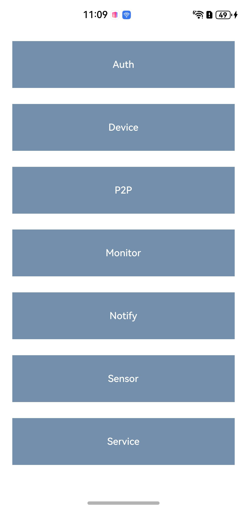
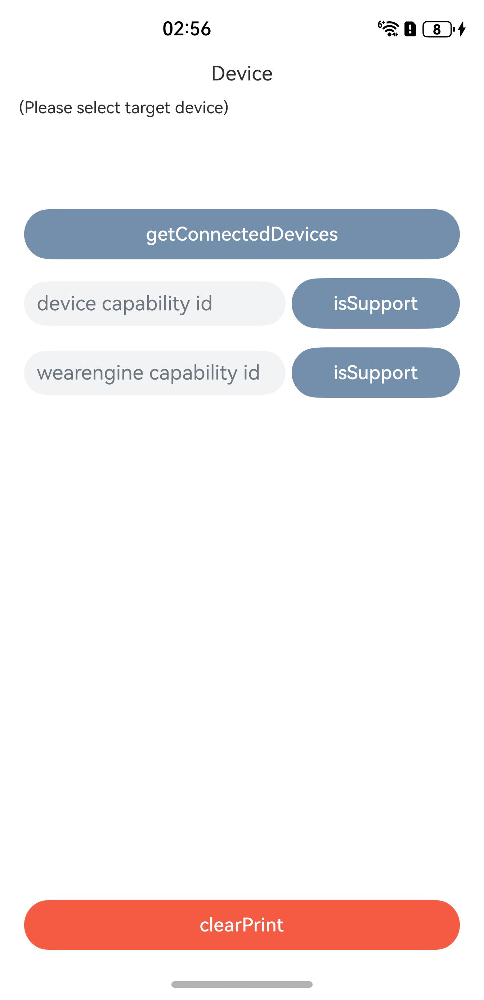
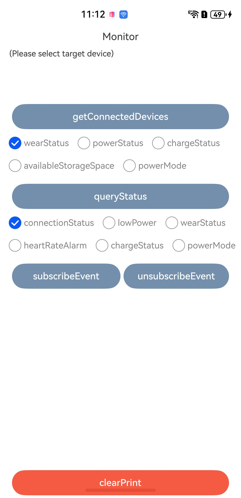
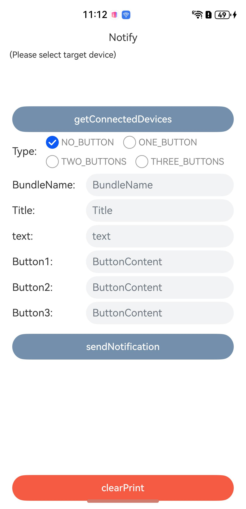
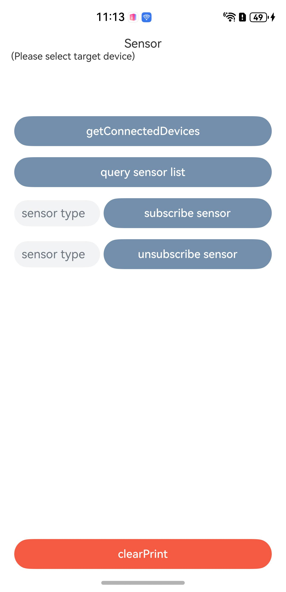
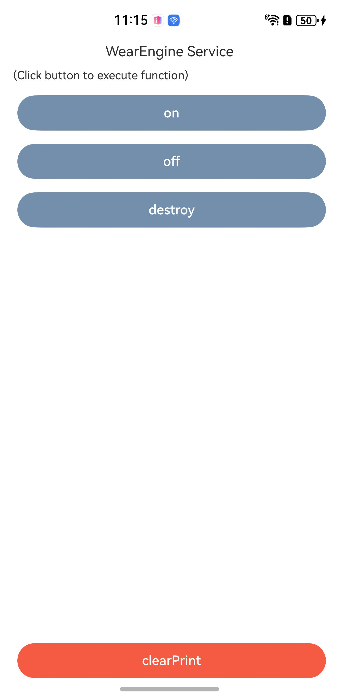

# 华为穿戴服务

## 介绍

本实例展示了使用华为穿戴服务获取已连接穿戴设备，与穿戴设备侧应用交互的能力。

需要使用华为穿戴服务接口 **@kit.WearEngine**

## 效果预览
| **主页面**                      | **授权页面**                        | **设备信息页面**                        | **状态查询与订阅页面**                      | **消息通知页面**                        | **端对端应用通信页面**                  | **传感器页面**                         | **连接页面**                        |
|------------------------------|---------------------------------|-----------------------------------|------------------------------------|-----------------------------------|--------------------------------|-----------------------------------|---------------------------------|
|  |  |  |  |  |  |  |  | 
## Sample工程的配置与使用

#### 在DevEco中配置Sample工程的步骤如下

1. [创建项目](https://developer.huawei.com/consumer/cn/doc/app/agc-help-createproject-0000001100334664)及[应用](https://developer.huawei.com/consumer/cn/doc/app/agc-help-createapp-0000001146718717)。
2. [申请WearEngine服务](https://developer.huawei.com/consumer/cn/doc/harmonyos-guides/wearengine_apply)。
3. 打开Sample应用，使用[AppGallery Connect](https://developer.huawei.com/consumer/cn/service/josp/agc/index.html)配置的应用包名替换AppScope\app.json5文件中的bundleName属性值。
4. 使用[AppGallery Connect](https://developer.huawei.com/consumer/cn/service/josp/agc/index.html)配置的应用client_id替换entry\src\main\module.json5文件中的client_id属性值。

#### Sample工程使用说明
1. 运行该 Sample 应用，首先点击"Auth"按钮，进入授权管理页面，勾选所需权限后点击"requestAuthorizations"按钮进行登录/授权操作，如果系统帐号未登录，会拉起华为帐号登录页，用户登录后拉起授权页面。
2. 完成授权后，回到主界面，进入不同的页面中体验不同模块的功能。

## 工程目录
├─entry/src/main/ets         // 代码区     
│&emsp;├─entryability    
│&emsp;│&emsp;└─EntryAbility.ets                   // 程序入口类   
│&emsp;├─pages              
│&emsp;│&emsp;├─Index.ets                          // 主页面     
│&emsp;│&emsp;├─AuthPage.ets                       // 授权管理页面  
│&emsp;│&emsp;├─DevicePage.ets                     // 设备信息页面  
│&emsp;│&emsp;├─MonitorPage.ets                    // 状态查询与订阅页面   
│&emsp;│&emsp;├─NotifyPage.ets                     // 消息通知页面  
│&emsp;│&emsp;├─P2pPage.ets                        // 端对端应用通信页面   
│&emsp;│&emsp;├─SensorPage.ets                     // 传感器页面   
│&emsp;│&emsp;└─ServicePage.ets                    // WearEngine服务页面  
│&emsp;└─util         
│&emsp;&emsp;&emsp;└─Constant.ets                       // 通用常量    
└─entry/src/main/resources               // 资源文件目录

## 具体实现

授权相关功能，请参考AuthPage.ets：
* 使用AuthorizationRequest接口创建授权请求，设置待授权的权限类型，调用requestAuthorizations方法，拉起登录/授权页面
* 调用getAuthorizations方法，获取已被用户授权的权限类型

设备的基础信息，请参考DevicePage.ets：
* 使用getConnectedDevices方法获得已连接的设备列表
* 通过已连接设备的内置方法可以查询设备所支持的能力集与设备的序列号

设备状态与用户状态的查询与订阅，请参考MonitorPage.ets:
* 通过调用queryStatus方法查询MonitorItem中不同枚举对应的状态
* 通过调用subscribeEvent方法订阅MonitorEvent中不同枚举对应的事件类型

向穿戴设备发送消息通知，请参考NotifyPage.ets：
* 使用Notification接口创建待发送的通知，使用NotificationOptions创建通知配置类，包含待发送的通知与通知的回调函数
* 调用notify接口向设备侧发送模板化通知

与穿戴设备侧的应用进行端对端通信，请参考P2pPage.ets:
* 需要在代码段中配置设备侧应用的包名与签名
* 在进行端对端通信前，建议先确认设备是否可进行端对端通信，如查询P2P能力集是否支持，或设备是否支持应用安装，进一步可以查询对端应用是否安装、对端应用版本号，如有需要还可拉起设备侧应用
* 在进行端对端通信前，需要设备侧应用完成对消息接收事件或者文件接收事件的订阅

穿戴设备的传感器，请参考SensorPage.ets:
* 通过调用querySensors方法查询指定的设备上可使用的传感器列表
* 调用subscribeSensor方法与unsubscribeSensor完成对指定传感器的数据订阅与取消订阅

管理应用与Wear Engine服务之间的连接状态，请参考ServicePage.ets：
* 使用on与off方法完成对连接状态断开事件的订阅与取消订阅
* 通过destroy方法主动断开Wear Engine服务的连接，主动断开时不会触发on方法注册的回调函数

## 依赖

依赖穿戴设备

## 约束与限制

1. 本示例仅支持标准系统上运行，支持设备：华为手机、平板。
2. 首次使用华为穿戴服务前，必需打开运动健康App，同意隐私授权。
3. HarmonyOS系统：HarmonyOS Next Developer Beta2及以上。
4. DevEco Studio版本：DevEco Studio Next Developer Beta2及以上。
5. HarmonyOS SDK版本：HarmonyOS Next  Developer Beta2及以上。