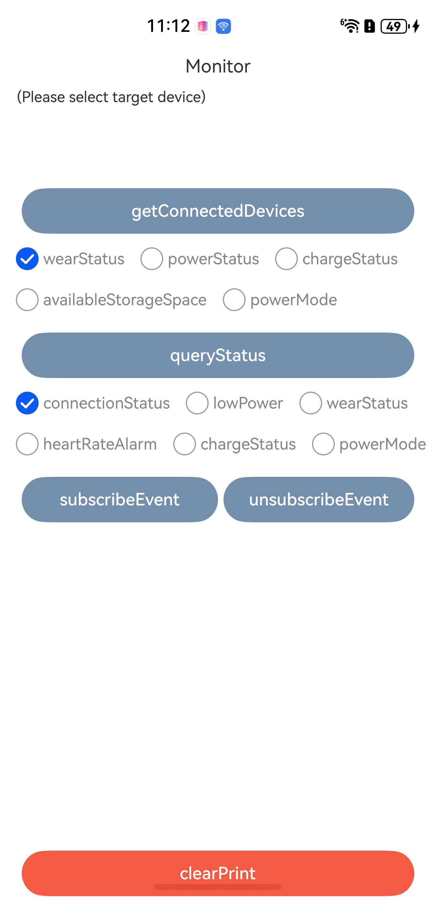
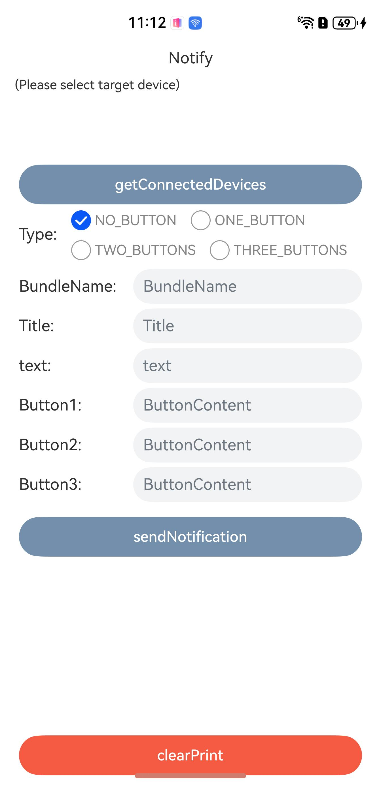
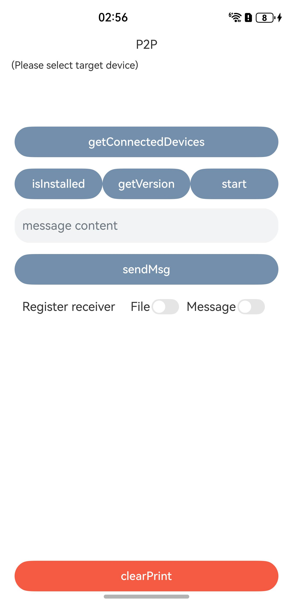
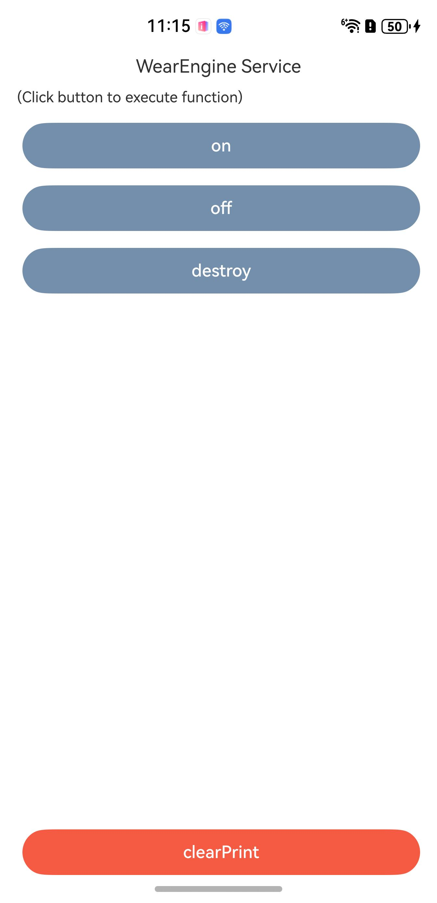

# Wear Engine

## Overview

This sample shows how to use Wear Engine to obtain the list of connected wearable devices and interact with the wearable app.

The APIs that you need to use are packaged into **@kit.WearEngine**.

## Preview
| **Home Screen**                     | **Authorization Screen**                       | **Device Information Screen**                       | **Status Query and Subscription Screen**                     | **Message Notification Screen**                       | **P2P Communication Screen**                 | **Sensor Screen**                        | **Connection Screen**                       |
|------------------------------|---------------------------------|-----------------------------------|------------------------------------|-----------------------------------|--------------------------------|-----------------------------------|---------------------------------|
|  |  |  |  |  |  |  |  | 
## How to Configure and Use the Sample Project

#### Configuring the Sample App in DevEco Studio

1. [Create a project](https://developer.huawei.com/consumer/en/doc/app/agc-help-createproject-0000001100334664). Under the project, [add an app](https://developer.huawei.com/consumer/en/doc/app/agc-help-createapp-0000001146718717).
2. [Apply for integrating Wear Engine](https://developer.huawei.com/consumer/en/doc/harmonyos-guides/wearengine_apply)
3. Open the sample app and replace the value of **bundleName** in the **AppScope\app.json5** file with the app bundle name specified in [AppGallery Connect](https://developer.huawei.com/consumer/en/service/josp/agc/index.html).
4. Replace the value of **client_id** in the **entry\src\main\module.json5** file with the app's **client_id** configured in [AppGallery Connect](https://developer.huawei.com/consumer/en/service/josp/agc/index.html).

#### Using the Sample App
1. Run the sample app. Tap the **Auth** button to access the authorization management screen. Select the permissions required, and tap **requestAuthorizations** to authorize or sign in to the app. If you have not logged in to your device with a HUAWEI ID, the HUAWEI ID sign-in screen will display. Sign in to your HUAWEI ID, then the app authorization screen will display.
2. You'll be redirected to the home screen after the authorization is complete. Visit different app screens to try out the modules.

## Project Directory
├─entry/src/main/ets         // Code area.    
│&emsp;├─entryability    
│&emsp;│&emsp;└─EntryAbility.ets                   // Entry point class.  
│&emsp;├─pages              
│&emsp;│&emsp;├─Index.ets                          // Home screen.    
│&emsp;│&emsp;├─AuthPage.ets                       // Authorization management screen.     
│&emsp;│&emsp;├─DevicePage.ets                     // Device information screen.     
│&emsp;│&emsp;├─MonitorPage.ets                    // Status query and subscription screen.      
│&emsp;│&emsp;├─NotifyPage.ets                     // Message notification screen.     
│&emsp;│&emsp;├─P2pPage.ets                        // P2P communication screen.  
│&emsp;│&emsp;├─SensorPage.ets                     // Sensor screen.  
│&emsp;│&emsp;└─ServicePage.ets                    // Wear Engine service screen.     
│&emsp;└─util         
│&emsp;&emsp;&emsp;└─Constant.ets                       // Common constants.   
└─entry/src/main/resources                // Directory for storing resource files.

## How to Implement

For details about how to perform authorization, please refer to **AuthPage.ets**.
* Call **AuthorizationRequest** to create an authorization request, set the permission types to be granted, and call **requestAuthorizations** to display the sign-in/authorization screen.
* Call **getAuthorizations** to obtain the permissions granted by the user.

For details about basic device information, please refer to **DevicePage.ets**.
* Call **getConnectedDevices** to obtain the list of connected devices.
* Use the built-in method of a connected device to query the capabilities supported by the device and the device SN.

For details about how to query and subscribe to the device status and user status, please refer to **MonitorPage.ets**.
* Call **queryStatus** to query the status of different enums in **MonitorItem**.
* Call **subscribeEvent** to subscribe to the event types corresponding to different enums in **MonitorEvent**.

Send notifications to the wearable device. For details, please refer to **NotifyPage.ets**.
* Call **Notification** to create a notification to be sent. Use **NotificationOptions** to create a notification configuration class, including the notification to be sent and the callback function for the notification.
* Call **notify** to send a template-based notification to the device.

For details about P2P communication with the wearable app, please refer to **P2pPage.ets**.
* Set the app bundle name and signature in the code snippet.
* Before performing P2P communication, it is recommended that you first verify whether the device supports P2P communication. This includes checking if the P2P capability is supported, whether the device supports app installation, and whether the counterpart app is installed as well as its app version. If necessary, you can also launch the device-side app.
* Before performing P2P communication, make sure that you have subscribed to the message/file receiving event for the device-side app.

For details about sensors on the wearable device, please refer to **SensorPage.ets**.
* Call **querySensors** to query the list of available sensors on a specified device.
* Call **subscribeSensor** and **unsubscribeSensor** to subscribe to and unsubscribe from data from a specified sensor, respectively.

For details about how to manage the connection status between your app and Wear Engine, please refer to **ServicePage.ets**.
* Use the **on** and **off** methods to subscribe to and unsubscribe from disconnection events, respectively.
* Call **destroy** to proactively disconnect from Wear Engine. Calling this method won't trigger the callback function registered by the **on** method.

## Dependencies

Dependent on the wearable device.

## Constraints

1. The sample app is only supported on Huawei phones and tablets running standard systems.
2. Agree to the privacy policy in the Huawei Health app before you use Wear Engine for the first time.
3. The HarmonyOS version must be HarmonyOS Next Developer Beta 2 or later.
4. The DevEco Studio version must be DevEco Studio Next Developer Beta 2 or later.
5. The HarmonyOS SDK version must be HarmonyOS Next Developer Beta 2 or later.
