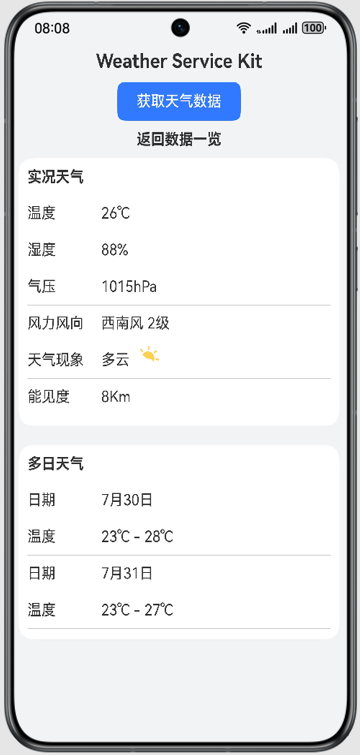
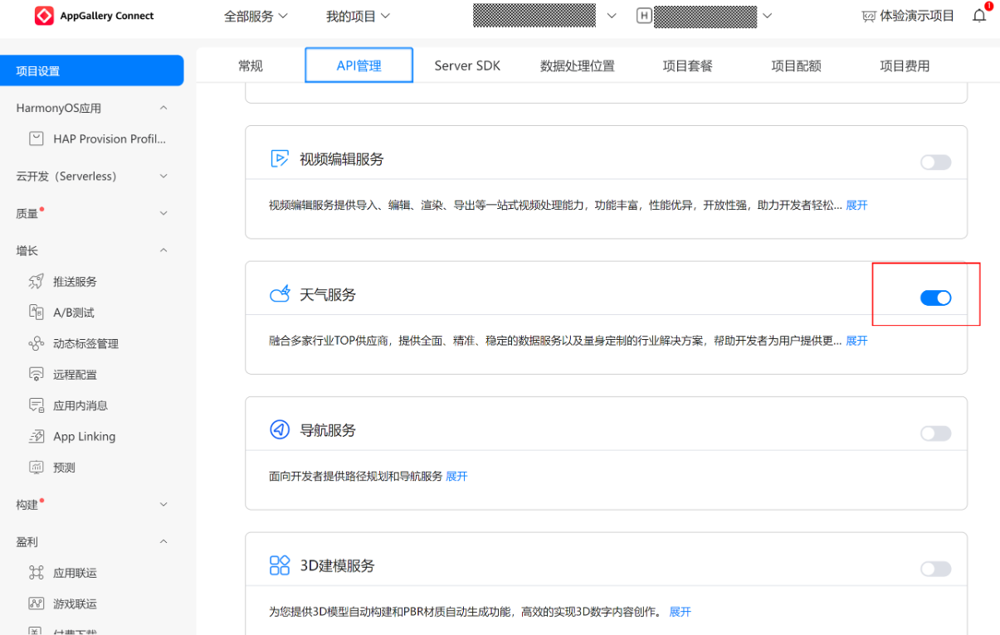

## 获取天气数据

### 介绍
Weather Service Kit（天气服务）是鸿蒙生态下的一个数据提供服务， 
Weather Service Kit融合了多家气象行业TOPs供应商，提供专业、精准、稳定的超本地化天气数据服务，
开发者可以通过Weather Service Kit提供的开放能力获取天气数据。

### 效果预览



### 工程目录
```
├──entry/src/main/ets/
│  ├──entryability
│  │  ├──EntryAbility.ts    // 本地启动ability
│  └──pages
│     └── Index.ets          // 获取天气界面
└──entry/src/main/resources            // 应用静态资源目录
```

### 具体实现
调用Weather Service Kit获取天气数据
```ts
// 导入天气服务模块
import { weatherService } from '@kit.WeatherServiceKit';
import { BusinessError } from '@kit.BasicServicesKit';
import { hilog } from '@kit.PerformanceAnalysisKit';

// 建天气请求
let weatherRequest: weatherService.WeatherRequest = {
  location: {
    latitude: 0,
    longitude: 0
  },
  limitedDatasets: [
    weatherService.Dataset.CURRENT, weatherService.Dataset.DAILY, weatherService.Dataset.HOURLY,
    weatherService.Dataset.MINUTE, weatherService.Dataset.ALERTS, weatherService.Dataset.INDICES,
    weatherService.Dataset.TIDES
  ]
};

// 调用getWeather方法执行查询请求，并处理返回结果
try {
  let weather: weatherService.Weather = await weatherService.getWeather(weatherRequest);
  hilog.info(0x0000, 'testTag', `Success to get weather: ${JSON.stringify(weather)}`);
} catch (err) {
  let businessError: BusinessError = err as BusinessError;
  hilog.error(0x0000, 'testTag',
    `Failed to get weather. Code: ${businessError.code}, message: ${businessError.message}`);
}
```

### 相关权限
需要在[AppGallery Connect](https://developer.huawei.com/consumer/cn/service/josp/agc/index.html#/)网站上开通天气服务权限 ，并重新申请Profile文件进行签名



### 约束与限制
1、硬件要求设备类型：Phone、Tablet、PC/2in1、Wearable。 

2、HarmonyOS系统：HarmonyOS NEXT Developer Beta2及以上。

3、软件要求DevEco Studio版本：DevEco Studio NEXT Developer Beta2及以上。

4、HarmonyOS SDK版本：HarmonyOS NEXT Developer Beta2 SDK及以上。

5、Weather Service Kit当前仅面向系统应用开放，暂不对外开放。

