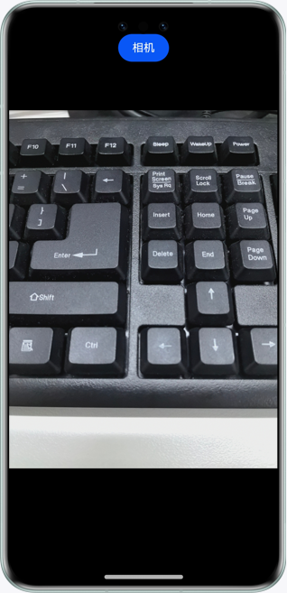

# Obtaining Camera from Web Pages

### Overview

This sample shows how to start the native camera on an HTML page to take a photo and obtain the returned photos.

### Preview



##### How to Use

1. Click the **Camera** button on the HTML page to start the native camera to take a photo.
2. The photo is displayed in the HTML **** tag.

### Project Directory

```

├──entry/src/main/ets/
│  ├──entryability
│  │  └──EntryAbility.ets            // Entry point class
│  └──pages
│     └──Index.ets                   // App home page
└──entry/src/main/resources          // Static resources
```

### Constraints

1. The sample app is supported only on Huawei phones running the standard system.

2. The HarmonyOS version must be HarmonyOS 5.0.5 Release or later.

3. The DevEco Studio version must be DevEco Studio 5.0.5 Release or later.

4. The HarmonyOS SDK version must be HarmonyOS 5.0.5 Release SDK or later.
