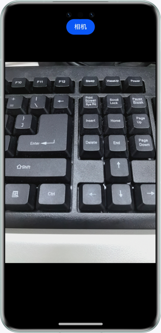

# 基于Web组件拉起相机进行拍照

### 介绍

本示例主要介绍在HTML页面中如何实现把相机拉起并进行拍照，并可以获取返回的照片。

### 效果预览



##### 使用说明

1. 点击HTML页面中的相机按钮，拉起原生相机进行拍照。
2. 完成拍照后，将图片在HTML的img标签中显示。

### 工程目录

```

├──entry/src/main/ets/
│  ├──entryability
│  │  └──EntryAbility.ets            // 程序入口类
│  └──pages
│     └──Index.ets                   // 应用首页
└──entry/src/main/resources          // 应用静态资源目录
```

### 约束与限制

1. 本示例仅支持标准系统上运行，支持设备：华为手机。

2. HarmonyOS系统：HarmonyOS 5.0.5 Release及以上。

3. DevEco Studio版本：DevEco Studio 5.0.5 Release及以上。

4. HarmonyOS SDK版本：HarmonyOS 5.0.5 Release SDK及以上。