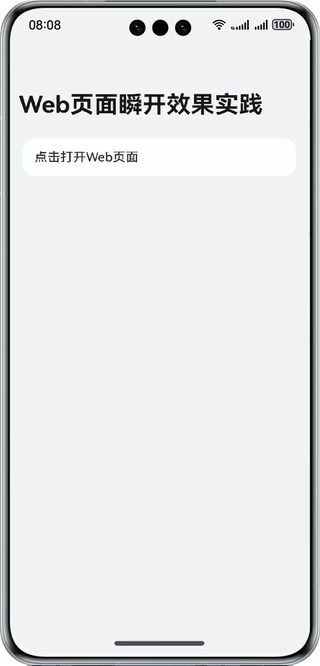

# 基于预渲染技术实现Web页面瞬开效果

### 介绍

本示例基于预渲染技术，实现了点击后Web页面瞬间打开的效果，无需额外加载过程，减少用户等待时长，提高了用户体验。

### 效果预览


使用说明：
1. 点击标签打开弹窗，加载Web网页。

### 工程目录

```
├──entry/src/main/ets/
│  ├──common
│  │  └──Constants.ets                  // 公共常量类
│  ├──entryability
│  │  └──EntryAbility.ets               // 程序入口类
│  └──pages              
│     ├──Index.ets                      // 首页
│     └──WebPage.ets                    // Web预渲染页面
└──entry/src/main/resources             // 应用静态资源目录
```

### 具体实现

1. 创建Web组件。
2. 在EntryAbility中预渲染网页，首页打开弹窗实现瞬开效果。

### 相关权限
ohos.permission.INTERNET

### 约束与限制

1.本示例仅支持标准系统上运行，支持设备：华为手机。 

2.HarmonyOS系统：HarmonyOS 5.0.5 Release及以上。

3.DevEco Studio版本：DevEco Studio 5.0.5 Release及以上。

4.HarmonyOS SDK版本：HarmonyOS 5.0.5 Release SDK及以上。