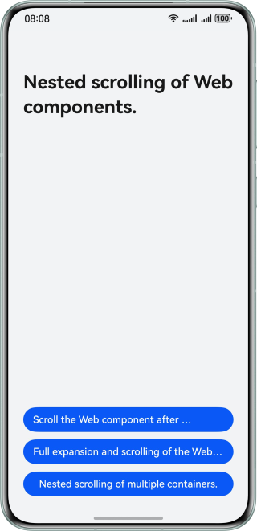

# Web Nested Sliding

### Overview
This sample showcases an article detail display case where a **Web** component is nested within a **Scroll** component and the **nestedScroll** attribute is used to intercept the scrolling action. Preview



### Project Directory

```
├──entry/src/main/ets/
│  ├──entryability
│  │  └──EntryAbility.ets               // Entry ability
│  ├──pages                  
│  │  ├──NestedScrolling.ets            // 
│  │  ├──FullExpansion.ets              // 
│  │  ├──WebNestedTabs.ets              // 
│  │  └──Index.ets                      // Home page
│  ├──view                  
│  │  └──StandardButtonList.ets         // 
│  └──viewmodel                  
│     └──MenuViewModel.ets              // 
└──entry/src/main/resource              // Static resources

```

### Concepts
- **Scroll**: a component that scrolls the content when the layout size of a component exceeds the viewport of its parent component.
- **Web**: a component used to display web pages.

### Required Permissions

- ohos.permission.INTERNET：Network request permissions are used to access network pages

### Constraints

1. The sample app is supported only on Huawei phones running the standard system.

2. The HarmonyOS version must be HarmonyOS 5.0.5 Release or later.

3. The DevEco Studio version must be DevEco Studio 5.0.5 Release or later.

4. The HarmonyOS SDK version must be HarmonyOS 5.0.5 Release or later.
