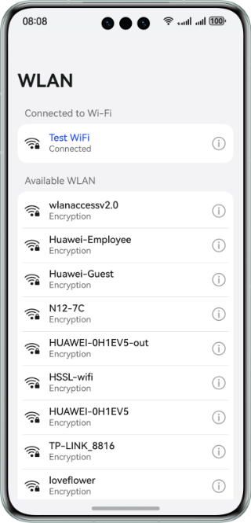
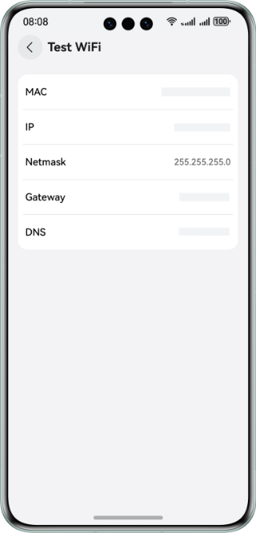

# WLAN Information Query

## Overview

This sample shows how to use the APIs provided by **wifiManager** to obtain WLAN information.

## Preview

| Home Page                              | Details Page                            |
|:--------------------------------------:|:---------------------------------------:|
|  |  |

## How to Use

1. Start the app. If WLAN is enabled and connected, the connected WLAN and available WLANs nearby are displayed. 
   The result for available WLANs may be empty. Schedule a recurring query every 10 seconds.

2. Touch the icon on the right of the connected WLAN to display the WLAN details. 
   The MAC address obtained by a non-system app is a random address.

3. The **Available WLAN** only displays WLAN information and does not support interaction.

## Project Directory

```
├──entry/src/main/ets               
│  ├──common
│  │  ├──constants.ets             // Constants
│  │  └──utils                     // Utility              
│  ├──entryability  
│  │  └──EntryAbility.ets          // Entry ability
│  ├──pages                                     
│  │  └──Index.ets                 // Home page
│  └──view
│     ├──DetailInfoView.ets        // WLAN details page
│     ├──InfoItemView.ets          // WLAN details page
│     └──WlanItemView.ets          // WLAN list
└──entry/src/main/resources        // Static resources of the app
```

## How to Implement

1. Call **wifiManager.getLinkedInfo()** to obtain information about the connected WLAN.
2. Call **wifiManager.getScanInfoList()** to obtain information about available WLANs nearby.
3. Call **wifiManager.getIpInfo()** to obtain information such as the subnet mask and gateway.

## Required Permissions

ohos.permission.GET_WIFI_INFO: Allows an application to obtain Wi-Fi information.

## Constraints

1. The sample is only supported on Huawei phones with standard systems.

2. The HarmonyOS version must be HarmonyOS 5.0.5 Release or later.

3. The DevEco Studio version must be DevEco Studio 5.0.5 Release or later.

4. The HarmonyOS SDK version must be HarmonyOS 5.0.5 Release SDK or later.
