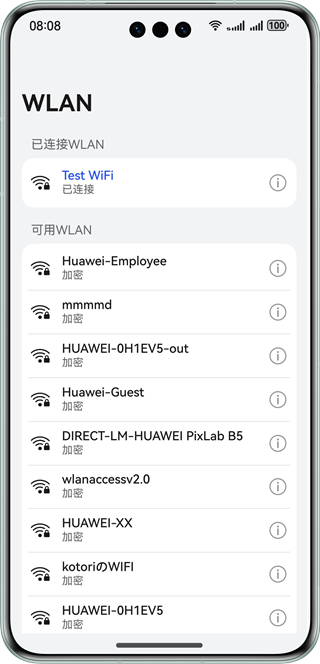
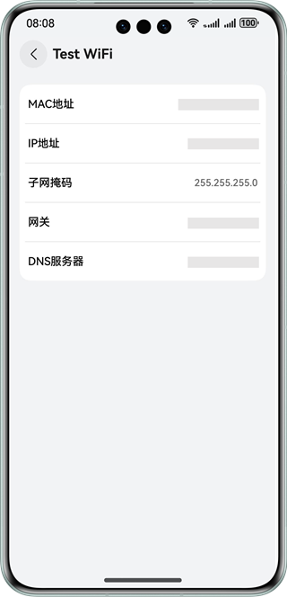

# 基于短距通信服务实现WLAN信息查询功能

## 介绍

本示例基于短距通信服务，实现WLAN信息的查询功能。帮助开发者在WLAN无线网络相关场景开发中，掌握WLAN开关查询，WLAN状态查询、监听等功能的实现方案。

## 效果预览

|                  首页                  |                  详情页                  |
|:------------------------------------:|:-------------------------------------:|
|  |  |

## 使用说明

1. 启动应用，若启动WLAN且已连接，显示已连接WLAN及附近可用WLAN（注：可用WLAN查询结果可能为空，设置定时10秒重复查询）。
2. 点击已连接WLAN右侧icon，显示WLAN详情页（注：非系统应用获取到的MAC地址为随机地址）。
3. 可用WLAN列表仅作展示查询能力，无交互动作。

## 工程目录
```
├──entry/src/main/ets               
│  ├──common
│  │  ├──constants.ets             // 常量类
│  │  └──utils                     // 工具函数               
│  ├──entryability  
│  │  └──EntryAbility.ets          // 程序入口
│  ├──pages                                     
│  │  └──Index.ets                 // 首页
│  └──view
│     ├──DetailInfoView.ets        // WLAN详情页
│     ├──InfoItemView.ets          // WLAN详情项
│     └──WlanItemView.ets          // WLAN列表项
└──entry/src/main/resources        // 应用资源目录
```

## 具体实现

1. 使用wifiManager.getLinkedInfo获取已连接的WLAN信息。
2. 使用wifiManager.getScanInfoList获取附近可用WLAN信息。
3. 使用wifiManager.getIpInfo获取子网掩码、网关等信息。

## 相关权限

ohos.permission.GET_WIFI_INFO：允许应用获取Wi-Fi信息

## 约束与限制

1. 本示例仅支持标准系统上运行，支持设备：华为手机。

2. HarmonyOS系统：HarmonyOS 5.0.5 Release及以上。

3. DevEco Studio版本：DevEco Studio 5.0.5 Release及以上。

4. HarmonyOS SDK版本：HarmonyOS 5.0.5 Release SDK及以上。