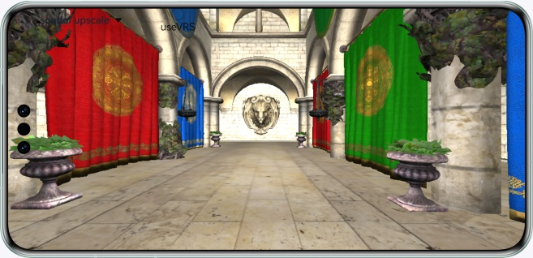

# XEngine超分和自适应可变速率着色的使用(OpenGL ES)

## 简介

本篇Codelab主要介绍如何使用XEngine空域GPU超分API、空域AI超分API进行纹理的超分以及使用XEngine自适应可变速率着色API修改着色率。示例代码通过XComponent组件调用NAPI创建EGL/OpenGL ES环境，实现绘制SPONZA场景，并展示XEngine特性的使用。本篇CodeLab使用Native C++模板创建。

## 效果预览

如图所示，XComponent组件绘制SPONZA场景，点击超分下拉选择菜单，切换超分模式，点击勾选框选择是否开启自适应可变速率着色



## 相关概念

- [EGL(Embedded Graphic Library)](https://developer.huawei.com/consumer/cn/doc/harmonyos-references/egl)：EGL 是Khronos渲染API (如OpenGL ES 或 OpenVG) 与底层原生窗口系统之间的接口。
- [XComponent](https://developer.huawei.com/consumer/cn/doc/harmonyos-references/ts-basic-components-xcomponent)：可用于EGL/OpenGL ES和媒体数据写入，并显示在XComponent组件。

## 使用说明

1. 运行示例代码。
2. 点击下拉选择菜单，在no upscale（不使用超分）、neural upscale（空域AI超分）、spatial upscale（空域GPU超分）、fsr upscale（FSR1.0超分）四种模式间进行切换。
3. 点击勾选框，可以开启/关闭自适应可变速率着色。

## 工程目录
```
├── entry/src/main	         // 代码区
│  ├── cpp
│  │  ├── types
│  │  │  ├── libnativerender
             └── index.d.ts      // native层接口注册文件
│  │  │── napi_init.cpp          // native api层接口的具体实现函数
│  │  │── CMakeLists.txt         // native层编译配置
│  │  │── 3rdParty               // 三方件
│  │  │── common                 // 通用接口
│  │  │── model                  // 模型
│  │  │── file                   // 文件管理
│  │  │── libs                   // 三方动态库
│  │  │── manager                // native&arkts交互
│  │  │── render                 // 渲染
│  │  │── shader                 // 渲染shader
│  ├── ets
│  │  ├── entryability
             └── EntryAbility.ts // 程序入口类
│  │  ├── pages
             └── index.ets       // 主界面展示类
│  ├── resources                 // 资源文件目录
│  │  ├── base
│  │  │  ├── media
             └── icon.png        // 图片资源
│  │  ├── rawfile/model/Sponza
                         └── sponza.obj    // 模型资源
```

## 具体实现
本示例展示的功能使用了XEngine中定义的以下API：
* const GLubyte* HMS_XEG_GetString(GLenum name);
* GL_APICALL void GL_APIENTRY HMS_XEG_SpatialUpscaleParameter(GLenum pname, GLvoid *param);
* GL_APICALL void GL_APIENTRY HMS_XEG_RenderSpatialUpscale(GLuint inputTexture);
* GL_APICALL void GL_APIENTRY HMS_XEG_NeuralUpscaleParameter(GLenum pname, GLvoid *param);
* GL_APICALL void GL_APIENTRY HMS_XEG_RenderNeuralUpscale(GLuint inputTexture);
* GL_APICALL void GL_APIENTRY HMS_XEG_AdaptiveVRSParameter(GLenum pname, GLvoid *param);
* GL_APICALL void GL_APIENTRY HMS_XEG_DispatchAdaptiveVRS(GLfloat *reprojectionMatrix, GLuint inputColorImage, GLuint inputDepthImage, GLuint shadingRateImage);
* GL_APICALL void GL_APIENTRY HMS_XEG_ApplyAdaptiveVRS(GLuint shadingRateImage);
通过调用展示的API实现空域GPU超分、空域AI超分、自适应可变速率着色功能。

## 相关权限

不涉及

## 依赖

* 本示例依赖assimp三方件，请按系统版本编译对应版本三方件，直接使用此示例即可；如需要替换请按系统版本[编译](https://gitee.com/openharmony-sig/tpc_c_cplusplus/tree/master)对应版本三方件
* 3D模型资源："[Crytek Sponza](https://casual-effects.com/data/)" by Frank Meinl, Crytek is licensed under [CC BY 3.0](https://creativecommons.org/licenses/by/3.0/)/replace "\\\" with "/" in file sponza.mtl

## 约束与限制

1. 本示例仅支持标准系统上运行，支持设备：请参考XEngine开发指南的[硬件要求](https://developer.huawei.com/consumer/cn/doc/harmonyos-guides/xengine-kit-preparations)。
2. 本示例为Stage模型，支持API version 12及以上。
3. HarmonyOS系统：HarmonyOS NEXT Developer Beta1及以上。
4. DevEco Studio版本：DevEco Studio NEXT Developer Beta1及以上。
5. HarmonyOS SDK版本：HarmonyOS NEXT Developer Beta1 SDK及以上。
