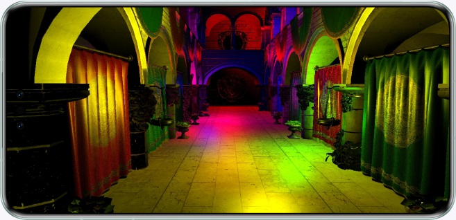

# Subpass Shading (Vulkan)

## Overview

In this codelab, you'll learn how to use Subpass Shading. The sample code takes drawing the scenes of Sponza Palace as an example, and calls NAPI using XComponent to build up the Vulkan environment. The demo project is created based on the Native C++ template.

## Preview

Scene of Sponza Palace drawn with XComponent



## Related Concepts

- [XComponent](https://developer.huawei.com/consumer/en/doc/harmonyos-references/ts-basic-components-xcomponent): The XComponent can accept and display the EGL/OpenGL ES and media data input.

## Instructions

1. Run the sample code.

## Project Directory
```
├── entry/src/main	             // Code area
│  ├── cpp
│  │  ├── types
│  │  │  ├── libnativerender
             └── index.d.ts      // API registration file at the native layer
│  │  │── napi_init.cpp          // Functions of APIs at the native layer
│  │  │── CMakeLists.txt         // Compilation configurations at the native layer
│  │  │── 3rdParty               // Third-party component
│  │  │── common                 // Common APIs 
│  │  │── file                   // File management
│  │  │── libs                   // Third-party dynamic libraries
│  │  │── manager                // native & ArkTS interactions
│  │  │── render                 // Rendering
│  ├── ets
│  │  ├── entryability 
             └── EntryAbility.ts // Entry class
│  │  ├── pages 
             └── index.ets       // Home screen display class
│  ├── resources                 // Directory of resource files
│  │  ├── base
│  │  │  ├── media
             └── icon.png        // Image resources
│  │  ├── rawfile
│  │  │  ├── forward_plus        // Forward plus shader file
│  │  │  ├── sponza_full         // Model file
│  │  │  ├── subpass_shading     // Subpass Shading shader file
```

## Implementation Details
The features shown in this sample code use the Subpass Shading API provided by the Vulkan extension API [VK_HUAWEI_subpass_shading](https://registry.khronos.org/vulkan/specs/1.3-extensions/man/html/VK_HUAWEI_subpass_shading.html).
* VKAPI_ATTR VkResult VKAPI_CALL vkGetDeviceSubpassShadingMaxWorkgroupSizeHUAWEI(VkDevice device, VkRenderPass renderpass, VkExtent2D* pMaxWorkgroupSize);
* VKAPI_ATTR void VKAPI_CALL vkCmdSubpassShadingHUAWEI(VkCommandBuffer commandBuffer);
You can call the APIs listed above to implement the Subpass Shading feature.

## Required Permissions

N/A

## Dependency

* This sample code depends on the Assimp third-party component, which needs to be compiled based on the system version.
* 3D model resources: "[Crytek Sponza](https://casual-effects.com/data/)" by Frank Meinl; Crytek is licensed under [CC BY 3.0](https://creativecommons.org/licenses/by/3.0/)/replace "\\\" with "/" in the **sponza.mtl** file.

## Constraints

1. The sample code can only run on devices with a standard system. Supported devices: For details, see [Hardware Requirements](https://developer.huawei.com/consumer/en/doc/harmonyos-guides/xengine-kit-preparations) in the XEngine Development Guide.
2. This sample demonstrates the stage model, which supports API version 12 or later.
3. HarmonyOS: HarmonyOS NEXT Developer Beta1 or later.
4. DevEco Studio: DevEco Studio NEXT Developer Beta1 or later.
5. HarmonyOS SDK: HarmonyOS NEXT Developer Beta1 SDK or later.
