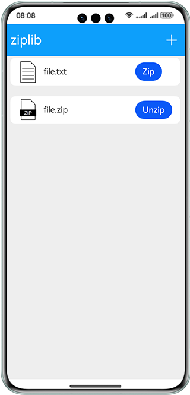
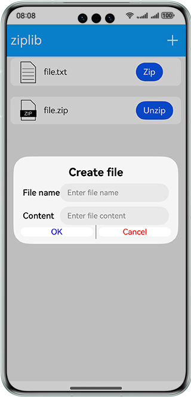

# Zip and Unzip

### Overview

This sample uses the interfaces provided by @ohos.zlib and @ohos.fileio to add, zip, and unzip files.

### Preview

| Home page                              | Dialog box                              |
|----------------------------------|------------------------------------|
|  |  |

### How to Use

1. Touch **+** in the upper right corner of the sample app.

2. In the **Create file** dialog box displayed, enter the file name and content, and touch **OK**.

3. The file with the extension .txt is displayed in the list on the home page, and the physical address of the file is **/data/app/el2/100/base/ohos.samples.ziplib/haps/entry/files/**. Touch **Zip**. A message is displayed, indicating that the file is compressed successfully. A .zip file with the same name is created in the file list.

4. Touch **Unzip** next to the compressed file. A message is displayed, indicating that the file is decompressed successfully. A folder with the same name is created in the file list.

### Project Directory

```
├──entry/src/main/ets/
│  ├──common
│  │  └──AddDialog.ets                    // Dialog box components
│  ├──entryability
│  │  └──EntryAbility.ets                 // Entry ability
│  ├──model
│  │  ├──DataSource.ets                   // Lazy loading data sources
│  │  └──Logger.ets                       // Log utility
│  └──pages
│     └──Index.ets                        // Home page, where all APIs are called
└──entry/src/main/resources               // Static resources
```

### How to Implement

The interfaces for adding, zipping, and unzipping files are called on the home page. For details about the source code, see [Index.ets](entry/src/main/ets/pages/Index.ets).
* Adding a file: Call **fileio.openSync()** to create a file and call **fileio.writeSync()** to write content to the file.
* Zipping a file: Call **zlib.zipFile()** to zip a file.
* Unzipping a file: Call **zlib.unzipFile** to unzip a file.

### Required Permissions

N/A

### Dependencies

N/A

### Constraints

1. The sample app is supported only on Huawei phones running the standard system.

2. The HarmonyOS version must be HarmonyOS 5.0.5 Release or later.

3. The DevEco Studio version must be DevEco Studio 5.0.5 Release or later.

4. The HarmonyOS SDK version must be HarmonyOS 5.0.5 Release or later.
